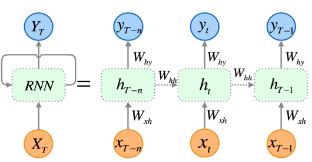
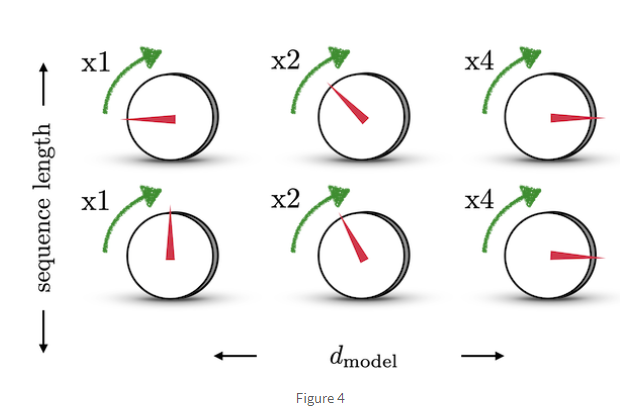

## 서론

Transformer([Attention Is All You Need](https://arxiv.org/pdf/1706.03762.pdf)) 논문이 나온지도 벌써 4년이 지났다. 어마무시한 성능을 자랑하는 Transformer는 안 쓰이는 곳을 찾기 힘들 정도로 거의 모든 분야의 최신 기술로 스며들고 있다. 이번 Transformer 1편에서는 시퀀스 데이터를 처리하기 위해서 고안된 시퀀스 모델들, RNN, LSTM, Seq2Seq, Attention을 활용한 Seq2Seq, 그리고 마지막으로 Self-Attention에 대해서 간략히 알아보고자 한다.  나는 시퀀스 데이터에 대한 배경 지식이 거의 없다. 그래서, Transformer 구조를 바로 살펴보는 것보다는 시퀀스 데이터들을 처리하기 위해서 어떠한 시도들과 문제점들이 있었는지를 이해하고, 그 문제점들을 Transformer는 어떤 식으로 해결하는지 알아보면 조금 더 와닿을 것 같다는 생각에서 본 글을 작성하게 되었다. 이 글의 최종 목적지는 Vision Transformer에 대한 올바른 이해이며,  Transformer 2편에서는 Transformer가 내 관심분야인 컴퓨터 비젼 영역(더 정확히는 OCR)에서  어떻게 적용되었는지 알아보려고 한다.

## RNN

RNN, input sequence가 길어지면(time step 증가), 초기에 들어온 인풋 $x_1, x_2,...$ 들은 필연적으로 뒤에 들어온 $x_n, x_{n-1},...$ 등과의 관계를 비교했을 때, 가중치들이(0과 1 사이의 값) 계속 곱해지면서 연관성이 떨어지게 되는 문제가 있다. (problem of vanishing gradient). 실제로는 연관성이 깊은 두 인풋 벡터들이 단지 거리(time step)가 멀다는 이유만으로  연관성이 없다고 판단될 수도 있다.

## LSTM

![[출처]: https://towardsdatascience.com/illustrated-guide-to-lstms-and-gru-s-a-step-by-step-explanation-44e9eb85bf21](LSTM.png)

[출처]: https://towardsdatascience.com/illustrated-guide-to-lstms-and-gru-s-a-step-by-step-explanation-44e9eb85bf21

이를 해결하기 위해 나온 모델이 LSTM(Long Short Term Memory)이다.  cell state와 hidden state에서 인풋값 이전의 time step(t-1) 정보들을 받고, sigmoid로 이루어진 3개의 gate들(forget gate, input gate, output gate)을 통해 이전 time step과 현재 input 값에 얼마만큼의 영향력(가중치)을 부여할지 학습한다. 이 영향력(가중치)은 input(과거와 현재 벡터들)에 의해 계산되고, 오래 기억해야할 중요한 time step 인풋에는 더 높은 가중치, 잊어도 되는 덜 중요한 인풋에는 낮은 가중치를 부여함으로써, 위의 RNN이 갖고 있는 vanishing gradient 문제를 보완했다.

## Seq2Seq

[[출처] : https://jalammar.github.io/visualizing-neural-machine-translation-mechanics-of-seq2seq-models-with-attention/](seq2seq.mp4)

[출처] : https://jalammar.github.io/visualizing-neural-machine-translation-mechanics-of-seq2seq-models-with-attention/

Encoder와 Decoder로 이루어진 Seq2Seq 모델은 Encoder에서 뽑아낸 인풋값 전체의 문맥, 인코딩된 context 벡터를 decoder에서 다시 디코딩하여 결과를 도출한다. Encoder와 Decoder 각각은 RNN으로 구성되어 있다. 과거의 time step 정보들을 순차적으로 고려해 값을 도출하는 RNN과 비교했을 때, Seq2Seq 모델은 Encoder로 인풋값의 전체 문맥을 반영하고 Decoder로 해독한다는 점에서 시퀀스 길이와 순서가 자유롭다는 장점이 있다. 하지만, Context Vector가 bottleneck으로 작용하여 (RNN이나 LSTM과 마찬가지로)인풋 시퀀스가 길어지면 성능이 떨어진다는 단점이 있다.

## Attention

[[출처] : https://jalammar.github.io/visualizing-neural-machine-translation-mechanics-of-seq2seq-models-with-attention/](attention.mp4)

[출처] : https://jalammar.github.io/visualizing-neural-machine-translation-mechanics-of-seq2seq-models-with-attention/

Attention 모델은 Encoder-Decoder Network(e.g. Seq2Seq)가 Context Vector에 의존하기 때문에 생기는 bottleneck 문제를 보완한다. Encoder 단계에서 각 time step마다 나오는 hidden state들을 context vector처럼 넘기고, Decoder 단계에서 각 time step에 대한 Decoder hidden state와  Encoder hidden state들과의 관계를 내적(dot product)으로 계산한다. 내적 후 softmax를 거친 이 값은 Decoder hidden state가 각 Encoder hidden state들과 각각 얼마만큼 집중해야할지 제시하는 attention score가 된다. 

LSTM이 해당 time step 직전의 정보에 대해서만 가중치를 계산했다면, Attention은 아웃풋 시퀀스의 각 step에 대해서 인풋 시퀀스의 각 step들이 얼마만큼의 가중치를 가져야할지를 계산한다.

## Transformer (Self-Attention)

![[출처] : https://jalammar.github.io/illustrated-transformer/](transformer.png)

[출처] : https://jalammar.github.io/illustrated-transformer/

Attention의 근본적인 핵심은 두 개의 시퀀스,  $Seq_a=[{v_{a_1}, v_{a_2},...,v_{a_n} }]$과 $Seq_b=[{v_{b_1}, v_{b_2},...,v_{b_m} }]$, 가 있을 때, $v_{b_1}$에 대해서 $v_{a_1},v_{a_2},...,v_{a_n}$ 이 갖는 영향력(가중치, 또는 관계)을 뽑는다는 것이다.

그렇다면 만약 이 영향력 뽑는 과정을 Sequence 스스로에게 적용한다면??

'A dog devoured his treat, because he was hungry.' 라는 문장에 attention을 적용한다면, 'dog', 'his', 'he' 간의 attention score는 꽤나 높게 나올 것이다. 또한, attention 과정을 통해 뽑은 vector는 일반 linear layer를 거친 vector보다 sequence 맥락을 좀 더 잘 반영한 vector일 것이다.

이렇게 시퀀스 스스로에게 attention을 적용하는 기법을 self-attention이라고 한다. 그리고 오늘 글의 주제인 Transformer는 self-attention 구조를 여러 개 합쳐서 만든 multi-head attention을 활용한다.

![[출처] : https://jalammar.github.io/illustrated-transformer/](self-attention.png)

[출처] : https://jalammar.github.io/illustrated-transformer/

1. **key, query, value**

여기서 주목할 점은 attention을 구하는 로직 자체는 똑같지만, Query, Key, Value 벡터들을 활용한다는 점이다. 시퀀스를 이루는 인풋 벡터들은 Query, Key, Value 한 세트씩을 갖게된다. Query 벡터는 해당 인풋 벡터와 나머지 벡터들 간의 관계를 질의(query)하는 역할이다. Key 벡터는 나머지 벡터들이 Query 벡터로 질의했을 때, 제공하는 해당 인풋 벡터가 가지고 있는 열쇠의 역할이다.  그리고 Value 벡터는 해당 인풋 벡터가 linear layer를 거친 값이라고 보면 된다.

직관적으로 설명하자면, 인풋 벡터가 다른 벡터들에게 질의할 때는 Query 벡터로, 다른 벡터가 질의할 때는 Key 벡터로 응답한다고 생각하면 된다. 이 Query 벡터와 Key 벡터는 내적과 softmax, 그리고 $\sqrt{d_k}$ 로 정규화를 거쳐서 Attention Score를 뽑는다. 이 내적하는 과정은 [여기](https://www.notion.so/Essence-of-Linear-Algebra-f615e933e30b412c82923502d18ea6e4?pvs=21)에서 봤듯이, Query와 Key 벡터 간의 유사도를 보는 것과 같은 의미를 갖는다. (즉, Query가 열쇠구멍이라고 한다면, Key는 그 열쇠구멍과 열쇠가 얼마나 맞는지를 의미한다.) 그리고 Attention Score는 linear layer를 거친 것과 같은 값인 Value 벡터와 곱해진다.

1. **positional encoding**
    
    
    

이렇게 kqv 연산을 통해 완성된 아웃풋 벡터들은 마찬가지로 다른 attention head들로부터 나온 벡터들과 이어붙여진다. 한 가지 문제점은 이렇게 이어진 벡터들 간의 시퀀스의 위치에 대한 정보가 없다는 점이다. 시퀀스의 위치 정보를 반영하기 위해, *1) 위치별 유일한 벡터값을 가지며, 2) 서로 다른 길이의 시퀀스에도 문제없이 적용이 가능하고, 3) 서로 다른 길이의 시퀀스의 두 인덱스 간 거리가 일정한*([출처] : https://hongl.tistory.com/231) positional encoding 기법을 적용한다.

## Vision Transformer

![[출처] : https://ai.googleblog.com/2020/12/transformers-for-image-recognition-at.html](vision_transformer.gif)

[출처] : https://ai.googleblog.com/2020/12/transformers-for-image-recognition-at.html

자연어 처리에서는 거의 Transformer를 쓰지 않는 태스크가 없을 정도로 Transformer는 무시무시한 성능을 자랑한다. Sequence 데이터에만 적용되던 Transformer는 이제 컴퓨터 비젼 영역까지 그 영향력을 확장했다. Vision Transformer의 방법은 기존 Transformer와 크게 다르지 않다. 똑같이 positional encoding을 붙이고, kqv 연산을 포함한 muli-headed attention, layer normalization, Residual 구조, 그리고 Feed-forward layer로 이루어져있다. 다만 다른 점은 3D로 구성된 이미지를 patch들로 찢어서 Sequence를 구성했다는 점과, decoder 부분을 제외하고, encoder만 활용했다는 점이다. 

![[출처] : https://theaisummer.com/vision-transformer/ 좌측은 Alexnet 필터, 우측은 ViT 필터](vit_filter.png)

[출처] : https://theaisummer.com/vision-transformer/ 좌측은 Alexnet 필터, 우측은 ViT 필터

![[출처] : https://theaisummer.com/vision-transformer/ 좌측은 네트워크 깊이에 따른 ViT의 평균 Attention Distance . 우측은 Conv layer에 따른 receptive field의 성장](vit_field.png)

[출처] : https://theaisummer.com/vision-transformer/ 좌측은 네트워크 깊이에 따른 ViT의 평균 Attention Distance . 우측은 Conv layer에 따른 receptive field의 성장

픽셀과 픽셀 사이의 지역적인 패턴들(receptive fields)을 뽑아내기 위해서 기존에는 convolutional layer를 겹겹히 쌓아야했다면, ViT의 경우, 첫번째 MHA(Multi-Headed Attention) 레이어부터 픽셀과 픽셀 간의 interaction을 확인할 수 있다.

## 마무리

RNN부터 Attention까지, Transformer가 나오기 전, 시퀀스 데이터를 처리하기 위해 나온 모델들과 Transformer가 어떤 식으로 이미지 분야에 적용되는지 간략하게 살펴보았다. 전체적인 흐름을 이해하는데 본 글을 참고하고, 자세한 구조적인 설명은 논문들을 참고하면 좋을 것 같다.

[Transformer (2)편](https://www.notion.so/Transformer-2-4c5bf427ed2d496abe6ebc372238cd2e?pvs=21)에서는 지금 회사에서 내가 맡고 있는 OCR 업무 중 **텍스트 이미지 인식(Scene Text Recogntion)**에 활용된 Transformer 모델들에 대해서 알아보고, 모델 학습을 진행하려고 한다.

## 참조

- [Attention is all you need](https://arxiv.org/pdf/1706.03762.pdf)
- [The Annotated Transformer](https://nlp.seas.harvard.edu/2018/04/03/attention.html)
- [Jay Alammar's Seq2Seq Models with Attention](https://jalammar.github.io/visualizing-neural-machine-translation-mechanics-of-seq2seq-models-with-attention/)
- [Jay Alammar's The Illustrated Transformer](https://jalammar.github.io/illustrated-transformer/)
- [CNN과 이미지가 찰떡궁합인 이유](https://seoilgun.medium.com/cnn%EC%9D%98-stationarity%EC%99%80-locality-610166700979#:~:text=%EA%B3%A0%EB%A1%9C%20translation%20invariance%EB%8A%94%20%EC%9E%85%EB%A0%A5,%EC%B6%9C%EB%A0%A5%EC%9D%84%20%ED%95%9C%EB%8B%A4%EB%8A%94%20%EC%9D%98%EB%AF%B8%EB%8B%A4.)
- [Transformer Positional Encoding](https://hongl.tistory.com/231)
- [How the Vision Transformer(ViT) works in 10 minutes: an image is worth 16x16 words](https://theaisummer.com/vision-transformer/)
- [Vison Transformer 구현](https://github.com/FrancescoSaverioZuppichini/ViT)