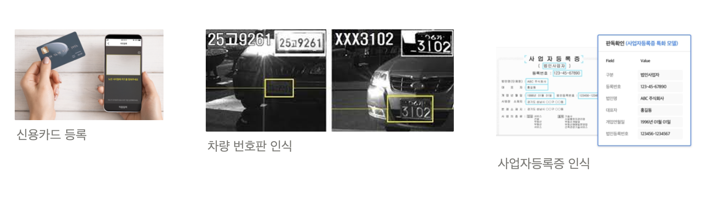
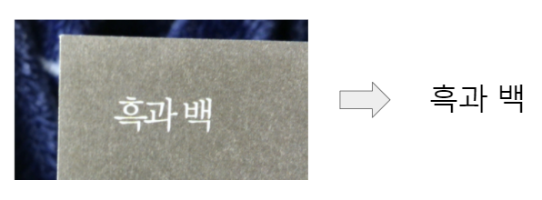
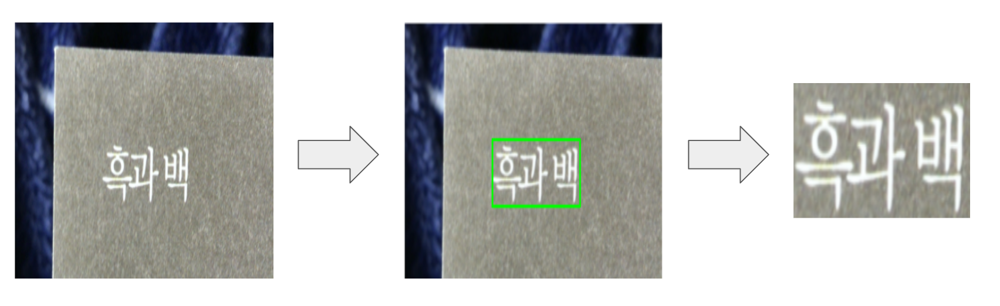
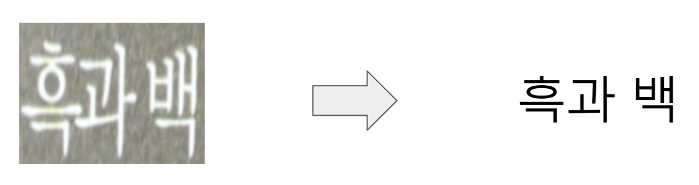
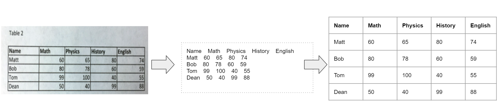
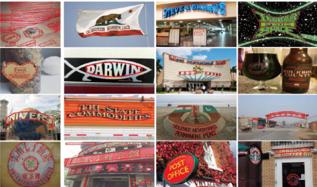
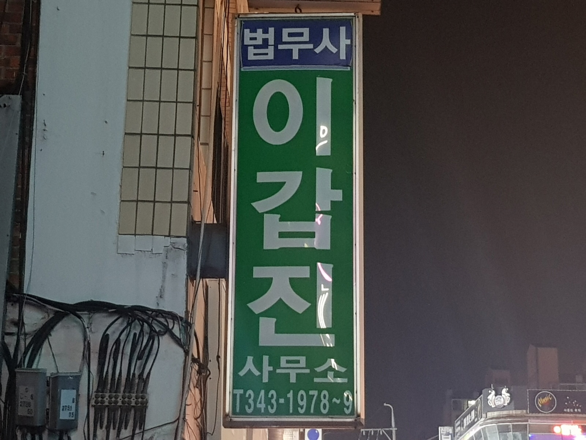
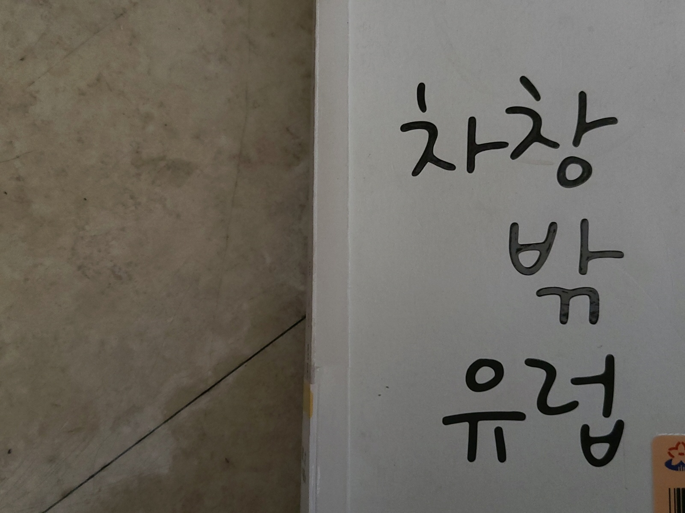

## Intro

OCR(Optical Character Recognition)은 이미지 속의 글자를 읽는 기술이다. 조금 생소할 수도 있는 이름인 OCR은 생각보다 [우리의 일상 속 깊숙이 자리하고 있다](https://medium.com/naver-cloud-platform/%EC%9D%B4%EB%A0%87%EA%B2%8C-%EC%82%AC%EC%9A%A9%ED%95%98%EC%84%B8%EC%9A%94-ocr%EC%9D%84-%EC%96%B4%EB%96%BB%EA%B2%8C-%ED%99%9C%EC%9A%A9%ED%95%A0%EA%B9%8C%EC%9A%94-ada22fb3c3ca#:~:text=%EB%AC%B8%EC%84%9C%EB%A5%BC%20%EC%9D%B8%EC%8B%9D%ED%95%98%EA%B3%A0%20%EC%82%AC%EC%9A%A9%EC%9E%90,%EB%8B%A4%EC%96%91%ED%95%98%EA%B2%8C%20%ED%99%9C%EC%9A%A9%EB%90%98%EA%B3%A0%20%EC%9E%88%EC%8A%B5%EB%8B%88%EB%8B%A4.&text=%EB%84%A4%EC%9D%B4%EB%B2%84%20%ED%81%B4%EB%A1%9C%EB%B0%94%EC%9D%98%20OCR%20%EA%B8%B0%EC%88%A0,%ED%95%98%EC%97%AC%20%EC%A0%95%ED%99%95%EB%8F%84%EB%A5%BC%20%EB%86%92%EC%9D%B4%EA%B3%A0%20%EC%9E%88%EC%8A%B5%EB%8B%88%EB%8B%A4.). OCR은 신용카드, 사업자등록증이나 주민등록증, 또는 영수증 등 필요한 서류 정보를 촬영만 하면 전자 정보로 변환 가능하게 해준다. 또, 차량번호판 정보를 추출해서 불법 주차나 속도 위반 차량을 파악하기도 한다. 그리고 아직 [종이 문서에서 전자 문서로의 전환](https://www.joongang.co.kr/article/23961049#home)이 진행중인 기업들이 한 장씩 문서 내용을 직접 체크해야하는 부담을 줄여 업무 자동화를 가속화해준다. 유입되는 데이터의 크기가 커지고 있는 빅데이터 시대에 사는 우리에게 '사람의 눈을 일일히 거치지 않고 이미지에서 필요한 텍스트 정보만을 추출할 수 있게 되었다'라는 것은 **빅데이터를 우리의 편의에 맞게 더 잘 활용할 수 있는 옵션이 생겼음을 의미**한다.

2019년, AI 자동차수리비 산출시스템 프로젝트를 진행중이였을 때였다. 파손된 차량의 사진을 휴대폰 촬영해서 앱에 업로드하면 수리 금액이 얼마가 나올지 예측하는 이미지 딥러닝 모델을 개발 중이였다. 여느때처럼 퇴근하고 집에 돌아가는 길, 같은 지하철을 타는 팀장님에게 이런 질문을 했었다. 

'저희 프로젝트처럼 사물 자체가 아닌 사물의 손상 심도까지 파악할 정도로 이미지 모델의 성능이 좋다면, 글자들을 인식하는 것도 상품화가 가능하지 않을까요?'

그 때 팀장님의 답변은 아직도 기억에 남는다.

"이미지 모델의 형태가 점점 발전하고 있기는 하지만, 결국 이미지 안의 물체의 영역을 탐지하고, 해당 물체가 미리 정의해놓은 클래스의 범주 내에서 분류되는 이미지 모델의 틀은 쉽게 변하기 힘들어요. 한글로 나올 수 있는 한 글자짜리 조합만 생각해도 대략 6, 7천개([링크](https://m.blog.naver.com/khsamuel/221442007316))쯤은 될 거고, ****거기다 종이 한장에 보통 글자가 못해도 300개 400개 쯤은 될 거예요. 그럼 그 문서 한 장에 나오는 글자들을 모두 올바르게 맞출 확률은 얼마나 될까요? 그리고 이 글자 읽는 태스크를 컴퓨터로 대체하려면 적어도 100장 이상, 아니 10,000장 정도는 거뜬히 처리할 줄 알아야 현장에 사용이 가능할 텐데, 그렇게 된다면 정확도는 얼마 정도가 보장될까요? 그런데 또 모르죠. 나중에는 그 정확도를 확 올릴 수 있는 기술들이 나올수도..."

자고 일어나면 최신 기술들이 뒤바뀔만큼 미친 속도로 새로운 기술들이 쏟아져 나왔고, 왜 문서를 AI 이미지 모델로 처리해서 정확도를 뽑는 게 힘든지 설명을 해주셨던 팀장님과 우리 팀은 2년째 OCR 제품을 개발중이다.
  

## OCR. 컴퓨터가 사람 대신 글을 읽어주는 일.

OCR. 이미지를 보고 컴퓨터가 인식할 수 있는 문자로 변환하는 일.

OCR은 어떻게 이뤄질까?

회사마다 어떤 모델을 쓰고, 어떤 단계에 기준을 두고 모델을 설계하는지는 조금씩 다르겠지만, 보통 OCR은 2단계 또는 3단계로 이루어진다. 2단계는 이미지 중 텍스트 영역을 탐지하는 1)문자 영역 탐지(STD)단계와, 탐지한 영역의 텍스트를 인식하는 2)문자 인식(STR)단계, 그리고 문서 이미지의 경우 인식한 텍스트 정보를 분류하고 구조화하는 3)문서 이해(Document Understanding) 단계까지 3단계로 구성된다.
  

### 1. **문자 영역 탐지 (Scene Text Detection;STD)**

이미지에는 한 개 이상의 문자 영역이 존재할 수 있다. 정확한 문자 인식을 위해 문자가 속하는 영역을 탐지한다. 잘못 잘린 문자 영역은 문자 인식의 성능을 떨어트리지만, 반대로 알맞게 잘린 문자 영역은 문서 이해(Document Understanding) 단계의 알맞은 단위로 작용한다. 

Scene Text Detection 관련 최신 모델들의 정보는 **[여기](https://paperswithcode.com/task/scene-text-detection)**에서 찾을 수 있다.

  

### 2. **문자 인식 (Scene Text Recognition;STR)**

STD(문자 영역 탐지)단계에서 잘라낸 문자 이미지로부터 컴퓨터 문자로 인식하는 단계이다. 보통 글자 하나 하나를 개별로 인식하는 것이 아니라, 1개 이상의 글자로 이루어진 단어 단위로 인식한다. 글자가 1개 이상이다 보니, 글자와 글자 간의 순차적 종속성(sequential dependency)이 존재한다. 예를 들어, 앞에 두 글자가 '아이스크'였다면 그 다음에 오는 글자는 '림'일 확률이 높다. 이런 순차적인(sequential) 특성을 활용하기 위해서, Bi-LSTM, Attention, 그리고 최근에는 Transformer 모델을 활용한다. ([이 글](https://www.notion.so/e181266b3b624c959e832c86343d435e?pvs=21)에서 Sequential Data를 처리하기 위한 모델들에 대해서 읽을 수 있다.)

STR 관련 최신 모델들의 정보는 [**여기**](https://paperswithcode.com/task/scene-text-recognition)에서 찾을 수 있다.

### 3. **문서 이해 (Document Understanding)**

STD와 STR 단계를 무사히 거쳐 원하는 컴퓨터 문자를 추출해냈다고 하자. 다음엔 뭐가 필요할까? 추출해낸 문자들을 컴퓨터가 이해할 수 있는 방식으로 정리하는 작업이 필요하다. 

아래 표 이미지를 중앙에 위치한 글자들로 추출해냈다고 하자. 사람은 맨 윗쪽 행이 각 열들을 나타내는 열이름(column name)이라는 것, 그리고 맨 왼쪽의 열은 행이름(row name), 그리고 옆의 행들은 각 행들의 정보를 나타낸다는 사실을 쉽게 알아차릴 수 있다. (Matt의 수학 점수는 60점, 물리학 점수는 65점) 하지만, 컴퓨터는 그렇지 않다. 중앙 글자들(정보)로부터 구조화하는 과정이 필요하다. 올바른 문서 이해 과정을 거친다면, 아래 그림의 세번째 표를 뽑아낼 수 있을 것이다. 참고로, 테이블화한다는 것은 [('Name' : 'Matt', 'Math' : 80, 'Physics' : 65, 'History' : 80, 'English' : 74), ...]와 같이 json, xml 등과 같은 포맷으로 구조화할 수 있음을 의미한다. 여기서 중요한 점은 글자에 대한 정보 뿐만 아니라, 글자의 위치, 그리고 그 글자 주변의 표 성분, 즉 사람이 문맥에 맞춰 글자를 읽기 위해 시각적으로 사용하는 정보들이 문서 이해 과정에서 고려되어야 한다는 것이다.

문서 이해 관련 최신 모델들의 논문 정보는 **[여기](https://paperswithcode.com/search?q_meta=&q_type=&q=document+understanding)**에서 찾을 수 있다.

## OCR을 하면서 생길 수 있는 문제들

물론 위 3단계를 문제없이 진행하면 이상적이겠지만, AI 모델에 99.9999%의 정확도는 있더라도 100% 정확도는 없다. 각 단계별 인식 측면에서 다양한 문제들이 발생한다.
  

### 1. 문자 영역 탐지(STD) 단계

**목적 : 인식 대상 텍스트를 이미지로부터 캡쳐**

1. 글자 미탐지/오탐지
    1. 오탈자 발생 ⇒ 문서 이해 단계에서 정보가 빠지는 경우 발생
    2. 오탐지(글자가 아닌 오점을 문자로 인식한 경우)
        
        ⇒ 인식 단계에서 잘못된 글자로 인식
        
2. 탐지 박스 단위
    1. 원래 하나의 박스를 두 개 이상의 박스로 잡는 경우
    2. 반대로 두 개 이상의 박스를 하나로 잡는 경우
    
    ![$10,000를 ['$10', '000']으로 탐지했다. 상금 만 달러가 10달러로 줄어든다면 아무도 좋아하지 않을 거다.](misdetection-example.png)
    
    

### 2. 문자 인식(STR) 단계

**목적 : STD단계에서 캡쳐한 텍스트 이미지를 전자 문자로 알맞게 변환**

1. 글자 방향에 따른 오인식
    - 왼쪽에서 오른쪽으로 나열된 단어들만 학습하다가 다른 방향으로 나열(수직이나 오른쪽에서 왼쪽 나열)된 단어 이미지가 들어오는 경우
        
        
        
        
        
        
        
2. 학습 데이터에 기반한 인식 오류
    - 학습한 폰트와 아예 다른(인식이 불가능할 정도의) 폰트를 사용한 텍스트인 경우
    - 숫자 '0'과 자음 'ㅇ', 숫자 '1'과 모음 'ㅣ' 처럼 문맥을 고려하지 않으면 구분하기 힘든 단일 문자들
        
        
        
        
        
    

### 3. 문서 이해 단계 (Rule-Based일 경우)

**목적 : 이미지에서 추출한 정보들을 구조화**

1. 기존 유형과 다른 문서 구조에 대한 인식 오류
    1. 같은 문서 유형이지만 문서 구성이 다른 경우
2. 앞에 STD와 STR에서 오류가 발생한 경우

  

## Outro

OCR 진행 시 위에 적어놓은 문제 외에도 많은 문제들이 존재한다. 그 중, 현재 OCR 모델 구조 상 해결이 불가능한 문제들이 생기면 머리가 아파진다. 예를 들어, STD모델의 학습 데이터 탐지 단위가 '단어'였는데, '글자' 단위의 탐지가 필요한 경우라거나  Wild-Scene 이미지 인식 시에 사용중인 STR모델의 아웃풋에는 없는 '글자 방향'이 필요한 경우. 그럴 때면, '현재 모델 구조를 유지한 채로 성능을 고도화한다' 첫번째 옵션과 '새로운 모델을 사용한다' 두번째 옵션 중에 갈팡질팡하게 되는데, 이는 결코 쉬운 과정이 아니다. 

뭐가 맞을지는 아무도 모른다. 기간 안에 에러를 감안하고도 도달할 수 있는 최고 성능을 뽑아내는 것 외에 정해진 건 없다. 몇 년 전만 해도 내가 OCR제품을 개발하고 있으리라곤 상상도 못 했던 것처럼. 다만, 한 가지 모델만 오래 사용하다보면, 그 모델이 이미지를 처리하는 방식과 뽑는 아웃풋에 사고 구조가 굳어지는 경우가 있는데, 사고가 굳지 않도록 계속해서 새로운 모델 구조를 공부해나가는 과정이 필요하다.