# Intro

이번 글은 2021년 8월에 나온 [PAN++: Towards Efficient and Accurate End-to-End Spotting of Arbitrarily-Shaped Text](https://arxiv.org/pdf/2105.00405.pdf)의 리뷰이다. **텍스트 탐지(STD)와 텍스트 인식(STR)이 한 번에 이루어지는 End2End Text Spotting** 모델이고, 기존의 End2End 모델들이나 STD(only) 모델들과 비교했을 때, 더 빠른 속도와 정확도를 갖는다고 한다. End2End Spotting 모델이긴 하지만, 이 글에서는 텍스트 탐지 과정이 어떻게 이루어지는지에 대해서만 중점적으로 다룰 예정이다.

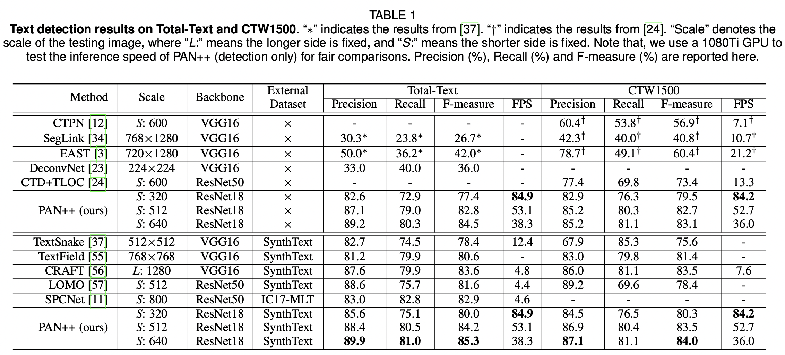

PAN++와 기존 STD 모델 간의 Precision, Recall, F1 Measure 비교

PAN++와 기존 End2End text spotting 모델 간의 F-measure와 Inference Speed 비교

### PAN++ 모델의 탄생 배경

텍스트 탐지가 어려운 이유는 탐지해야하는 텍스트의 형태가 매번 다르기 때문이다. 빳빳한 A4용지 위에 또렷하게 프린트된 텍스트는 탐지가 쉬운 반면, 종이가 구겨져있다거나, 잉크가 흐릿하다거나, 아니면 글자가 일직선이 아닌 다른 형태(폴리곤)로 적혀져있거나 하는 예외케이스들이 존재하기 때문이다. 

텍스트 탐지 방법은 크게 1)예측값을 텍스트 탐지 박스 좌표로 잡는 regression-based와 2)텍스트 탐지 영역을 픽셀단위로 예측하는 segmentation-based로 나뉜다. 텍스트 형태가 일정한 사각형이 아닌 폴리곤의 형태일 때, 아래 그림 (b)처럼 탐지 박스의 네 좌표를 결괏값으로 갖는 regression based는 폴리곤 영역을 제대로 잡기가 힘들다. 좀 더 다양한 텍스트 형태를 탐지하기 위해서 고안된 **segmentation based** 방법은 아래 그림 (c)처럼 형태 자체는 잘 잡지만, 구분되어야할 텍스트 라인이 합쳐져서 잡힌다는 문제점이 있다. ‘we won’t go back,’ 과 ‘we will fight back!’ 텍스트는 각각 다른 텍스트 인스턴스로 분리되어 잡혀야 맞지만, **텍스트 간의 간격이 가깝다보니, 여러 개의 텍스트 인스턴스들을 하나의 텍스트 박스로 인식(conglutination)하는 문제점**이 발생한다.

PAN++(선행연구 PSENet, PAN)는 위 문제점을 해결하기 위해 고안된 모델로, 서로 다른 텍스트 인스턴스를 구분짓기 위해서 텍스트 영역 라벨링을 **텍스트 영역,** **텍스트 커널**, 그리고 **텍스트 인스턴스,** 총 세 가지로 구분하여 모델학습을 진행하고, **Pixel Aggregation 기법**을 사용해서 텍스트 인스턴스들을 구분한다. 

** Regression-based와 Segmentation-based가 궁금하다면 이 [링크](https://www.notion.so/STD-Regression-vs-Segmentation-9d9ae48d53b94942b7cf640e48b20ae3?pvs=21) 참조

(a) 원본 이미지 (b) regression based 탐지 결과 (c) segmentation based 탐지 결과 (d) PAN++(segmentation based) 탐지 결과

# Model Architecture

PAN++ 모델의 모델 구조는 크게 backbone, neck, head 세 단계로 이루어져있다.

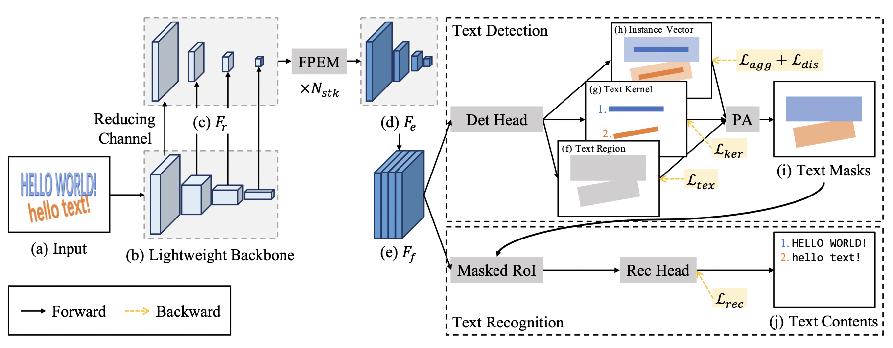

PAN++ 모델 구조

### 1. backbone

인풋 이미지로부터 featuremap을 추출하는 백본망으로는 resnet18, 50, 101을 제공한다. 

**백본망의 결과값으로는 인풋 이미지에 상응하는 featuremap이 총 4판**이 나오는데, 각각 인풋 이미지 해상도의 1/4, 1/8, 1/16, 1/32를 갖는다. (다운샘플링하는 컨볼루션(kernel_size = 1, stride = 2)를 여러번 거칠수록, 해상도는 줄어들고, feature level은 높아진다. 해상도 1/32 featuremap은 해상도 1/4 featuremap보다 해상도는 낮지만, 더 high-level feature를 갖는다.) 

이렇게 **4가지의 해상도로 나누어서 featuremap을 추출하는 이유는 다양한 feature-level의 표현력(representation)을 학습에 잘 반영하기 위함**이다.

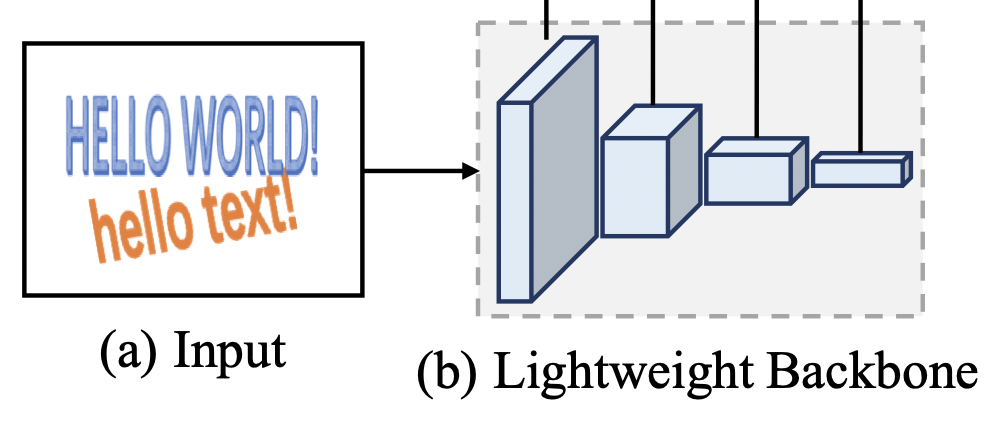

백본 인풋 (a)과 아웃풋 (b). 결괏값은 왼쪽부터 오른쪽으로 인풋이미지의 1/4, 1/8, 1/16, 1/32 해상도를 갖는다. 

### 2. neck

4개의 featuremap은 컨볼루션 레이어를 거쳐 채널수를 128개로 고정되고(그림의 Reducing Channel 단계), N_stk개의 **FPEM 모듈을 거쳐 인풋의 1/4 해상도와 512개의 채널을 갖는 아웃풋으로 변환**된다. FPEM(Feature Pyramid Enhancement Module)은 **마찬가지로 다양한 feature-level의 표현력을 학습에 반영하고, 신경망 층이 깊어짐에 따라 학습되어야할 값들이 희미해지는(gradient vanishing) 문제를 보완하기 위한 모듈**이다.

** FPEM에 대해서 좀 더 궁금하다면 이 [링크](https://www.notion.so/FPEM-Feature-Pyramid-Enhancement-Module-ba91b72ae2184555a456ff26f3172a72?pvs=21)를 참조

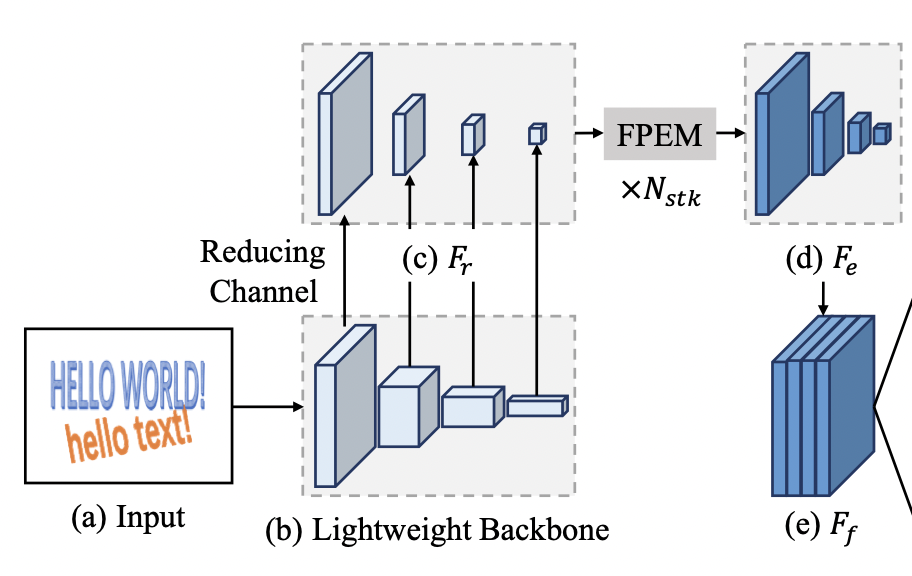

### 3. head

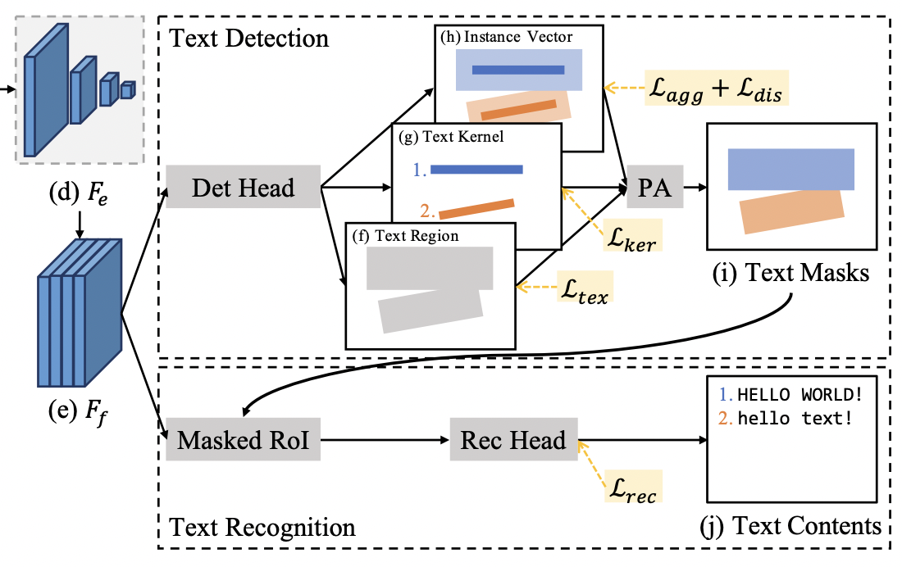

neck에서 받은 $H/4*W/4*512$ 형태의 featuremap(위 그림 (e)  $F_f$ )을 활용해서 Text Region, Text Kernel, Instance Vector에 대한 세 가지 아웃풋을 예측한다. 세 가지 아웃풋을 종합해서 Pixel Aggregation 기법으로 최종 아웃풋에 해당하는 Text Masks를 도출한다. 그리고 Text Masks로 얻은 텍스트 영역(Masked RoI; $F_f$ 위 Text Masks 영역을 투영(reflect)시킴)에서 텍스트가 어떤 문자인지 예측하는 텍스트 인식(STR) 단계를 수행한다. 이 중 우리는 Text Region, Text Kernel, Instance Vector가 무엇인지 그리고 어떻게 Pixel Aggregation을 통해 최종 아웃풋을 도출하는지 집중해서 살펴볼 것이다. 

# PAN++의 아웃풋 형식

텍스트 이미지를 라벨링(또는 어노테이션)하는 방법은 여느 이미지 라벨링과 비슷하다. 텍스트 인스턴스의 단위를 어떻게 설정할지나 라벨링에 [UNK]와 같은 특수한 태그를 추가해서 데이터 처리에 활용하는 등 세부적인 사항에서 그 편차가 있을 수 있겠지만, 텍스트 영역에 4점 이상의 박스를 그리고, 텍스트 내용으로 라벨링하는 것이 일반적이다. 원하는 결과를 도출하기 위해서 이 보편적인 라벨링을 PAN++에서는 어떤 식으로 활용하는지 주목하자. (라벨링 형태 자체를 변환하기 위해서는 많은 비용이 들기 때문에, 딥러닝 모델들은 기존의 라벨링을 잘 활용해서 독창적인 기법을 만들어내곤 한다.)

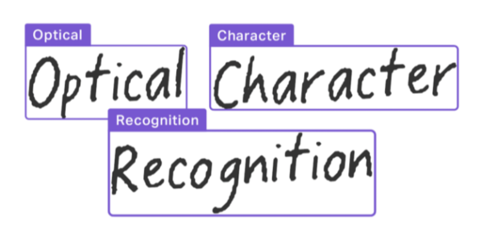

PAN++는 이 보편적인 라벨링을 Text Region, Text Kernel, 그리고 Instance Vector, 총 세 가지의 값을 활용한다.

- Text Region : 라벨링된 텍스트 박스와 동일하다. Segmentation map에 `cv2.drawContours` 함수로 마킹한다. 형태는 원본 이미지 기준 $H/4*W/4*1$ 형태다.
- Text Kernel : 서로 다른 텍스트 인스턴스들이 가까워서 하나의 인스턴스로 잡히는 문제(conglutination)를 해결하기 위해서 고안되었다. 아래의 그림처럼 Text Region을 텍스트 박스 중심으로 응축(shrink)시킨다. shrink 구현은 `pyclipper` 모듈을 활용한다. 형태는 원본 이미지 기준 $H/4*W/4*1$ 형태다.
- Text Instance : Text Kernel과 마찬가지로 위 conglutination 문제를 해결하기 위해서 고안되었다. 각 텍스트 박스는 고유한 Text Instance이다. Segmentation map에 `cv2.drawContours` 함수, for loop와 enumerate 함수로 서로 다른 픽셀값으로 색칠하여 고유한 인스턴스를 마킹한다. (영역이 겹칠 경우, 뒤에 오는 인스턴스 넘버로 마킹?) 형태는 원본 이미지 기준 $H/4*W/4*D$ 형태다. (코드 상에는 $D=4)$

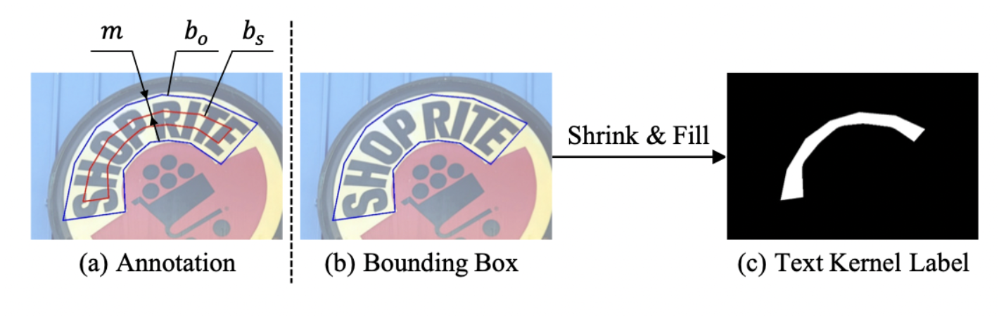

텍스트 라벨링에서 text kernel을 도출하는 방법

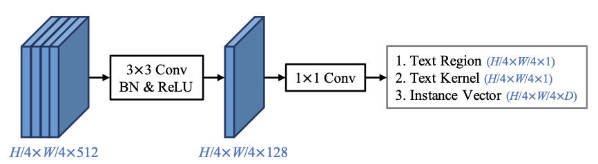

아래는 PAN++의 아웃풋 예시이다. 

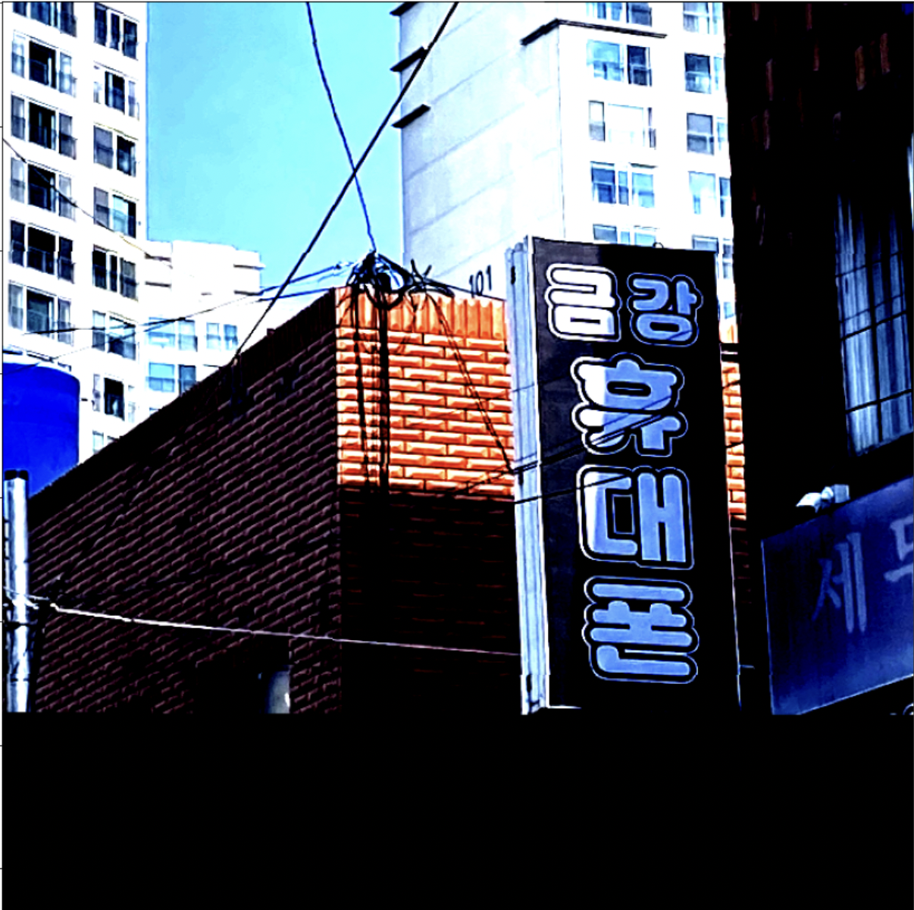

원본 이미지

Text Region

Text Kernel(Text Region보다 중심으로 응축된 영역)

Text Instance (고유한 텍스트 박스 마스킹)

# 손실 함수

이제 우리에게 Text Region, Text kernel, 그리고 Text Instance에 대한 정보가 생겼다. 이 정보를 **Train 단계에서** 어떻게 활용해야 **가까운 두 개의 텍스트가 겹치지 않고 서로 다른 텍스트 인스턴스로 구분되면서 텍스트 영역을 충분히 커버**할 수 있을까?

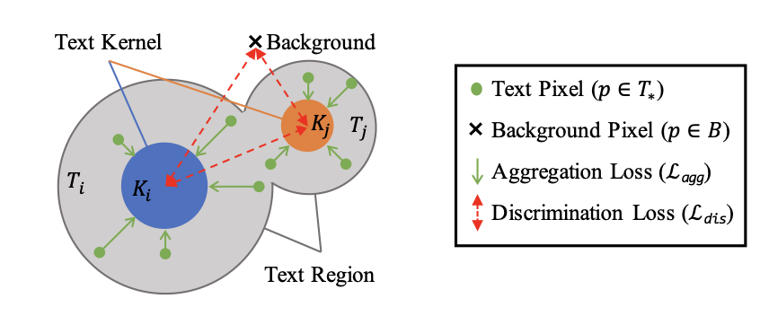

text kernel i(ki; 파랑)는 text region만큼 확장하지만, 다른 커널(주황색)과 겹치지 않아야한다.

탐지 손실함수는 text loss, kernel loss, 그리고 emb loss 총 세 종류의 **loss의 합**으로 이루어진다. 

- **text loss** : 텍스트 영역에 대해서 dice loss 적용. dice loss는 예측값과 정답값 간 겹치는 영역을 2로 곱한 후, 예측값과 정답값을 더한 값을 나누는 손실함수로 segmentation based 모델에서 자주 쓰인다.
- **kernel loss** : 텍스트 커널에 대해서도 마찬가지로 dice loss를 적용한다.
- **emb loss** : Text kernel은 Text Region이 응축된 영역이기 때문에, 다른 인스턴스와 겹칠 일은 거의 없다. 이 텍스트 커널에서 픽셀 영역을 조금씩 확장해나가면 어느 지점에서는 Text Region을 충분히 커버하지만, 거기서 더 나아가게되면 다른 Text Instance와 겹치게 된다. 모델의 학습방향은 Text Kernel이 1) 다른 인스턴스 영역과는 구분(**discrimination loss**)되면서, 2) Text Region만큼은 확장(**aggregation loss**)하는 것이다.
    
    
    aggregation loss
    
    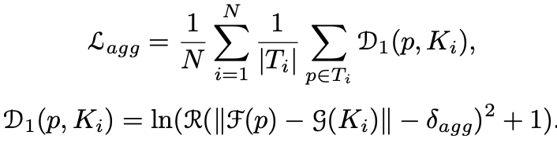
    
    F(p) = instance vector, g(K) = instance vector of text kernel. D1은 instance vector와 instance kernel 간의 거리를 나타낸다
    
    discrimination loss
    
    
    
    background와 인스턴스 간의 거리와 서로 다른 인스턴스 간의 거리를 나타낸다. 서로 다른 인스턴스 간의 거리를 계산하기 위해서 `torch.repeat` 과 `torch.eye` 를 활용한 것이 주목할만 하다. 
    

# Pixel Aggregation

위 손실함수를 잘 반영해서 학습하면, 꽤 정교한 아웃풋(text region, kernel, instance)을 얻을 수 있다. 더 정교한 결과를 위해서 PAN++는 **inference단계에서는** pixel aggregation 기법을 사용한다.

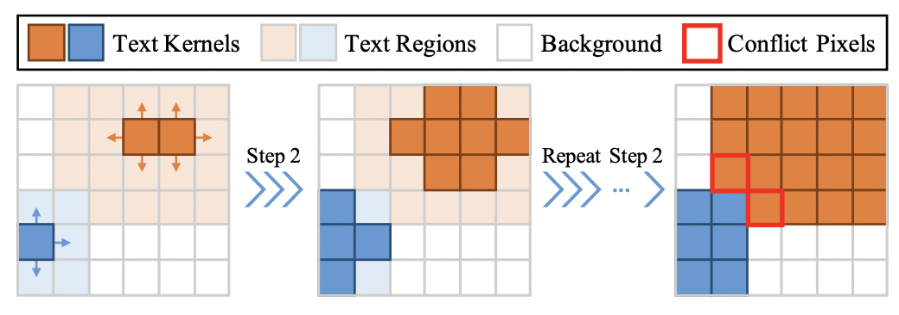

1. 결괏값(코드상 kernels, emb)에 대해서 connected component 기법을 적용한다. (connected component 기법은 같은 값을 갖는 인접한 픽셀들을 그룹화해주는 기법이다) 그룹화된 pixel들은 text kernel과 같은 의미를 갖는다.
2. 각각의 kernel은 4방향으로 픽셀을 확장해나간다(BFS와 같은 방식). 탐색하는 픽셀의 instance vector 간의 유클리디언 거리가 d보다 작을 경우에만 확장하여, 다른 instance들과 겹치는 일이 없도록 한다
3. 근접 픽셀이 없을 때까지 두번째 스텝을 반복한다.

해당 pixel aggregation 코드는 Cython으로 짜여있다. 파이썬에서 `cv2`나 `numpy` 라이브러리를 활용해도 충분히 구현이 가능하지만, 속도가 느린 편인데, 해당 코드는 정말 빠르다. Cython으로 다른 python code들과 함께 구동가능하다는 점도 주목할만하다. 

# Outro

End2End Text Spotting 모델 PAN++의 텍스트 탐지(STD) 부분에 대해서 살펴보았다. PAN++는 실제로 다른 우수한 텍스트 탐지 모델들(CRAFT)과 비교했을 때, 굉장히 성능도 잘 나오고 빠른 편이다. 모델 구조, 라벨링을 활용하는 방법, 커스텀한 손실함수, 그리고 inference 시 후처리까지 아주 꼼꼼하게 설계되어 있기 때문에 가능한 성능이지 않나 싶다.

해당 논문과 모델 코드까지 천천히 뜯어보면서 논문 하나(모델 하나)를 만들기 위해서 저자들이 얼마나 많은 실험과 머리를 쥐어짜는 고심을 했을지 생각해보았다. 모델을 구성하는 단계마다 최신/최선의 기법들을 적용해서 0.001%의 정확도라도 더 끌어올리려고한 노고가 느껴졌다. 이 글에 논문의 최대한 많은 내용을 담으려고 노력했지만, 모델의 STR 부분, 모듈 구성 시의 builder 패턴, 학습 시의 ohem 기법, pixel aggregation의 cython 익스텐딩 등 커버하지 못한 부분도 많다. (누락된 부분에 대해서는 차차 살펴보면서 머릿속에 익히려고 한다)

한편으로 코드를 천천히 뜯어보고 정리하면서 배운 점 또한 많다. 

- 모델을 구성하는 모듈들은 어떻게 정리하는 게 깔끔한지 알게 되었다. ([CRAFTS 코드 구현](https://github.com/watanka/CRAFTS-implementation)할 때, 가장 힘들었던 부분이 코드가 지저분한데, 방대한 양을 어떻게 정리해야할지 모르겠었다는 것)
- 가지고 있는 데이터를 활용해서 원하는 아웃풋을 만들어내는 것도 모델 성능을 높이기 위한 하나의 방법이라는 것을 알게 되었다. (높은 정확도까지 보장된다면 새로운 논문이 나올지도..?)
- 그 외에 자잘한 함수들(`torch.Conv2d`  의 `groups` 인자, `torch.repeat` 과 `torch.eye` 로 두 개의 for문 처리 등등..)
