# Intro

11월 16일부터 3일간 카카오 if 2021이 열렸다. 개발자들에게 흥미로운 컨텐츠들로 가득했는데, 그 중 엔터프라이즈 팀에서 진행한 'OCR 모델 진행 개편기'가 눈에 들어왔다. 카카오는 OCR을 어떻게 구성하고 있을까? (OCR이 무엇인지 궁금하다면, [이 글](/blog/2021-11-20-ocr/index.md)을 읽어보길 권한다.)
<br>
</br>

OCR에 대한 설명과 카카오에서 구성하고 있는 OCR파이프라인을 소개했다. `Text Detection`과 `Text Recognition` 사이에 `Script identification` 을 두어 인식하는 이미지가 어떤 언어인지 구별한다고 한다. 이렇게 언어를 구별하는 단계를 두면, 언어별 특화된 모델 웨이트를 사용해서 더 광범위한 데이터 범위와 언어별 더 정확한 예측이 가능해진다. 
<br>
</br>

그 후에, 인식한 단어들을 기반으로 해당 단어가 어떤 개체(entity; 사람, 조직, 시간 등 일반화할 수 있는 범주)에 속하는지 인식하는 `NER(Named Entity Recognition)` 과 텍스트 간 알맞게 묶어주는 `Text Clustering` , 그리고 등록된 템플릿에 단어들을 매칭하는 `Template Matching` 으로 후처리를 했다고 한다.


이 글은 어떻게 OCR 파이프라인을 AS-IS(현재 상태)에서 TO-BE로 개편하기 위해 어떤 점들을 고쳤는지에 대해 주목하고, 개편 전과 후의 모델 구조를 살펴보려고 한다.

(개인적으로 조금(보통은 1~2% 이내의) 나은 성능 향상을 위해 이미 성능이 어느정도 나오는 파이프라인을 과감히 놓아주고 새로운 체크포인트에서 출발을 하는 것은 결코 쉬운 일이 아니었을 거라고 생각한다. )
<br>

</br>

## OCR 개편 목표

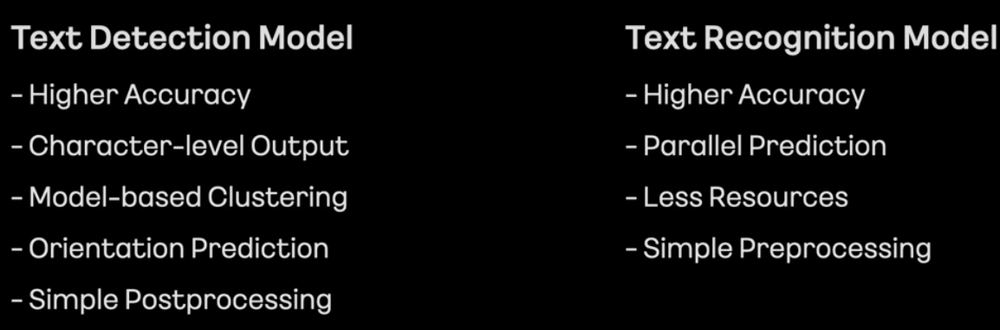

새로운 시도를 위해 목표를 확실하게 정의하는 과정은 필수다. 텍스트 탐지 모델의 목표는 높은 정확도, 글자 레벨 박스, 모델을 통한 텍스트 클러스터링, 텍스트 방향 예측, 그리고 간단한 후처리였고, 텍스트 인식 모델의 목표는 마찬가지로 높은 정확도, 병렬 예측(더 빠른 연산을 위해서), 더 적은 리소스, 그리고 간단한 후처리였다고 한다. 그럼 텍스트 탐지 모델부터 어떤 식으로 개편했는지 알아보자.

<br></br>

# 텍스트 탐지 모델(STD)

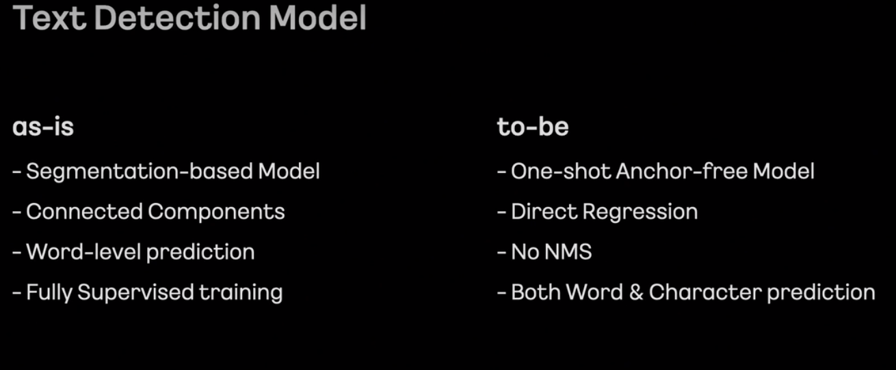

### AS-IS

- 나열한 as-is 조건 중에 부합하는 모델 중 가장 유명한 모델은 아무래도 [CRAFT](https://github.com/clovaai/CRAFT-pytorch)인듯하다.

Object Detection

- 이미지 내에 물체의 영역을 탐지하는 물체 탐지 모델은 박스 좌표를 추출하는 방식에 따라, Segmentation-based와 Regression-based로 나뉠 수 있다.
1. Segmentation-based
- Segmentation-based는 원본이미지에 대응되는 Featuremap을 뽑아서 pixel 단위 처리로 물체 영역을 뽑는 방식이다.
- Segmentation-based Text Detction의 대표적인 모델, CRAFT는 적절한 파라미터 조절로 word-level과 character-level 텍스트 탐지가 가능하다.
- 아래 그림처럼 모델을 거친 각 글자들은 heatmap(아보카도처럼 생긴 동그라미)으로 표현된다. 정 가운데 빨강이 1에 가까운 값, 가운데에 멀어질수록 0에 가까운 파랑색 값을 갖게 된다. 이는 글자가 실제로 위치할 확률(probability)로도 해석이 가능하다.

![[출처] : **CRAFT: Character-Region Awareness For Text detection**](craft_example.gif)

[출처] : **CRAFT: Character-Region Awareness For Text detection**

- 뽑은 heatmap 위에 일정값 이상을 갖는 픽셀들끼리 합치고, 그 합친 영역을 구분하는 박스를 그리면 텍스트 영역 탐지가 완성된다.
- regression-based 방식처럼 박스 형태에 얽매이지 않고, pixel 단위로 텍스트 영역을 탐지하기 때문에 다양한 물체 형태를 예측 가능하다는 장점이 있다.
- 모델에서 나온 결과로부터 물체 영역을 탐지하는 후처리가 시간이 오래 걸린다는 단점이 있다.
- 한 이미지에 텍스트가 오밀조밀 모여 있을 가능성이 높은 문자 탐지 태스크의 특성상, segmentation-based 기법을 사용할 경우, 한 텍스트 그룹이 다른 텍스트 그룹과 겹치게 되는 경우가 생길 수 있다. 아래 그림처럼 'PLEASE', 'TURN', ... 등의 텍스트들은 개별의 텍스트 박스로 잡혀야 마땅하지만, heatmap 영역 간격이 가까우면 하나의 박스 형태로 잡히는 단점이 있다.

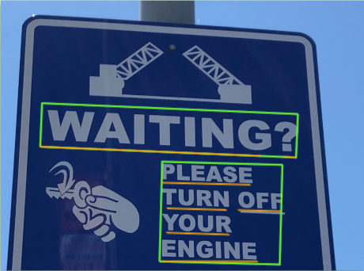

1. Regression-based
    
    

### TO-BE

- 그렇다면 to-be는?
- 조건별로 나열해서 모델을 추측해보자.
- TO-BE 조건들
    - **one-shot anchor-free model**
        - anchor free는 카카오에서 어떤 모델을 사용하는지 추측하는 데에 가장 큰 단서였다.
        - 물체 탐지(object detection) 모델은 크게 regression-based와 segmentation-based로 나뉜다.
        - regression-based는 다시 anchor-based와 anchor-free로 나뉜다. 그 중 anchor-based는 이미지 인풋을 격자 셀로 나누고, 각 격자마다 미리 정의해둔 k개의 앵커 박스들을 할당해서 물체의 박스 좌표를 표현한다.
            - 아래 그림을 예로 들면, 4x4 격자 셀에 2개의 앵커박스가 존재한다.
            - 박스 좌표는 보통 4개로 표현하기 때문에 아웃풋 형식은 4x4x(4*2)의 행렬이 된다.
            - 격자 셀 각각에 대해서 2개씩의 앵커박스, 그리고 각 앵커박스는 4개의 좌표로 구성
            - 한 격자 셀에 같은 클래스가 두 개 이상 존재하는 경우와 같은 앵커박스 형태가 두 개 이상 존재하는 경우는 이 anchor box구조가 커버하지 못하는 예외케이스이긴 하지만, 격자 셀 개수가 많아질수록 언급한 경우들을 드물다.
            - 학습을 위한 라벨링의 경우, 각 격자셀에 대해서 정답 박스 영역(gt box)과 앵커박스별 IoU를 구해서 positive 또는 negative, 아예 겹치지 않는 경우 background로 설정한다.
            
        
        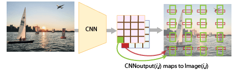
        
        - [anchor-based detection](https://nuggy875.tistory.com/33)는 사전정의된 앵커박스의 정보에 따라 성능이 바뀌는 문제와, 정확한 박스영역 탐지를 위해서는 더 많은 앵커박스가 필요하다는 문제, 그리고 각 그리드셀의 앵커박스 수만큼 (예: 50x50 grid x 80 anchor boxes=200k) gt를 포함하는지 안 하는지(positive인지 negative인지) IoU를 일일히 계산해야한다는 연산적 부담이 있다.
        - 이를 보완하기 위해 나온 것이 anchor-free model. anchor free의 대표적인 모델 FCOS(Fully Convolutional One Stage Object Detection) 모델을 살펴보자.
        

        FCOS
        
        |  | anchor-based | anchor-free |
        | --- | --- | --- |
        | 격자 셀 라벨링 | 정답 박스와의 IoU 계산해서 positive 또는 negative 설정 | 정답 박스 안에 속하면 positive, 정답 박스가 여럿일 경우 ambiguous |
        | regression loss | L1 Loss | IoU loss |
        | classification loss  | Binary Cross Entropy Loss  | Focal Loss  |
        | 박스 좌표 regression 방법 | anchor box와의 중심으로부터 박스값 보정  | gt box 경계값으로부터의 거리 |
        - Centerness라는 개념 도입. heatmap과 유사
        - anchor based는 anchor box와의 offset을 계산하지만, FCOS는 중심점으로부터 거리를 계산한다.
        - L_cls는 focal loss, L_reg는 IoU loss
        - anchor box scale 대신 FCOS는 bounding box regression의 범위를 제한
    - **Direct Regression**
        - Indirect Regression은 앵커박스로부터 박스좌표를 보정하는 과정
        - Direct Regression은 중점으로부터 박스좌표를 바로 보정하는 과정
        - Segmentation-based에서 Direct Regression. 이는 박스를 구한 후, offset으로 박스 영역을 텍스트 영역에 좀 더 fit하게 깎는 과정이 있을 것 같다.
    - **No NMS**
        - Non-Maximum-Suppression을 빼고도 정확한 박스 후보군을 뽑을 수 있는 방법?
        - centerness라는 개념을 사용하면, 텍스트 영역 내의 모든 픽셀값이 다 같은 값을 갖는 것이 아니라, 중앙에 가까울수록 더 높은 값, 멀수록 더 낮은 값을 갖게 된다. min(l*, r*)와 max(l*, r*) 간 격차가 적다는 것은 중앙에 가깝다는 의미이다.
            
            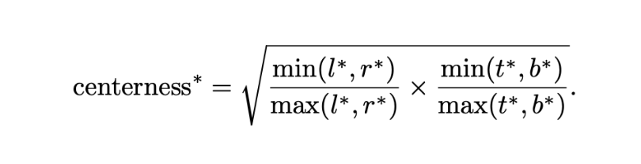
            
        - [MT](https://www.notion.so/MT-Multi-Perspective-Feature-Learning-Network-a6914981053f4d6b86e0cb07cf50fea2?pvs=21)는 NMS 제거
    - **Both Word & Character prediction**
        
        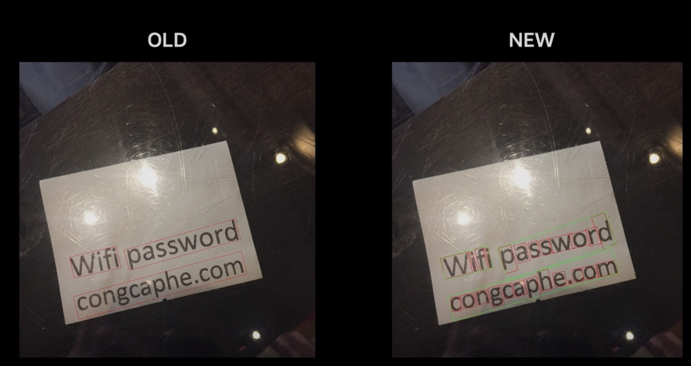
        
        - 사실 이 과정이 가장 궁금했다. CRAFT도 나온 heatmap으로부터 heatmap이나 affinity threshold를 조정하면 단어에서 글자 단위 탐색이 가능하지만, 정확하다고 하기엔 조금 무리가 있다.
        - Direct Regression이 character 단위로 결과를 뽑으면, offset으로 텍스트 영역을 깎는 과정에서 character들을 word로 합치는 과정이 있을 것 같다..?
        - 

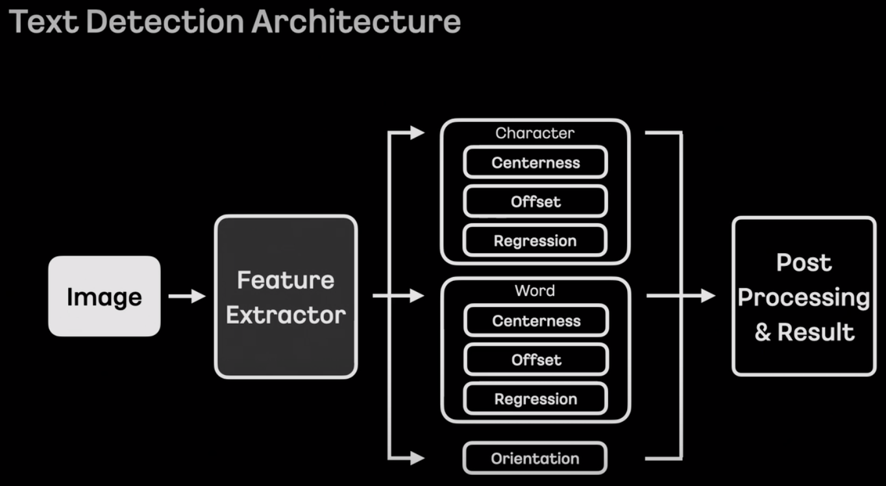

- centerness
- offset
- regression
<br></br>

# 텍스트 인식 모델(STR)

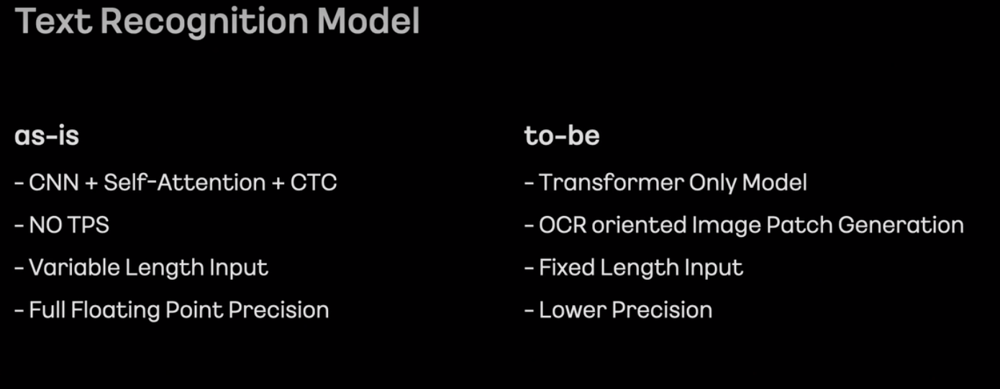

### AS-IS

- CNN + Self-Attention + CTC
- NO TPS
- Variable Length Input
- Full Floating Point Precision

### TO-BE

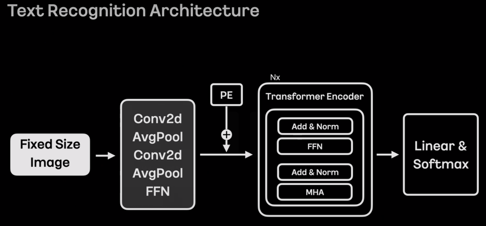

- 이 구조는 사실 [ViTSTR](https://github.com/roatienza/deep-text-recognition-benchmark)과 동일한 구조다.
- 한 가지 인상적이였던 것은 이미지 패치를 16x16이 아닌 텍스트 방향에 맞춰서 (보통 왼쪽에서 오른쪽으로 예상) column-wise하게 잘랐다는 점이다.
- STD 단계에서 orientation 방향을 구하는데, 이 값을 STR 단계에서 어떤 식으로 활용하는지 궁금하다.
    - 딱 떠오르는 방법은 orientation 방향에 맞게 왼쪽에서 오른쪽으로 회전.
- 듣고 보니 당연한 얘기인 것 같다.(훌륭한 논문의 개념을 다 읽고 나면, 마치 너무나도 당연해서 여태껏의 다른 방법들은 틀린 듯 느껴지는 것처럼)

<br></br>

# 학습 방법

## STD

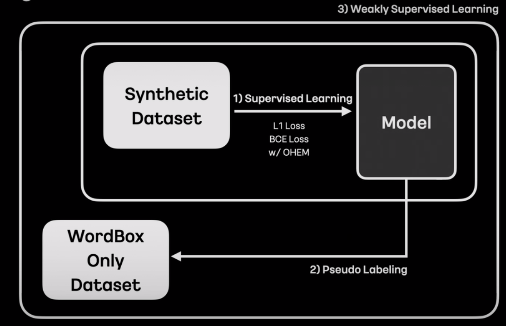

- L1 Loss(예측값과 GT 차이를 절대값으로 계산) : 아마 STD에 들어가는 값 중, [Regression(박스 좌표), Offset] 에 사용될 듯
- BCE(Binary Cross Entropy Loss)  : orientation과 centerness
- OHEM : Online Hard Example Mining의 약자. 학습 이미지의 픽셀 loss값 기준 임계값보다 큰 픽셀들을 hard sample, loss 값이 작은 픽셀들을 easy sample로 구별한다. negative pixel(easy sample) 양이 positive pixel의 양이 3배(조절 가능한 값)보다 많을 경우, negative pixel의 값은 전체가 아닌 top n개만큼(n < #negative pixel)만 반영한다.
    
    **hard sample는 학습에 상대적으로 많이 반영하고, easy sample은 적게 반영한다는 컨셉.**
    
    - OHEM이 사용된 예 (CRAFT)
        
        ```python
        # 해당 코드는 [CRAFT-Reimplementation](https://github.com/backtime92/CRAFT-Reimplementation/blob/craft/loss/mseloss.py)에서 가져온 코드
        import numpy as np
        import torch
        import torch.nn as nn
        
        class Maploss(nn.Module):
            def __init__(self, use_gpu = True):
        
                super(Maploss,self).__init__()
        
            def single_image_loss(self, pre_loss, loss_label):
                batch_size = pre_loss.shape[0]
                # sum_loss = torch.mean(pre_loss.view(-1))*0
                # pre_loss = pre_loss.view(batch_size, -1)
                # loss_label = loss_label.view(batch_size, -1)
        
                positive_pixel = (loss_label > 0.1).float()
                positive_pixel_number = torch.sum(positive_pixel)
                positive_loss_region = pre_loss * positive_pixel
                positive_loss = torch.sum(positive_loss_region) / positive_pixel_number
        
                negative_pixel = (loss_label <= 0.1).float()
                negative_pixel_number = torch.sum(negative_pixel)
        
                if negative_pixel_number < 3*positive_pixel_number:
                    negative_loss_region = pre_loss * negative_pixel
                    negative_loss = torch.sum(negative_loss_region) / negative_pixel_number
                else:
                    negative_loss_region = pre_loss * negative_pixel
                    negative_loss = torch.sum(torch.topk(negative_loss_region.view(-1), int(3*positive_pixel_number))[0]) / (positive_pixel_number*3)
        
                # negative_loss_region = pre_loss * negative_pixel
                # negative_loss = torch.sum(negative_loss_region) / negative_pixel_number
        
                total_loss = positive_loss + negative_loss
                return total_loss
        
            def forward(self, region_scores_label, affinity_socres_label, region_scores_pre, affinity_scores_pre, mask):
                loss_fn = torch.nn.MSELoss(reduce=False, size_average=False)
        
                assert region_scores_label.size() == region_scores_pre.size() and affinity_socres_label.size() == affinity_scores_pre.size()
                loss1 = loss_fn(region_scores_pre, region_scores_label)
                loss2 = loss_fn(affinity_scores_pre, affinity_socres_label)
                loss_region = torch.mul(loss1, mask)
                loss_affinity = torch.mul(loss2, mask)
        
                char_loss = self.single_image_loss(loss_region, region_scores_label)
                affi_loss = self.single_image_loss(loss_affinity, affinity_socres_label)
                return char_loss + affi_loss
        ```
        

## STR

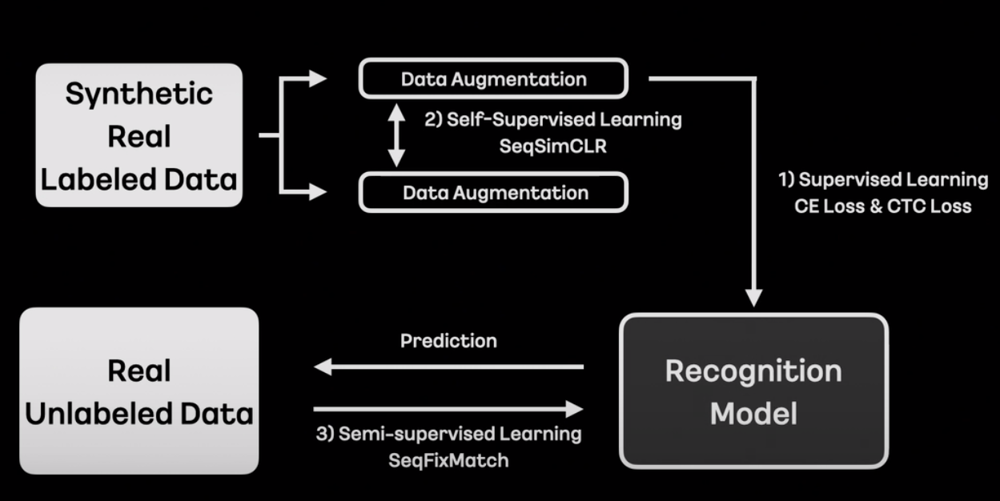

### SeqSimCLR

실제 라벨된 데이터로부터 Data Augmentation을 진행하면서 SeqSimCLR 기법을 사용했다고 한다. 

SimCLR의 개념은 이렇다.

1. 인풋 이미지에 서로 다른 데이터 증강 기법을 적용한다. (예를 들어, 하나는 색 변환, 하나는 rotation)
2. 두 이미지를 네트워크에 태워서 Representation으로 표현한다.
3. 다시 조그만 네트워크에 태워서 Projections로 뽑은 후, Contrastive Loss로 유사도 손실함수로 계산한다. 

![[출처] : [https://zablo.net/blog/post/understanding-implementing-simclr-guide-eli5-pytorch/](https://zablo.net/blog/post/understanding-implementing-simclr-guide-eli5-pytorch/)](Untitled 12.png)


[https://deep-learning-study.tistory.com/731](https://deep-learning-study.tistory.com/731)

### seqfixmatch

[https://github.com/google-research/fixmatch](https://github.com/google-research/fixmatch)

[https://ainote.tistory.com/6](https://ainote.tistory.com/6)


# Reference

[if(kakao) 2021 : OCR 모델 개편 진행기](https://if.kakao.com/session/73)

[Sequence-to-Sequence Contrastive Learning for Text Recognition](https://arxiv.org/pdf/2012.10873v1.pdf)

[PlugNet: Degradation Aware Scene Text Recognition Supervised by a Pluggable Super-Resolution Unit](https://www.ecva.net/papers/eccv_2020/papers_ECCV/papers/123600154.pdf)

[AE TextSpotter: Learning Visual and Linguistic Representation for Ambiguous Text Spotting](https://arxiv.org/pdf/2008.00714.pdf)

[MT: Multi-Perspective Feature Learning Network for Scene Text Detection](https://arxiv.org/pdf/2105.05455.pdf)

[What's wrong with the Bottom-up Methods in Arbitrary-shape Scene Text Detection?](https://arxiv.org/pdf/2108.01809.pdf)

[https://neverabandon.tistory.com/m/60](https://neverabandon.tistory.com/m/60)