# Introduction

이번에 리뷰할 페이퍼는 Multimodal Semi-Supervised Learning for Text Recognition이다. 2022년 AWS AI Lab에서 나온 ‘Multimodal’과 ‘Semi-Supervised’가 키워드인 텍스트 인식 모델이다. 우선 ‘Multimodal’부터 살펴보자.

## MultiModal

  불과 5년 전만 해도 컴퓨터가 글을 읽는 일은 무리였다. 물론 단어 몇 개나 미리 지정해둔 트리거 신호를 사용해서 글자를 인식하는 경우는 있었지만, 한 이미지에 몇 백개가 넘는 글자를 오탈자 하나 없이 다 맞추는 것은 불가능에 가까웠다. 게다가 몇 백개의 글자를 포함한 이미지가 몇 만장이라면? 정확도는 현업에서 사용할 수 있는 수준이 아니였다. 하지만, 딥러닝의 발전과 함께 글자를 읽는 [OCR](https://www.notion.so/OCR-d61d9146f5f749d6bcd482e722913a49?pvs=21)(Optical Character Recognition) 특성 모델들이 발전하면서 이제 AI는 **글자를 꽤 잘 본다.** 꽤 높은 정확도와 사람이 따라올 수 없는 속도로 문서 이미지를 보고 그 안에 포함된 글자들을 내뱉는다.

네이버 OCR 결과 예시

### 보고 읽는다는 것

 하지만, 한 가지 아쉬운 점은 ‘**읽다’**는 것은 ‘**본다**’와는 다르다는 점이다. ‘읽다’라는 행위는 문장 성분 하나하나를 독립적으로 보는 것 뿐만 아니라 문맥(context)을 함께 이해하는 것이다. 대상이 단어라면, 단어를 구성하는 글자들을 유기적으로 이해하는 과정이 필요하고, 대상이 문장이라면, 문장을 구성하는 단어들 각각과 그 단어들이 서로 맺는 관계를 이해하여 문장을 인식하는 과정이 필요하다. (그런 의미에서 책을 읽는 건 우리가 생각한 것보다 훨씬 어려운 일일지도 모른다) 아래 그림을 한 번 살펴보자.

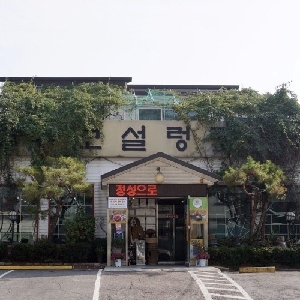

*본다 ≠ 읽는다*

  사진의 간판에 뭐라고 적혀있는걸까? 이 사진을 ‘보기'만 했을 때, 추출해낼 수 있는 단어는 ‘보’, ‘설’, ‘렁'이다. 나무에 어렴풋이 가려진 글자가 두 개정도 더 있는 것 같지만, 해당 이미지를 기존의 OCR프로세스에 돌렸을 때, 나올 수 있는 결과는 ‘보', ‘설', ‘렁' 뿐일 것이다. 하지만, 사람은 이 이미지를 보고 나무에 가려져 보이지 않는 ‘탕'까지 유추해낼 수 있다. 보이는 글자 ‘설렁'을 보고 ‘탕’까지 읽어낸 것이다. 이것이  문맥을 이해했을 때 나올 수 있는 결과이다. 이처럼 사람은 ‘**보고 읽는**' 반면에, 현재(어쩌면 이미 과거의) OCR 프로세스는 ‘**보는**' 행위에 그친다는 단점이 있다. 

이런 단점을 해결하고자 다른 데이터 도메인을 함께 활용하는(e.g: text + vision, vision + speech) multi-modal  연구들이 진행되고 있다. multi-modal 모델의 예로는 문장이 말한대로 그려주는 OpenAI의 Dall-E나 LG에서 개발중인 엑사원 등이 있다.(아래는 직접 뽑아본 Dall-E 이미지 아웃풋들이다.) 

white horse face with carrot on the forehead, oil painting

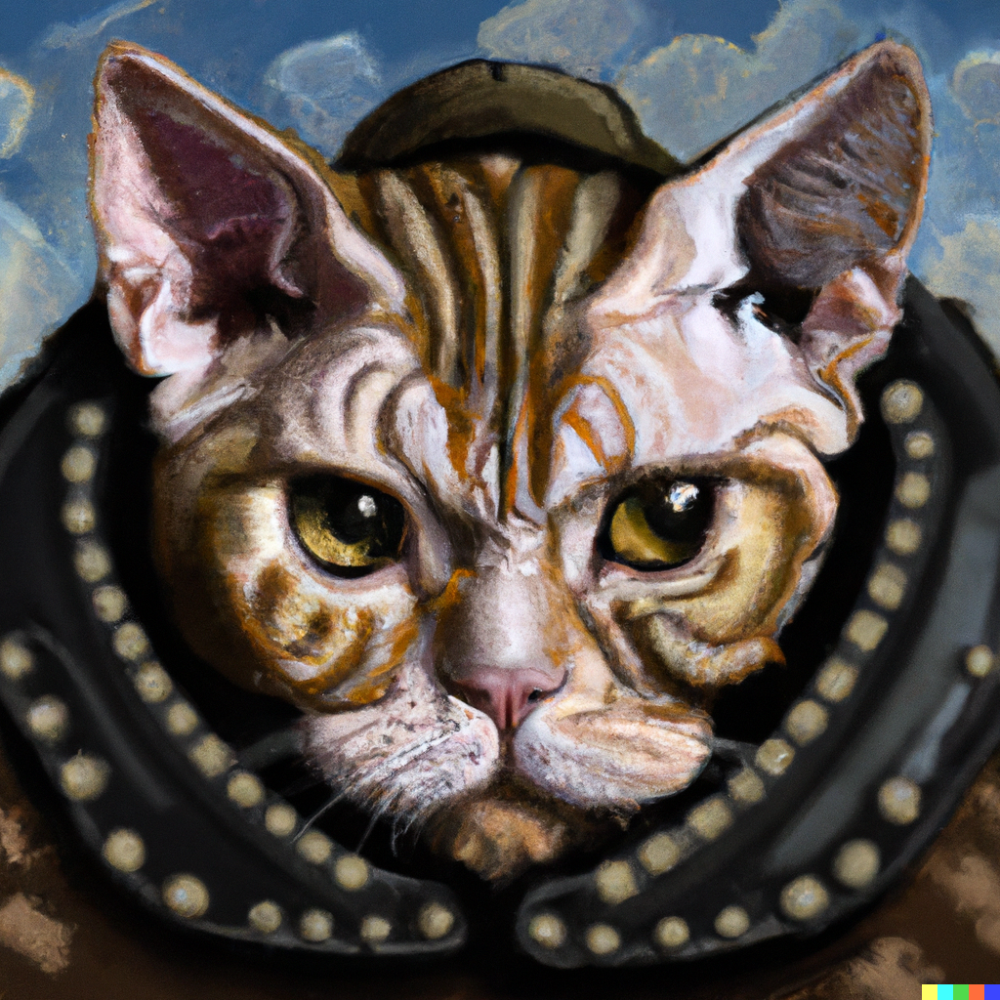

van gogh style armored cat

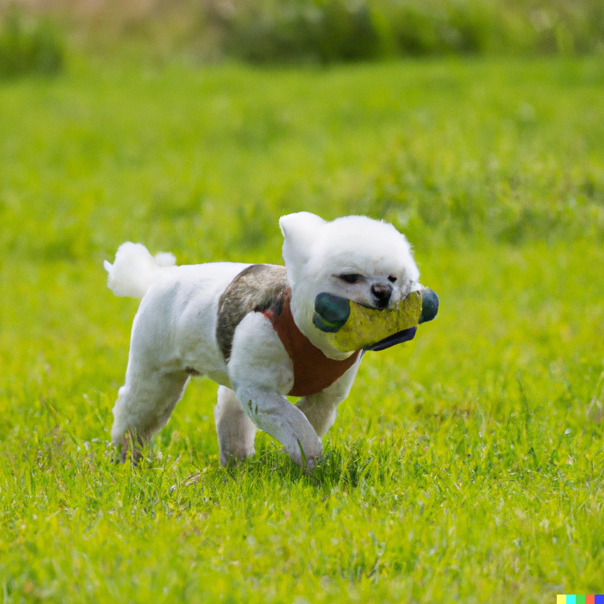

armored maltese in battlefield

  한 이미지에는 픽셀뿐만 아니라, 텍스트로써 이해할 수 있는 문맥들이 존재한다. 컴퓨터 비전과 자연어 처리를 융합한 이번 페이퍼의 모델 SemiMTR(Semi-Supervised Multimodal Text Recognition)은 이미지로 한 번, 그리고 텍스트로 다시 한 번 이미지를 인식한다.

## Semi-Supervised

딥러닝과 빅데이터 시대가 도래하면서 무엇보다 데이터의 중요성이 강조되었고, 그만큼 방대한 양의 데이터가 공개되었다. CNN과 같은 지도학습 모델은 데이터와 상응하는 답안지(라벨링)를 필요로 한다. 문제는 데이터의 양이 커질수록, 자연스럽게 컴퓨터가 답안지로 사용할 라벨링 비용 또한 커진다는 것이다. 쉴새없이 쏟아지는 데이터의 양에 비해 라벨링은 턱없이 부족하기만 하다. 그럼 어떻게 해야할까? SemiMTR모델은 1)가지고 있는 데이터를 더 효율적으로 활용하여 모델을 학습시키는 방법과, 2)모델을 사용해서 라벨링을 대체하는 방법을 활용한다. 

1. 가지고 있는 데이터를 더 효율적으로 활용하여 모델을 학습시키는 방법

데이터를 더 효율적으로 활용하기 위해서 컴퓨터만 이해할 수 있는 공간에다가 가지고 있는 데이터들을 나열시킨다. 데이터를 나열시키면서 데이터 간의 관계(거리)를 하나씩 학습해나간다. 예를 들어, 학습이 제대로 이뤄졌다면, 단어 ‘king’과 ‘queen’ 간의 관계(거리+방향)는 ‘man’과 ‘woman’의 관계와 비슷하다는 걸 알게 된다. 독립적인 데이터 포인트 하나에 대해서 하나의 라벨링으로 학습하는 것이 아니라, 두 개 이상의 데이터 간의 관계를 학습해나가는 것인데, 이를 **contrastive learning** 기법이라고도 한다. 

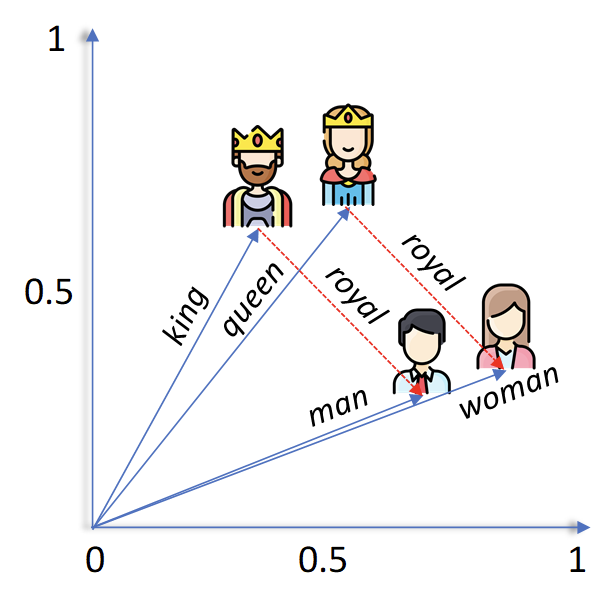

1. 모델을 사용해서 라벨링을 대체하는 방법

모델이 일정 이상의 성능을 확보했다고 가정하자. 99.999% 맞출 거라는 확신이 있는 데이터들만 따로 모아놓는다. 그리고 그 데이터들을 모델이 인식하지 못하지만 사람은 인식할 수 있는 수준의 변형(augment)시킨다. 그렇게 되면, 결과물로 모델이 생성한 99.999% 확신할 수 있는 라벨링과 모델이 아직 학습하지 못한(사람은 인식하지만) 패턴을 가진 데이터 먹거리가 생긴다. 라벨링이 없어도 모델이 자급자족할 수 있는 수단이 생긴 것이다.

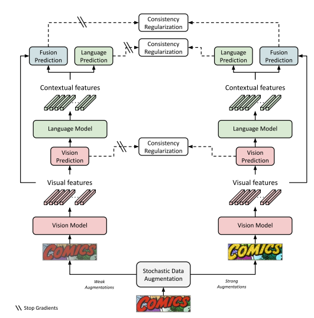

아래는 논문을 읽고 요약한 내용이다.

### Abstract

- 최근까지 텍스트 인식기를 학습시키기 위한 실제 텍스트 이미지 데이터셋이 부족했었음
- 학습을 위해 합성 데이터를 사용한 지도 학습에 초점을 뒀었음
- 라벨링 없는 실제 텍스트 이미지들이 대량 방출됨
- 이 리소스들을 활용하기 위해, semi-supervised 방법들이 나오기 시작함
- 아주 소수의 방법들만 vision/language를 활용한 multi-modal 구조를 가지고 있음.
- 이 간극을 메꾸기 위해, multimodal 방식의 텍스트 인식기를 소개함 (SemiMTR)
- 해당 방법은 추가적인 학습 절차를 삼가하고, 현 3단계 multi-modal 학습 방식을 유지함
- 우선 vision 모델을 사전학습 시켜 self-supervised 학습과 supervised-학습을 합침
    - 더 자세히는, 기존의 visual representation learning algorithm을 확장시키고 글자인식을 위한 contrastive-based 방식을 소개함.
- 텍스트 뭉치들(corpus)를 사용해서 language 모델을 학습한 후에는 전체 네트워크를 약(weakly)과 강(strongly) 증강(augmented)된 텍스트 이미지들 간의 시퀀셜, 글자레벨, consistency regularization을 활용하여 파인튜닝함
- 새로운 셋업에서, consistency는 각 modality에서 각각 시행됨
- 추가 실험에서는 우리의 방법이 현 학습 스키마들의 정확도를 넘어서고, 텍스트 인식 벤치마크에서 최신 성능을 보여주는 것을 확인할 수 있었음

### Introduction

- ABINet이라는 모델 사용
    - 세 단계로 이루어져있는데, 이 단계들로 라벨링이 없는 실제 데이터들을 학습에 활용할 수 있음
        - supervised vision model pretraining
        - bidrectional language representation learning of the language model
        - supervised fine-tuning of the fusion model and entire
    
    - vision model을 학습시키기 위해서 label과 unlabel 데이터들을 contrastive learning으로 활용하는데,
        - contrastive learning의 핵심 아이디어는 같은 이미지이지만 다르게 증강된 이미지들의 representation 간의 동의율과 다른 이미지들 간의 분리율을 최대화하는 것
    - 더 정확히는 SeqCLR 기법을 적용함.
        - SeqCLR은 seq2seq contrastive learning 기법임 (원래는 손글씨 인식용으로 나옴)
        - 이 기법 적용을 위해, 더 로버스트한 transformer-based 백본을 채택했고, 더 강한 색깔-텍스쳐 증강기법을 적용했다.
    - 파인튜닝 단계에서는
        - 약증강과 강증강된 텍스트 이미지로부터 증강된 실제 텍스트 이미지 간 시퀀셜, 글자-레벨, consistency regularization을 진행한다.
        - 약증강 이미지로부터 인공 가짜-라벨시퀀스를 생성하고, 같은 이미지의 강증강 버젼을 전체 모듈을 학습시킬 때 라벨 시퀀스로 사용한다.
    - 실험을 통해, 각 모덜리티가 스스로 자급자족 학습(teacher of itself)하고, 각각의 학습을 위한 psuedo-label을 생성할 때, 가장 학습이 잘 진행된 것을 확인했다.

### Related Work

- Vision-language multimodal text recognizer
    - SCATTER - custom decoders for vision and language
    - SRN - global semantic reasoning module
    - SEED - offered a semantics enhanced encoder-decoder framework
    - VisionLAN -  provide vision model w/ language capability
    - ABINET - vision-language multimodal architecture that possesss an explicit language model which can be pretrained on text corpus
- Semi-supervised learning for text recognition
    - case1. seq2seq domain adaptation techniques between labeled and unlabeld datasets
    - case2. seq2seq contrastive learning for visual representations learning
    - psuedo-labeling methods to utilize unlabeled images
    - confidence-based criterion for filtering noisy pseudo-labels
- Consistency Regularization
    - self-supervised learning에 널리 쓰이는 기술
    - core idea : model predictions should remain the same under each semantic-preserving perturbations of the same image
    - case1. enforces the network to be agnostic to some transformations and disturbances
    - case2. proposes a consistency regularization in semi-supervised settings by using noise injections and augmentations on the unlabeled examples
    - FixMatch : classification task에서 unlabeled 데이터에 대해 psuedo-labeling을 한 consistency regularization함.
        - strongly augmented version으로부터 나온 predictions와, 같은 이미지지만 weakly augmented version으로부터 나온 pseudo-label과 매칭하도록  학습한다.

### Architectural Background

1. pretrain vision model
2. pretrain language model via a version of masked language modeling
    - mask the attention maps instead of input characters
3. end2end fine tuning stage via supervised cross-entropy losses on the vision, language, and fusion predictions

### SemiMTR: Multimodal Semi-Supervised Learning

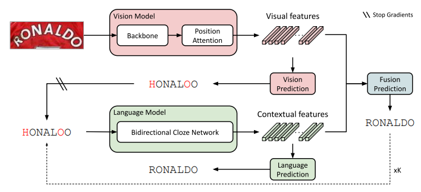

vision model ⇒ vision features ⇒ vision prediction ⇒ (gradient stop) ⇒ language model ⇒ contextual features ⇒ combine visual + contextual features ⇒ fusion prediction

### Vision Model Pretraining

- 사전학습에 unlabeled real data 포함
- 마지막 학습 phase에 unlabeled data만 사용하는 competitive semi-supervised methods가 vision model의 성능을 개선하였다
- SeqCLR + Transformer-based backbone

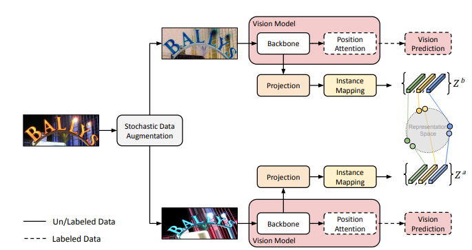

- 각 이미지를 두 번 augment ⇒ 각 visual backbone 과 projection head에 feed
- instance-mapping 함수 적용 ⇒ 각 증강된 이미지의 representation 시퀀스를 만들어 sub-word 단위의 contrastive learning이 가능하게 함
- 각 평행한 브랜치에서 라벨링 데이터의 visual prediction의 supervised loss 계산

사전학습은 6개의 빌딩 블럭으로 이루어져있음.

**stochastic data augmentation**

- 인풋 이미지에서 두 개의 augmented view 생성

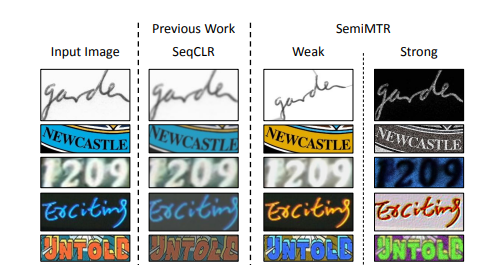

**Visual backbone**

- ResNet + Transformer units

**Projection head**

- optional auxiliary network
- transforms the visual backbone features into a lower dimensional space

**Instance-mapping function**

- unique block for seq2seq predictions divides each feature map into a sequence of separate representations over which the contrastive loss is computed
- 기존 contrastive 방법과 달리, 전체 이미지들이 아닌 시퀀스를 이루는 개별 성분들 간의 contrasting이 가능하게 합니다.
- window-to-instance mapping 방식을 사용
    - feature map들의 배치가 NxFxHxW ⇒ NxH*WxF가 되도록 펴고,
    - adpative average pooling 적용해서
    - flatten된 각 featuremap으로부터 T개의 독립된 representation 추출하여 Z 세트로 모음
        
        $Z=AdaptiveAvgPool2d(Flatten(P))$
        
    - 이 함수는 두번 호출되어 각 augmented view로 적용

**Contrastive Loss**

- 같은 인풋은 augmentation과 상관없이 더 가깝게, 다른 인풋은 더 멀게 학습하기 위한 손실함수
- Noise Contrastive Estimation(NCE) loss function

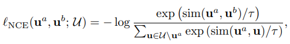

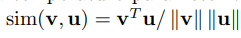

cosine distance

**Vision decoder and supervised loss**

- SeqCLR 과 contrastive learning methods에서 supervised training phase는 self-supervised stage가 끝나고 진행됩니다. 하지만, semiMTR은 학습 스테이지들이 늘어나는 걸 막고, 통합된 semi-supervised training scheme을 진행합니다.

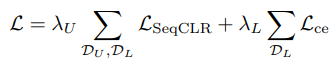

### Consistency Regularization for Fusion Model Training

- pseudo labeling을 사용하여 추가 재학습 과정이 필요한 다른 semi-supervised learning 방법과는 다르게
- self-supervised learning을 위해서, 파인튜닝에 더 적합한 sequential, character-level, consistency regulaization을 진행
- weakly-augmented version에서 라벨 추출
- strongly-augmented version에다가 추출한 라벨 적용해서 학습

**Stochastic strong and weak augmentations**

- 여러 color-texture augmentation method를 실험함
- 그중 가장 효과있는 방법 채택

**Sequential consistency regularization loss**

- 첫번째 padding token location (denoted by $N^{weak}$)에서 먼저 teacher’s sequential prediction을 prune하고,
- 각 글자들에 독립적으로 consistency regularization 적용

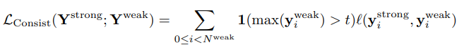

- 1(*>t) = threshold operator ⇒ teacher label의 신뢰도가 일정이상일 때만 학습에 반영
- L은 cross-entropy 또는 KL-divergence
- 6.2에선 threshold, label값 종류(prob vector or one-hot)의 영향에 대해서 실험

**Teacher and Student Modalities**

- 보통 teacher student decoder에서 consistency regularization을 계산하는 방법은 전체 네트워크의 단일 디코더를 통해서이지만,
- multimodal text recognition scheme에서는 각 modality가 각각의 decoder를 가지고 있으므로, 각각이 teacher 또는 student가 될 수 있음.
- 6.2에서는 각 configuration을 실험해 각 modality가 pseudo label을 생성하는 teacher가 되어야하는지 유무를 체크함

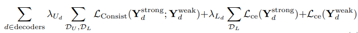

### Experiments

1. analyze capability of current synthetic and real-world datasets
2. compare our method with leading semi-supervised methods

*Datasets*

*Comparison to State-of-the-Art Methods*

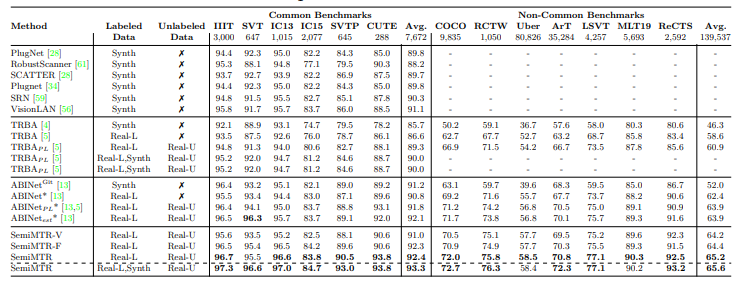

### Ablation Studies

**6.1 Vision Model Pretraining**

*Two-stage vs unified training*

- 기존 contrastive learning ⇒ contrastive-based pretraining & fully-supervised fine-tuning 2 stages 였음
- contrastive learning objective와 supervised cross-entropy loss를 합치는 unified training stage로 진행

**6.2 Consistency Regularization**

*Sequnetial consistency regularization loss*

- cross-entropy vs KLDivergence
- soft label vs one hot label
- stopping the teach gradients and using a threshold

*Teacher-student modalities*

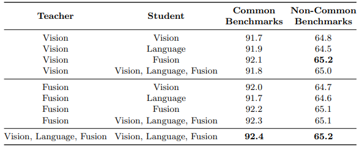

- 각 modality가 teacher 또는 student가 될 수 있는데, 각 modal끼리 teacher-student 관계가 가장 높은 성능을 보였다.

### Conclusions and Future Work

- SemiMTR은 첫번째  multimodal이자 semi-supervised learning 알고리즘을 사용한 text recognition 모델이다
- contrastive-based visual representation learning과 sequential, character-level consistency regularization을 적용했다.
- label 데이터 뿐만 아니라 unlabel 데이터도 활용하지만, 기존 모델의 3 스테이지를 그대로 유지했다.
- 다른 모델들보다 높은 성능을 보여준다
- 다른 리서처들에게 unlabel 데이터를 어떻게 활용할지에 대한 생각을 열어줬다.