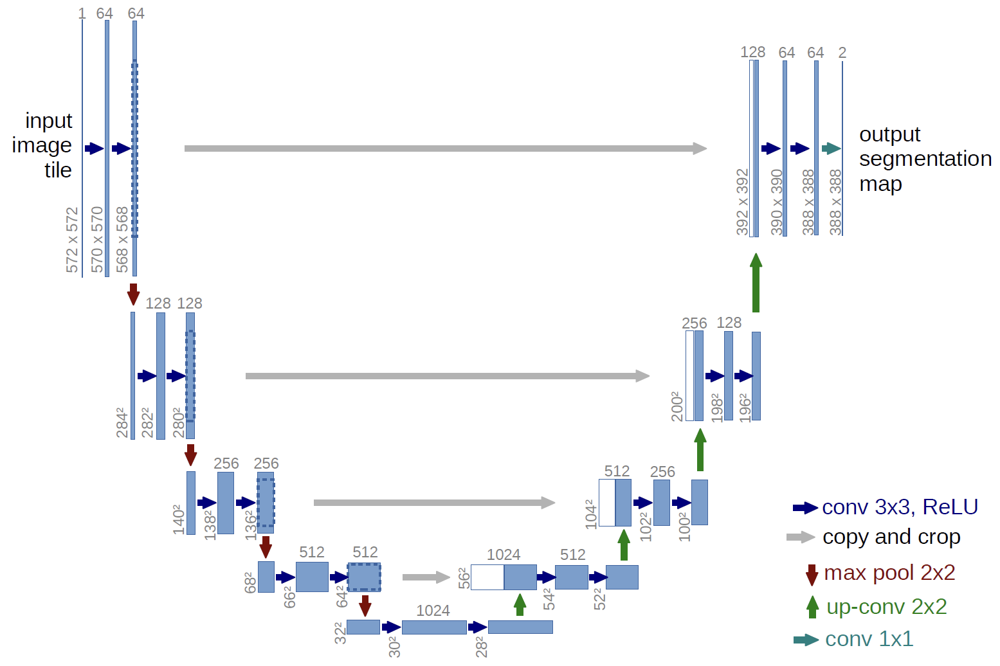
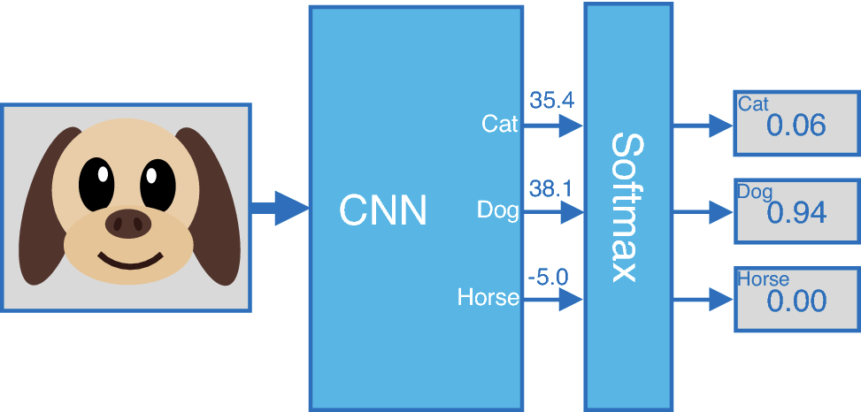
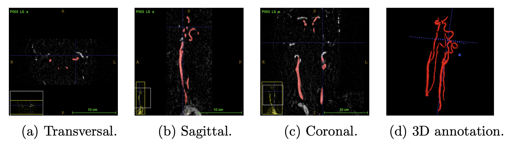
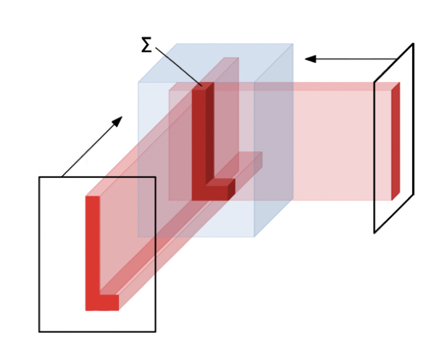
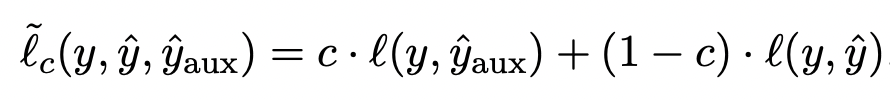

## Intro

- Image Segmentation Model(이미지 분할 모델)은 픽셀 단위의 클래스 분류를 통해 이미지 내 물체를 탐지하는 모델이다.

Image Segmentation Model 중 하나인 DeepLabV3. 픽셀별 값을 예측해 물체를 탐지한다.

- segmentation model의 대표적인 모델 UNet. 2015년에 생명공학 분야에서 MRI나 전자현미경 이미지의 탐지를 위해 처음 나온 논문이다. ([UNet: Convolutional Networks for Biological Image Segmentation](https://arxiv.org/pdf/1505.04597.pdf)) 벌써 7년이나 된 모델이고, 현재는 segmentation 태스크에서도 적용되기 transformer와 같은 다른 우수한 성능을 내는 모델들이 많지만, UNet은 여전히 segmentation 태스크를 가장 직관적인 방법으로 설계한 구조라고 할 수 있다.
- 이 UNet에 대해서 이렇게 글을 쓰게 된 계기는 현재 참여하고 있는 [kaggle competition](https://www.kaggle.com/competitions/uw-madison-gi-tract-image-segmentation/data)(UW-Madison GI Tract Image Segmentation)에서 UNet을 다시 공부하게 되었기 때문이다. 정확히는 2차원 이미지를 처리하는 vanilla UNet에서 변형된 **3차원 MRI 이미지를 처리하는 2.5D UNet**이다.
    
    참고 : UNet으로부터 파생된 UNet 구조들
    
    - Eff-UNET
    - UNET+, ++, 3+ (NestedUNet)
    - 3D UNet
    - 2.5D UNet

포켓몬 이브이는 품고 있는 돌의 속성에 따라 다양한 종류로 진화하게 된다. UNet이 이브이라면, 2.5D UNet과 다른 UNet 변형 모델들은 그 진화형 쯤 되지 않을까 싶다.

- 이번 글은 UNet에 대해서 간단하게 설명하고, UNet의 변형 모델인 2.5D UNet에 대해서 설명하고자 한다.

## UNET

---

### 모델 구조

이름 그대로 인풋 이미지가 왼쪽에서 오른쪽으로 U자형 곡선을 타고 내려갔다가(contracting path;downstream;downsampling;encoder 등 다양한 이름으로 불린다) 올라가는 것(expanding path; upstream;upsampling;decoder)을 확인할 수 있다.

높이로 봤을 때 총 5개의 층으로 구분되는데, 층이 한 칸씩 낮아질 때마다 featuremap의 hxw 사이즈는 반으로 줄어든다.(갈색 화살표;2x2 max pool). 반대로 층이 한 칸씩 높아질 때에는 featuremap의 hxw 사이즈는 두 배가 된다(초록색 화살표;2x2 up-conv). 

각 층에서 featuremap은 두 번의 3x3 conv과 ReLU를 거치는데, 각 연산마다 hxw 사이즈는 2씩 줄어들고(패딩이 없기 때문에 커널 사이즈(3x3)에서 하나 작은 2만큼의 사이즈가 줄어든다), 채널 수는 64부터 2배씩 증가한다. 

> e.g) 첫번째 레이어 피쳐맵 사이즈
$(L_{featuremap} - L_{kernelsize}+2L_{padding}) / L_{stride} + 1 = (572 - 3 + 2*0)/1 + 1 = 570$
> 

그리고 한가지 주목할 점은 내려갈 때(downstream) 각 층의 마지막 피쳐맵이 보존되었다가, U자 모양에서 마주보고 있는 올라갈 때(upstream)의 featuremap과 결합(skip architecture)된다는 점이다. 예를 들어서, 첫번째 층의 마지막 피쳐맵(hxwxc = 568x568x64)은 동일한 높이의 맨 마지막 층의 피쳐맵(hxwxc=392x392x128)과 합쳐진다. 피쳐맵의 크기가 서로 다르기 때문에 더 큰 왼쪽의 피쳐맵 사이즈를 오른쪽의 피쳐맵 사이즈와 맞게 잘라준다. (e.g 568 ⇒ 392) 이렇게 서로 먼 위치의 피쳐맵을 더해주는 것은 초기 연산 단계(얕은 층, low-level)의 피쳐맵이 후기 연산 단계(깊은 층, high level)에까지 골고루 영향을 미치도록 설계한 구조이다. ResNet에서 residual layer(skip connection)로 가중치 소실 문제를 해결한 것과 비슷한 맥락이라고 생각하면 된다.

residual layer; layer를 거치면서 소실될 수도 있는 가중치를 identity layer로 뒷단에 다시 한번 더함으로써 gradient vanishing 문제를 어느정도 해소한다.

### 손실함수(loss function)

손실함수로는 cross-entropy를 사용한다. 분류 모델이 인풋으로 들어온 이미지 한 장에 대해서 softmax값을 도출한다면, segmentation 모델인 UNet의 경우, 이미지를 이루는 각 픽셀에 대해서 softmax값을 갖는다. 

이미지 분류 모델 기본적인 형태. softmax값(각 클래스에 대한 예측확률을 담은 아웃풋)을 도출한다.

이미지를 이루는 픽셀들 각각에 대해서 softmax값을 도출한다. prediction의 색깔은 클래스를 의미한다.
e.g)갈색 : 소| 분홍색 : 나무|초록색 : 잔디| 파랑색 : 하늘

## 2.5D UNet

---

- 의학 데이터에는 3D 데이터(volumetric)가 많이 존재한다. MRI는 대표적인 3D 데이터이다. 3D 데이터를 2D로 자르지 않고, 3D 자체로 사용해야하는 이유는 2D로 자르면 중복되는 정보가 많고, 3D 데이터로 구성되어 있을 때여야만 의미있는 데이터일 경우가 많기 때문이다. 예를 들어서, MRI로 촬영한 복부 사진의 단면 이미지들보다 온전한 3D 이미지 한 장일 때 더 유용한 정보인 것과 같다.

MRA(Magnetic Resonance Angiography)로 스캔한 동맥 3D 이미지.

- 3D 이미지의 세번째 차원값은 volume과 pixel을 합친 voxel이라고 부른다.
- 모델을 거친 3D 이미지 인풋의 voxel은 해당 위치에 타겟이 있을 확률값이 된다. 2D 이미지에서 UNet의 픽셀 결괏값이 해당 클래스에 대한 확률인 것과 같은 맥락이다.
- 이 3D 이미지를 핸들하기 위해서 2D에 차원을 하나 더 붙인 3D 컨볼루션을 사용할 수 있지만, 3D 컨볼루션은 연산 비용이 굉장히 큰 편이다.
- 그래서 2.5D UNet에서는 3D 컨볼루션을 사용하지 않고 효율적으로 3D 데이터를 핸들하고, 3D 차원에서 타겟값을 예측하는 3D image segmentation을 소개한다.

### 방법

1. 3D 이미지를 다양한 방향에서 투영시켜 이미지 시퀀스로 만든다. 투영시키는 방법은 보통 Maximum Intensity Projection이나 Radon Transform을 사용한다.
2. 이미지 시퀀스로 만든 이 프로젝션 이미지들에 2D 컨볼루션을 다시 적용하고, 학습가능한 3D 재구축 알고리즘을 적용하여 3D 이미지로 다시 만든다.
3. 이미지 시퀀스를 타겟 오브젝트에 다시 투사해서 복원하는 과정에서 그림자와 같은 얼룩이 발생하는데, 이를 학습가능한 filtration(여과 연산)으로 개선한다. 
4. 학습가능한 재구축(learnable reconstruction algorithm) 알고리즘을 통해 3D 이미지로 아웃풋을 도출한다. 다양한 방향에서 선형 backprojection을 적용한다. 

이미지 재구축 연산자 

### 모델 구조

- M : MIP(maximum Intesity Projection)
- U : 2D Unet
- F : learnable filtration
- R : reconstruction operator using p linear backprojections for directions
- T : fine-tuning operator (average pooling followed by a learnable normalization followed by the sigmoid activation)

모델 구조

논문에서는 위의 3D 이미지 학습 방법론에, m개의 projection 이미지들에 대해서 전부 학습시키기엔 메모리 소모가 크니, 두가지 path를 사용한 random 2.5D 기법을 추가한다. projection 이미지 전체가 아닌 랜덤으로 일부를 뽑아 학습 효율을 극대화하는 방식이다.

**path1. $\hat{y}_{aux}$**

path1에서는 projection 이미지들의 각도를 **랜덤으로 일부분 뽑아** UNet에 태우고, learnable filtration과 reconstruction 과정을 거쳐 3D 아웃풋을 뽑는다. UNet, learnable filtration, reconstruction 과정 모두 학습된다.

**path2. $\hat{y}$**

path2에서는 3D 인풋 x에서 나온 MIP 이미지들의 **모든 프로젝션 방향을 생성**한다. 그리고 UNet을 태운 후, m개의 프로젝션 이미지에 적용한다. 여기서 UNet은 학습되지 않고 고정된(frozen) 상태이다. m개의 UNet 아웃풋을 가지고, filtration F와 파인튜닝 T를 학습할 수 있게 된다. 

### 손실함수

이렇게 아웃풋으로 나온 $\hat{y}_{aux}$ 와 $\hat{y}$ 는 정답지 y와 dice-loss로 학습에 반영된다.

## 마무리

---

- 복부를 찍은 MRI 영상 이미지에서 대장, 소장, 위장을 찾는 캐글 컴피티션에 참여하게되었다. 이 MRI 데이터는 복부의 여러 단면(slice)들로 이루어진 3D 이미지들이다. 이 3D 이미지로부터 물체를 탐지하는 태스크는 3D Image Segmentation이라고 한다.
- 3D Image Segmenetation 문제를 해결하기 위해 kaggle Discussion을 살펴보다, 2.5D UNet이라는 모델을 찾게 되었다.
- 2.5D UNet은 3D 컨볼루션을 사용하지 않고, 다양한 각도에서 타겟을 2D로 투사해(MIP;Maximum Intesity Projection) 이미지 시퀀스를 만들어 UNet에 태운 후, 다시 3D로 복원해서 3차원 내의 타겟 위치를 탐지하는 방식을 사용한다.
- 3D 컨볼루션을 사용하지 않기 때문에 연산량 부담이 적고, 여기에 논문은 다양한 각도를 랜덤 샘플링하여 UNet과 3D 재구축 웨이트들을 학습시키는 path1과 모든 프로젝션 방향에 대해 프리즈된 UNet과 3D 재구축 웨이트를 학습시키는 path2, 이 두 개의 방법으로 모델을 학습시킨다.
- MIP나 reconstruction operator, filtration operator와 같은 방법에 대한 자세한 설명이 없어서 조금 더 서칭 후, 업데이트하도록 하겠다.