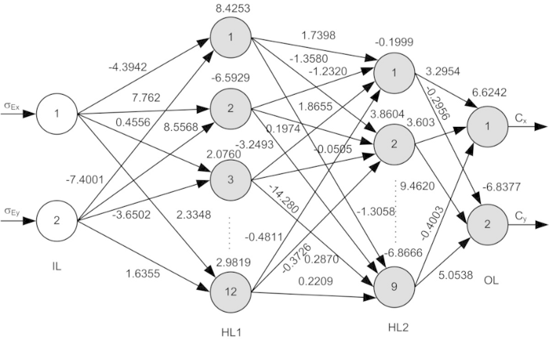
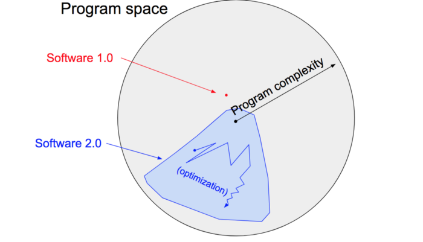
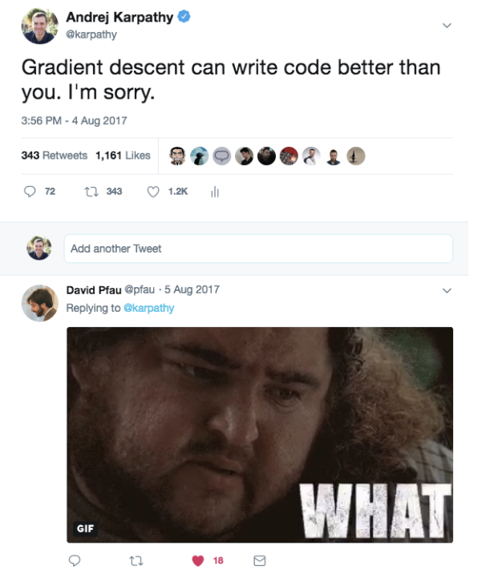

# Software 2.0 by Andrew Karpathy(2017)

이 글은 테슬라의 CTO였던 Andrew Karpathy가 2017년에 쓴 Software 2.0이라는 글이다. 2017년 작성 당시, Andrew Karpathy가 뉴럴 네트워크에 대해서 어떤 생각을 가지고 있는지, 5년이 지난 지금 2022년에 뉴럴 네트워크는 어떻게 변화되었는지, 그리고 앞으로는 또 어떻게 변화할지 고민하면서 글을 번역해보려고 한다.
  

## 소프트웨어 2.0

나는 사람들이 뉴럴넷을 ‘머신러닝 툴박스 중 하나’라고 소개하는 것을 가끔씩 보곤한다. 뉴럴넷은 그만의 장점과 단점이 존재하고, 여기 저기에 쓰이며, 캐글 컴피티션 우승을 위해 사용되기도 한다. (지금은 캐글 컴피티션에 뉴럴넷을 사용하는 것이 보편적인 일이지만, 2017년 당시에는 그다지 보편적이진 않았나보다.)

불행히도, 그들의 이해는 나무만 보고 숲은 보지 못하는 것과 같다. 뉴럴넷은 그저 또 다른 분류기가 아니라 우리가 소프트웨어를 개발하는데 있어서 근본적인 변환을 일으킬 시작점이다. 뉴럴넷은 소프트웨어 2.0이다.

소프트웨어 1.0의 전통적인 “기술 스택”은 모두가 잘 알고 있다. 파이썬, C++과 같은 언어로 작성되어있으며, 프로그래머에 의해서 직접적인 명시로 이루어져있다. 코드의 라인들을 한줄 한줄 작성하면서 프로그래머는 자신의 의도를 프로그램 스페이스에 명시해야한다.

반면에, 소프트웨어 2.0은 뉴럴넷의 가중치들과 같이 훨씬 추상적이고 인간에게 친화적이지 않은(human-unfriendly) 언어로 작성된다. 뉴럴넷은 너무나 많은 가중치로 이루어져 있기 때문에 (보통 수백만 개의 가중치로 구성된다) 어떤 인간도 이런 코드를 작성하는 것은 불가능하다.(필자가 시도해봄)

대신에, 우리는 의도한 프로그램의 행동에 어떠한 목표를 상세해주고(e.g. ‘인풋 아웃풋예시를 충족하는’, 또는 ‘바둑 게임을 이기는’ 등의), 서칭할 프로그램 스페이스의 부분집합(subset)을 명시하는 코드 골격(rough skeleton)을 작성하며(i.e. 뉴럴넷 아키텍쳐와 같은), 또 이 프로그램 스페이스를 찾는데 연산 리소스들을 사용하여 프로그래밍 목표를 달성한다. 뉴럴넷의 경우, 이 서칭 과정을 역전파와 SGD(stochastic gradient descent)와 함께 효과적으로 이루어질 수 있는 프로그램 스페이스의 연속적인 부분집합을 찾는 것으로 제한한다. 

이 비교를 더 구체적으로 하기 위해서, 사람이 직접 소스코드를 엔지니어링하는 소프트웨어 1.0(e.g. .cpp 파일들)에서는 바이너리 파일로 컴파일된다. 소프트웨어 2.0에서는 소스코드는 1)목표하는 행동 양상을 정의하는 데이터셋들과 2)대략적인(많은 디테일이 채워져야하는) 코드 골격을 제공하는 뉴럴넷 아키텍쳐로 이루어져있다. 최종적인 뉴럴넷을 컴파일하기 위해서는 데이터셋을 학습시켜 뉴럴넷에 녹여내야한다. 오늘날 가장 실용적인 적용사례에서, 뉴럴넷 아키텍쳐들과 학습 시스템들은 **원자재(commodity)**로써 입지를 굳혀가고, 대부분의 액티브한 ‘소프트웨어 개발’은 라벨링되있는 데이터들을 선별하고 가공 정제하는데(curating, growing, massaging and cleaning) 집중되어 있다. 그리고 이것은 우리의 소프트웨어에 반복해 적용하는 프로그래밍 패러다임을 본질적으로 전환시키고 있다. 개발 팀은 이에 따라 데이터셋을 수정하고 키우는 2.0 프로그래머들(데이터 라벨러들)과, 모델 학습코드 인프라, 분석, 시각화, 라벨링 인터페이스들을 감싸고 있는 코드들을 유지보수하고 반복하는 소수의 1.0 프로그래머들로 나뉜다.

파고들어보니, 대부분의 현실 문제들에서 직접 프로그램을 짜는 것보다 데이터를 수집하는 것(또는 더 일반적으로 말하자면, 목표하는 행동을 정의하는 것)이 더 쉬웠다. 데이터 수집이 직접 코딩보다 쉽다는 이유와 아래에서 설명할 소프트웨어 2.0 프로그램들의 장점들 때문에, 우리는 산업들이 1.0 코드에서 2.0 코드로 전환되는 것을 목격하고 있다. **소프트웨어 (1.0)은 세상을 먹어치웠고, 이제 AI(소프트웨어 2.0)은 소프트웨어를 먹어치우고 있다.**
 

 

### 지금 일어나고 있는 전환(Ongoing Transition)

지금 일어나고 있는 전환들의 몇몇 예들을 간단하게 살펴보자. 각 예들은 직접 코드로 작성하기에는 너무 복잡해 포기하고 있다가 2.0으로 스택 전환이 되면서 근 몇 년 사이에 발전을 보인 분야들이다.

**Visual Recognition(시각 인식)**은 ****머신러닝(e.g. SVM)이 살짝 가미된(sprinkled on top at the end) 엔지니어된 피쳐들로 구성되어있었다. 그리고 우리는 큰 데이터셋(e.g. ImageNet과 같은)과 CNN 구조들의 스페이스 서칭을 통해 좀 더 강력한 visual feature들을 찾았다. 최근에는 해당 뉴럴넷 구조를 직접 서칭하지 않고, 서칭 자체를 뉴럴넷에 맡기게 되었다.

**Speech Recogntion(음성 인식)**은 ****수많은 전처리와 gaussian mixture 모델들과 hidden markov 모델들로 수행되었지만, 오늘날에는 완전히 뉴럴넷으로 수행된다. Fred Jelinek이 1985년에 쓴 인용에 따르면, ‘언어학자를 자를 때마다, 우리의 음성인식 시스템은 더 좋아질 것이다.’

Speech Synthesis(음성 합성)는 다양한 봉합 메커니즘(stitching mechanism)에 의해 시도되었으나, 오늘날에 최신 모델들은 오디오 시그널 아웃풋 그 자체를 생성하는 큰 ConvNet(e.g. WaveNet)들로 대체되었다.

**Machine Translation(기계번역)**은 어절 기반의 통계 기술들(phrase-based statistical techniques)로 시도되었었지만, 이것 또한 뉴럴넷으로 대체되었다. 필자가 좋아하는 구조는 weakly supervised 또는 아예 unsupervised한 환경에서 소스 언어에서 학습된 단일 모델이 다른 타겟 언어로 번역되는 다국어 셋팅이다.

**Games.** 룰 기반의 바둑 프로그램은 예전에 개발되었었지만, 어떤 프로그램도 AlphaGo Zero를 이기진 못한다. 필자는 DOTA2나 Starcraft 또한 그러리라 믿는다.

**Databases.** AI 밖의 전통적인 시스템들은 이미 서서히 전환을 겪고 있었다. ‘The Case for Learned Index Structures’는 기존의 cache-optimized B-Trees 알고리즘을 메모리에서는 10배가량(order-of-magnitude) 절약하고 속도 측면에서는 70% 이상 앞지르는 뉴럴넷으로 데이터 관리 시스템의 코어 부분을 대체하였다.
 

 

### 소프트웨어 2.0의 이점들

왜 우리는 소프트웨어 2.0으로 복잡한 프로그램들을 이동시켜야할까? 가장 쉬운 답은 실전에서 더 잘 작동하기 때문이다. 하지만, 이 스택을 선호하는데에는 다른 많은 편한 이유들이 있다. 소프트웨어 2.0(예시 ConvNet)과 소프트웨어 1.0(예시 제품 레벨의 C++ 코드 베이스)을 비교하여 소프트웨어 2.0의 이점들을 몇 개 살펴보자.

**계산적으로 동질적이다(Computationally homongeneous)**

표준적인 뉴럴넷은 본질적으로 행렬곱과 ReLU와 활성화 함수(thresholding at zero), 이 두 가지 연산으로 이루어진다. 훨씬 더 이질적이고(heterogeneous) 복잡한 전통적인 소프트웨어의 요소들(instruction set)과 비교해본다면?

적은 수의 코어 연산 단위(core computational primitives. e.g. 행렬곱)를 위해 소프트웨어 1.0만 적용하면 되기 때문에, 소프트웨어 2.0이 훨씬 정확도/퍼포먼스 개런티 측면에서 훨씬 쉽다.

**연산에 담아내기 수월하다(Simple to bake into silicon)**

결과적으로 뉴럴넷을 돌리기위한 기초 셋팅(명령어 집합; instruction set)이 비교적 간단하기 때문에, 이 뉴럴넷들을 실리콘(연산장치)에 담기는 훨씬 수월하다. e.g) 커스텀 ASICs, [뉴로모픽 칩](https://spectrum.ieee.org/semiconductors/design/neuromorphic-chips-are-destined-for-deep-learningor-obscurity) (인간의 두뇌와 유사한 컴퓨터 칩) 등등. 세상은 저전력으로도 돌아가는 지능이 보편화될 때 바뀔 것이다. e.g) 기학습된 ConvNet, 음성 인식기, WaveNet 음성 합성 네트워크 등을 전부 다 합친 작은 인공지능(protobrain)을 담을 수 있는 작고 저렴한 칩이 나올 수도 있다.

**지속적인 러닝 타임(Constant running time)**

뉴럴넷 전파의 모든 반복은 FLOPS의 정도와 동일하다. C++ 코드 베이스를 사용했을 때, 생길 수 있는 다양성(variability)은 0이다. 물론, 다이내믹 연산 그래프(dynamic compute graphs)를 가질 수는 있겠지만, 그럼에도 실행 플로우(execution flow)는 보통 굉장히 제한적이다. 그런 관점에서 소프트웨어2.0에서 우리는 의도치 않은 무한 루프에 빠질 일은 거의 없다고 보면 된다.

**지속적인 메모리 사용(Constant memory use)**

위 특징들과 비슷한 맥락으로 다이내믹하게 할당되는 메모리는 없기 때문에 디스크가 스와핑될 확률은 거의 없고, 코드를 뒤지면서 메모리 누수를 확인할 필요가 없다.

**휴대하기 편하다(It is highly portable)**

매트릭 연산들로 이루어진 이 시퀀스는 클래식한 바이너리 코드들이나 스크립트들과 비교했을 때 어떤 연산 구성이든 실행하기 훨씬 쉽다.

**애자일하다(It is very agile)**

만약 당신이 C++코드가 있고, 누군가 그 코드를 두배 더 빠르게 돌릴 수 있길 원한다면(퍼포먼스 손실을 감안하더라도), 새로운 스펙에 시스템을 튜닝하는 일은 결코 쉬운 일이 아니다. 하지만, 소프트웨어 2.0에서 우리는 뉴럴넷에 채널의 반을 삭제하거나 재학습해서 조금의 퍼포먼스 손실으로만 스피드를 두 배 이상 빠르게 만들 수 있다. 이건 마술이다. 거꾸로, 데이터나 컴퓨팅 파워가 더 생겼다고하면, 뉴럴넷의 사이즈를 더 키우거나 재학습함으로써 당신의 프로그램을 개선할 수 있다.

**모듈들이 이상적인 전체로 녹아들 수 있다(Modules can meld into an optimal whole)**

우리 소프트웨어는 보통 공공 함수들, API들, 엔드포인트들을 통해 통신하는 모듈들로 쪼갤 수 있다. 하지만, 따로 학습된 두 개의 소프트웨어 2.0 모듈들이 상호작용한다면, 우리는 쉽게 전체(whole)에 대해 역전파할 수 있다. (한 개 이상의 태스크가 다른 뉴럴넷들도 역전파를 통해 가중치 업데이트를 공유할 수 있다는 뜻) 만약 당신의 웹브라우저가 자동으로 low-level 시스템 명령어들(low level system instructions)을 10 스택 다운 재 디자인해서 웹페이지들을 로딩하는데 훨씬 더 높은 효율을 냈다고 생각해보라. 얼마나 멋진 일인가. 아니면 컴퓨터 비전 라이브러리(e.g. OpenCV)에서 너의 특정한 데이터를 자동으로 튜닝해준다면? 소프트웨어 2.0에서 이런 건 기본이다.

**당신보다 낫다(It is better than you)**

그리고 마지막으로 가장 중요한 것은 뉴럴넷은 사람들이 만들어낸 어떠한 코드들보다(지금도 이미지/비디오와 소리/음성에서 사람의 코드가 차지하는 비율은 극히 적다) 좋은 코드이다.
 

 

### 소프트웨어 2.0의 한계

2.0 스택은 단점들도 있다. 최적화 후에 결과물로 나온 거대한 네트워크들은 분명 잘 작동하긴 하지만, 어떻게 작동하는지에 대해서는 알지 못한다. 많은 응용 분야들에서 우리는 이해하지(설명하지) 못한 99% 정확도의 모델 또는 이해 가능한(설명 가능한) 90% 정확도의 모델을 선택할지 결정해야한다.

2.0 스택은 비직관적이고 당황스러운 방법으로 실패할 수도 있다. 아니면 더 쵝악은 ‘조용히 실패'하는 것이다. e.g) 학습 데이터 중 bias(편향, 여기서는 학습목표와 다른 데이터 특징이라고 이해하면 될 듯하다.)를 조용히 반영하는데, 이는 대부분의 경우 데이터가 수십만 개에 다다르기 때문에  정확히 분석하거나 평가하기 힘들다.

마지막으로, 우리는 이 스택의 이상한 특징들에 대해서 아직 알아가는 중이다. 예를 들어, [adversarial examples](https://openai.com/blog/adversarial-example-research/)와 [adversarial attacks](https://github.com/yenchenlin/awesome-adversarial-machine-learning)는 이 스택의 비직관적이 성향을 나타낸다. (여기서 adversarial이란 의도적으로 뉴럴넷에 학습목표와 다른 데이터를 학습에 적용하여 학습목표로부터 벗어나게하는 것을 말한다. 더 알아보고 싶다면 링크 참조)
 

 

### 2.0 스택에서의 프로그래밍

소프트웨어 1.0은 우리가 쓰는 코드다. 소프트웨어 2.0은 평가 기준(’학습 데이터를 올바르게 분류해줘’와 같은)에 근거한 최적화에 의해 쓰여진 코드다. 최적화는 사람이 작성한 코드들보다 훨씬 더 나은 코드를 찾을 수 있기 때문에, 어떤 셋팅에서던 프로그램 자체는 분명하진 않지만, 반복해서 퍼포먼스를 평가할(e.g. 이미지 분류 잘했어? 바둑 게임 이겼어?) 수 있는지가 이번 전환(Transition)에서 중요한 주제가 될 것이다. 

트렌드를 살펴보는 관점(lens)은 중요하다. *만약 당신이 소프트웨어 2.0을 단순히 ‘분류를 꽤 잘하는 뉴럴넷 또는 머신러닝 기술 중 하나'로 인식하기보다, 새롭고 떠오르는 프로그래밍 패러다임으로 인식한다면, 더 많은 예측들(extrapolations)이 뚜렷해질 것이고 더 할 수 있는 것들이 보일 것이다*.

1.0 코드를 적기 위해 사람을 도울 어마어마한 양의 툴들을 만들어냈다.(IDE 구문 강조 기능, 디버거, 프로파일러, 함수 서칭, 깃 통합 등등) 2.0 스택은 데이터셋들을 축적하고, 마사징하고 정제하는 프로그래밍으로 이루어질 것이다. 예를 들어, 뉴럴넷이 몇몇의 어렵거나 흔하지 않은 케이스들에서 실패한다면, 우리는 코드를 적기보단 더 많은 라벨링 샘플을 적용하여 문제를 해결할 것이다. 데이터셋들을 축적하고, 시각화하고, 정제하고, 라벨링하고, 소싱하는 워크플로우를 돕는 소프트웨어 2.0 IDE를 누가 만들 것인가? *IDE가 데이터 예시 단위 손실함수에 근거하여 잘못 라벨링된 이미지들을 띄워주거나, 예측을 통해 라벨링(프리라벨링)하는 것을 돕거나, 아니면 뉴럴넷 예측의 불확실성에 근거하여 라벨링할만한 데이터 예시를 제시해줄지도 모른다.*

같은 맥락에서, 깃허브도 소프트웨어 1.0 코드를 위한 아주 성공적인 플랫폼(home)이다. 소프트웨어 2.0에도 깃허브와 같은 공간이 있을까? 2.0의 경우 저장소는 데이터셋이 되고 커밋들은 라벨들의 추가 및 수정이 되겠다.

전통적인 패키지 매니져들과 pip, conda, docker 등과 같은 서빙 인프라는 우리가 바이너리를 더 잘 배포하고 구성할 수 있도록 돕는다. 소프트웨어 2.0 바이너리를 효과적으로 배포하고, 공유하고, 임포트하고, 더 잘 작동하게 하기 위해서 우리는 어떻게 해야할까? 뉴럴넷에서도 conda와 비슷한 게 있을까?

짧게 말해서, 반복적인 평가가 가능하고 저렴하며, 알고리즘 자체가 명시적으로 디자인하기 어렵지 않다면, 어떤 도메인이던 소프트웨어는 점차 널리 퍼질 것이다. 소프트웨어 개발 생태계와 이 새로운 프로그래밍 패러다임이 어떻게 적응할지. 많은 기회들이 널려있다. 그리고 장기적으로 봤을 때, 이 패러다임의 미래는 우리가 AGI를 개발할 때, 소프트웨어 2.0으로 작성될 것이 점점 명확해지고 있기 때문에 밝다.
 

 

### Takeaway

Andrew Karpathy가 이 글을 낸 2017년은 구글 딥마인드에서 이세돌을 이겼던 알파고의 바둑실력을 초월하는 알파고 제로가 출시된 년도이다. 그리고 뉴럴넷의 획기적인 성능향상을 일구어낸, 이제는 자연어 처리부터 이미지, 음성 인식, 강화학습 등 거의 모든 분야에서 사용되는 Transformer가 세상에 알려진 년도기도 하다. 2022년 현재 돌이켜봤을 때, 위에 적어놓은 Andrew Karpathy의 모든 말들은 어쩌면 너무나 당연한 말일지도 모르겠다. 그의 말 중 많은 부분이 현실로 이뤄졌고 이뤄지는 중이다. 마치 높은 언덕에 올라가 저 멀리를 내다보는 선구자처럼. 가끔은 기술만 파고들다가 시야가 좁아지는 경우가 있다. 그럴 때에는 한걸음 물러서서 시대적 흐름으로써 ‘**내가 하고 있는 일이 가지는 의미와 내가 사회에 기여할 수 있는 바는 어떤 것이 있는지**’ 한 번쯤 생각해볼 여유가 필요하다.