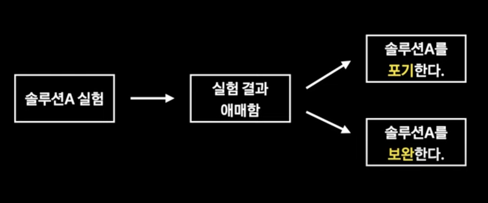

[if(kakao)dev2022 발표영상](https://if.kakao.com/2022/session/4)

카카오 개발자 컨퍼런스 if(kakao) dev 2022가 12월 7일부터 9일까지 열렸다. 이번에도 역시 흥미로운 주제들을 다룬 세션들이 많았는데(얼마전에 있었던 카카오 서버 다운 사건에 대해서도), 그 중 내 관심을 가장 끈 주제는 ‘실험을 잘한다는 것은 무엇일까’. 카카오 추천팀의 개발자 분께서 발표한 세션이였다.

업무에 딥러닝을 활용하는 개발자로써(딥러닝 개발자, 딥러닝 엔지니어, 딥러닝 리서치 사이언티스트 등등 다양한 텀이 있지만, 정확히 내가 어떤 범주에 속하고, 그리고 또 속하고싶은지는 아직 잘 모르겠다.) 성장하기 위해서 어떤 역량들이 필요한지 항상 고민하곤 한다. 

빠른 구현을 위한 프로그래밍 능력, 당면한 문제 해결을 위해 딥러닝을 적절히 활용하는 창의성, 매번 업데이트되는 최신 트렌드를 잘 반영하여 코드와 모델의 성능을 기록하고 정리하는 능력 등등 정말 다양한 분야의 역량이 필요한 딥러닝이지만, 그 중 실무에서 가장 중요한 덕목은 아무래도 ‘실험을 잘하는 것’이라는 생각을 한 적이 있다. 그래서 많은 세션들 중 단연 ‘실험을 잘한다는 것은 무엇일까’라는 타이틀은 더욱 눈에 띄었다.

불확실성을 전제로 하는 머신러닝 특성상 100%의 정확도, 100%의 효율은 없다. 다만, 전세계에서 부리나케 연구되는 학문이라 빠른 페이스로 트렌드가 바뀌고 새로운 기술들이 세상에 나온다. 기존 솔루션이 조금은 부족했던 부분 플러스 ‘더 좋은 게 나왔다던데?’라는 소식을 들으면, 이제 개발자는 실험 모드에 들어가게 된다. 새로운 모델(여기선 모델이라고 뭉뚱그렸지만, 학습 방법, 데이터 처리 등 머신러닝에 관련된 다양한 기술을 말한다)이 ‘기존 모델보다 실제로 나은지’를 실험으로 입증해야하는 것이다.

물론 실험 결과가 기존 솔루션보다 낫다라는 결론이 나면 해피엔딩이다. 문제는 새로운 모델의 결과가 애매할 때이다. (원래 있던 문제는 해결하는데, 없던 문제가 생겼다거나. 분명 정확도는 좋은데, 모델 연산이 너무 무거워 해결하고자하는 문제에는 투머치라거나. 정말 다양한 방면에서 애매할 수 있다.) 그럴 때는 두 가지 옵션으로 정리가 가능하다고 한다. 솔루션을 포기하거나 아니면 보완하거나.

<!--  -->
 
 

### 옵션1. 솔루션 포기

솔루션을 포기하기로 결정했다는 것은 그동안 해당 솔루션을 위해 투자한 시간을 (어떤 의미에서는) 확실한 성과가 없이 버려야하는 것과 마찬가지다. 확실한 성과가 없으면 실험자 본인이 지치기는 물론이고, 실적을 내야하는 회사에서 살아남기는 힘들다. 그렇다고 해서 솔루션 포기가 그동안 했던 것들이 아예 티끌로 사라지는 것은 아니다. 진행한 실험 결과로부터 어떤 교훈을 얻을 수 있을지, 즉 ‘어떻게 다음 실험에도 도움이 될 수 있을까‘를 남기는 것이 중요하다고 한다. 실험을 반복할수록 경험이 쌓이고, ‘이 방향은 아니야’, ‘이 방향은 더 파볼만 한데?’하는 소위 말해 짬(?)이 생긴다. 이런 경험들을 어떻게 본인의 발전 뿐만 아니라 팀원들에게 도움이 될 수 있는 방향으로 기록하여 ‘팀의 발전’으로 기여할 수 있는지가 ‘실험을 잘 하는 기준’의 하나가 될 수 있지 않을까 싶다.

또한, 성능을 개선하기 위한 다른 솔루션을 찾아야한다. 다른 솔루션을 찾아야한다는 것은 지금 투자한만큼의 시간이 다시 필요할 수도 있음을 의미하고, 더욱 최악인 것은 다음 솔루션이 이번 솔루션처럼 ‘포기’로 돌아갈 수도 있음을 인지해야한다는 것이다. 또, 해당 솔루션을 애초에 선택한 이유는 ‘성능이 좋다더라’하는 이유에서였을텐데, 이렇게 두세번 찾은 솔루션의 성능이 애매한 것을 확인하게 되면, 어느 기준으로 새로운 다른 솔루션을 찾아야하는지 막막해지기도 한다. (나도 논문을 볼 때, ‘이 퍼블릭 데이터셋에 대해서 이만큼 엄청난 성능을 보였다!’ 하는 부분에 대해서는 연차가 쌓일수록 무덤덤해지는 것 같다. 이렇게 연구결과를 믿기 힘든 부분은 머신러닝의 특성상 아마도 실험 셋팅이 회사, 기관, 연구소마다 다른 탓과, 실무에서 사용되는 데이터와 학회에서 사용되는 데이터 간의 격차가 커서일 듯 싶다.)

포기한 솔루션은 내가 해결하지 못하였다고 접는 것이 아니라, 남들에게도 매력적인 솔루션으로 느껴진다면 계속해서 시도될 것이라고 한다. 마치 원탁의 기사에서 나오는 ‘엑스칼리버’처럼. (효율이 중요하고 영업이익을 내야하는 회사이지만, 구성원들이 매력적인 솔루션들을 충분히 시도해볼 수 있도록 하고, 실패하더라도 커뮤니케이션을 통해 팀 전체의 성장을 위해 교훈을 남기는 회사가 정말 좋은 회사가 아닐까 싶다.)

<!--  -->
 
 

### 옵션2. 솔루션 보완

솔루션을 보완하기로 마음먹었다면, 어떤 부분들을 보완할지 리스트업하게 될 것이다. 때때로 주어진 시간에 비해 보완해야할 부분이 너무 많아 어디서부터 시작해야할지조차 모를 때가 있는데, 그럴 때일수록 우선 순위를 설정하고 그에 맞게 하나하나 차근차근 고쳐나가는 것이 중요하다고 한다. 그렇게 우선순위를 설정하면, 보완하고 실험하고 실패하고를 반복하며 솔루션을 보완해나간다. 한 번만에 원하는 결과가 나올수도 있고, 수십번해도 안 될 수도 있다. 뚝심있게 실험을 풀어나가는 것도 중요하지만, 실험이 반복될수록 ‘매몰 비용이 발생’한다는 것을 인지해야한다고 한다. 어떻게 될 것 같은데… 될 것 같은데… 싶은 마음은 알겠지만, 물러서야할 때를 알아야한다는 것이다. 이 물러서야할 때를 알기 위해, 실험 전 ‘마무리 조건’을 설정해놓으라고 한다. (이 ‘마무리 조건’을 어떻게 정해야할지는 아직 잘 모르겠다. 사실 실험이 원하는 방향으로 진행이 안되면 찜찜하고 될 때까지 해내고 싶은데, 어떻게 마무리 조건을 설정해야 이만큼 했으면 할만큼 했다 싶은 생각이 들지 잘 모르겠다.)

결론적으로 실험을 하면서, 아래와 같은 질문들에 대한 대답이 물흐르듯이 나온다면 아마 실험을 잘 진행하고 있는 걸 거라고 한다.

Q1. 실험 결과를 어떻게 남겨야 다음 실험에 도움이 될 수 있을까?

Q2. 보완 실험은 어디서부터 진행하는 게 좋을까? (보완하면 좋을 점이 너무 많이 보인다.)

Q3. 마무리 조건을 어떻게 세우는 게 좋을까?

### 실험을 잘한다는 것

실험을 잘 한다는 것은 ‘승부수’가 있다는 것이라고 한다. 그리고 이 승부수는 이 실험이 성공할 거라고 생각하는 이유라고 한다. 단지 ‘이번에 나온 논문의 성능이 좋다던데?’라는 이유보다는 ‘학습용 데이터가 부족한 우리 문제에 소량의 데이터만으로도 이 정도 성능을 뽑는 논문이 나왔대’라는 이유라면, 실험이 성공할 확률이 높다는 것이다. 좀 더 일반화하자면, ‘문제 환경(Environment)과 문제 해결의 핵심이 되는 특징(Key Feature)이 들어맞을 때, 솔루션이 적합하다.’라고 한다. 

승부수에 따른 실험 결과 분석

1. key feature 구현을 제대로 했는지 확인
2. key feature가 실제로 문제 해결에 도움이 되는지 확인

승부수가 있으면, 실험 결과 분석이 쉬워진다고 한다. ‘승부수가 되는 key feature 구현이 제대로 되었는지 확인한다’와 ‘key feature가 실제로 문제 해결에 도움이 되는지 확인한다.’라는 두 가지 가이드라인이 생겼기 때문이다. 이 다음 스텝은 두 가지 가이드라인으로부터 차근차근 밟아나가면 된다. 만약 key feature 구현은 제대로 되었는데, 문제 해결에 도움이 되지 않는다면, 내 가설과 실제 상황이 다르다는 것을 의미함으로, 어떻게 다른지 비교 분석해나가다보면, 다른 실마리가 보일 것이라고 한다. 승부수는 실험을 위해 어느 부분에 집중해야할지 알기 때문에, 실험 사이클도 짧게 가져갈 수도 있다고 한다. 또 승부수는 위의 세가지 질문들에 대한 답변도 될 수 있다고한다. 예를 들어, 마무리 조건을 어떻게 설정해야할지 모를 때는 ‘key feature’를 올바르게 구현하고, ‘key feature’가 실제 문제 해결에 도움이 되는지 확인하는 것으로 마무리 조건을 설정하면 된다고 한다.

Q1. 실험 결과를 어떻게 남겨야 다음 실험에 도움이 될 수 있을까?

Q2. 보완 실험은 어디서부터 진행하는 게 좋을까? (보완하면 좋을 점이 너무 많이 보인다.)

Q3. 마무리 조건을 어떻게 세우는 게 좋을까?

⇒ Key Feature에 기반해서 판단하면 된다!
 
 

### 승부수를 잘 세우려면?

1. 내가 풀려는 문제(+환경)를 이해해야한다. 
2. 기존 솔루션에 대해 이해해야한다.
3. 내가 구현하려는 솔루션에 대해서도 깊이 있게 이해해야한다.

가장 중요한 것은 내가 풀려고 하는 문제와 환경에 대해서 잘 이해하는 것이다. 아무리 솔루션이 좋아도, 내 문제에 맞지 않다면, 틀린 솔루션이다. 이 좋은 솔루션을 내 문제에 맞게 활용하는 것 또한 문제와 환경에 대한 이해가 필요하다. 두번째는 기존 솔루션에 대해 이해해야한다고 한다. 기존 솔루션을 모르면, 내가 구현한 새로운 솔루션이 아무리 좋다고 해도, 어떻게 기존 솔루션과 다른지, 그래서 어떻게 새로운 솔루션이 더 나은 건지 모르게 된다. 세번째는 내가 구현하려는 솔루션에 대해서도 깊이 있게 이해해야한다는 것이다. 무얼 중점적으로 구현해야하는지, 어떠한 부분이 내 문제 해결에 적합한지 알아야 실험의 진행 방향도 알 수 있다.
 
 

### 추가 조언

번외로 실험에는 파이프라인 결함과 같은 엔지니어링적인 요소가 성능에 큰 영향을 미친다고 한다. 이럴 때는 단순하게 시작해서 점점 하나씩 추가해가는 식으로 개발을 하면, 예기치 않은 결함을 피할 수 있다고 한다. 

또, key feature가 잘 작동하지 않을 때에는 솔루션 자체가 아닌 환경이 원인일 때도 있다고 한다. 실험이 실패했을 때, key feature가 잘 동작할 수 있는 환경이었는지도 검토해보라고 한다.

마지막으로, 실험 과정에서 많은 실패를 경험하게 될 텐데, 그저 실패에서 끝내기보단 하나하나 교훈을 얻어가면서 실험을 진행하다보면 결국에는 좋은 결과가 나올 수 있을 것이라고 한다.
 
 

### 마치며

좋은 딥러닝 개발자(또는 딥러닝 리서치 사이언티스트, 딥러닝 연구원)로써 내가 길러야할 역량은 무엇일까 하는 고민을 자주 하곤 했다. 딥러닝 문제를 근본적으로 잘 해결할 수 있는 수학, 프로그래밍 능력, 최신 트렌드를 따라가는 부지런함, 당면한 문제 해결을 위해 딥러닝 기술을 잘 활용하는 창의성 등등 많은 역량들이 중요하겠지만, 그 중 실험을 잘 하는 것이 실무 문제 해결을 위해 정말 중요하다는 생각을 했다. 카카오 if 세션 ‘실험을 잘한다는 것’에서 어떻게 하면 실험이 잘 진행되지 않아도 실패로부터 교훈을 남길 수 있는지, 솔루션을 보완하기로 했다면 어디서부터 보완해나갈지, 그리고 얼마만큼 했을 때 멈춰야할지에 대해서 배웠다. 무엇보다 실험을 할 때에는 찾은 솔루션이 어떻게 당면한 문제에 적합한지 아는 승부수가 필요하다고 한다. 실험 결과가 안 나올 때면, 다음 스텝은 어디로 가야하지? 그냥 포기해야하나? 더 잡고 있어야하나? 하고 고민할 때가 많았는데, 그동안 있었던 고민들에 정말 중요한 단서가 된 세션이였다. 역시 개발자 컨퍼런스는 시간을 내서 봐야되는 듯 싶다. 그럼 이번 글도 좋은 자양분으로 삼아 정진하자.