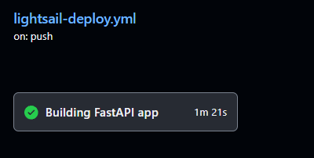
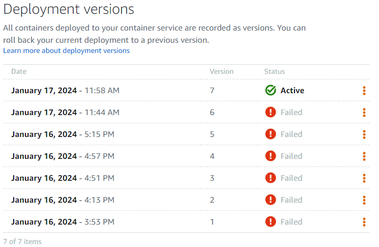

만족스럽진 않지만, 우선은 동작하는 어플리케이션을 배포했다.

(어플리케이션은 [http://3.39.105.35:8090/](http://3.39.105.35:8090/)에서 확인할 수 있다.)

아직 추가해야할 내용도 많고, 개선해야할 내용도 많지만, 한 번에 하기보다는 **하나씩 작업하는 게 중요하다**. 개선과정에 있어서 중요한 것은 자동화할 수 있는 부분은 최대한 자동화해서 개발 싸이클을 개선하는 것이다. 작업하는 내용에만 집중하고, 코드를 관리하기 위해서 Github Issue에 작업할 내용을 기록하고, 브랜치를 파서 작업했다. 

현재 AWS LightSail에다가 어플리케이션을 배포하였는데, 이 배포 과정을 Github Action을 사용해서 자동화하려고 한다.

서칭해보니 AWS의 다른 서비스들에서는 배포를 위해 CodeDeploy라는 배포 서비스를 제공하는데, AWS-LightSail은 해당사항이 없다고 한다. 그럼 LightSail은 배포를 자동화를 할 수 없는 걸까?

AWS-LightSail Instance가 EC2와 비슷하다면, AWS-LightSail Container Service는 ECS(container service)와 비슷하다.

aws-cli에서 lightsail로 이미지를 푸쉬하고 배포하는 기능을 제공한다.

EC2를 사용하면 S3에 빌드한 소스를 넘기고, S3에서 CodeDeploy가 변경내용을 가져와서 인스턴스에 적용하는 방식이였는데, LightSail Container Service는 바로 이미지를 푸쉬하고 배포하면 되니 더 간편한 것 같다. (왜 CodeDeploy가 S3를 통해야만 하는지는 아직 잘 모르겠다.)

다시 본론으로 돌아와서,

LightSail Container Service에 배포하기 위해서는 Github Action이 다음과 같은 과정을 거쳐야한다. 여기서 action runner는 깃헙 액션에서 워크플로를 실행하기 위해 제공하는 임시 서버이다.

1. 깃헙 체크아웃 - 마스터 브랜치의 변경사항을 action runner에 반영한다.
2. aws-cli 중 lightsailctl을 사용할 것이므로, action runner에 aws-cli lightsail 플러그인을 설치한다.
3. 도커 이미지를 빌드한다.
4. 빌드한 이미지를 컨테이너 서비스로 푸쉬한다.
5. 푸쉬한 서버를 배포한다.

```jsx
name: lightsail-deploy
on:
  push:
    branches: ['master']
  pull_request:
    branches: ['master']
permissions:
    contents: read

env:
  LIGHTSAIL_SSH_KEY: ${{ secrets.LIGHTSAIL_SSH_KEY }}
  LIGHTSAIL_HOST: ${{ secrets.LIGHTSAIL_HOST }}
  OPENAI_API_KEY: ${{ secrets.OPENAI_API_KEY}}
  LIGHTSAIL_USERNAME: ubuntu
  LIGHTSAIL_SERVICE_NAME: llmsummarizer-container
  AWS_REGION: ap-northeast-2

jobs:
  buildfastapi:
    name: Building FastAPI app
    runs-on: ubuntu-latest
    
    steps:
			# 1. 깃헙 체크아웃 - 마스터 브랜치의 변경사항을 action runner에 반영한다. 
      - name: Getting Code from Github
        uses: actions/checkout@v4
      - name: Updating to the latest versions
        run: |
          sudo apt-get update
          sudo apt-get install -y jq unzip
			# 2. aws-cli 중 lightsailctl을 사용할 것이므로, action runner에 aws-cli lightsail 플러그인을 설치한다.
      - name: Install Amazon Client
        run: |
          curl "https://awscli.amazonaws.com/awscli-exe-linux-x86_64.zip" -o "awscliv2.zip"
          unzip awscliv2.zip
          sudo ./aws/install || true
          aws --version
          curl "https://s3.us-west-2.amazonaws.com/lightsailctl/latest/linux-amd64/lightsailctl" -o "lightsailctl"
          sudo mv "lightsailctl" "/usr/local/bin/lightsailctl"
          sudo chmod +x /usr/local/bin/lightsailctl
      
			# 3. 도커 이미지를 빌드한다.
      - name: Build a Docker Container
        run: docker build -t llmsummarizer:latest .
      
			#4.빌드한 이미지를 컨테이너 서비스로 푸쉬한다.
      - name: upload image to Lightsail container service
        run: |
          service_name=${{ env.LIGHTSAIL_SERVICE_NAME }}
          aws lightsail push-container-image \
            --region ${{ env.AWS_REGION }} \
            --service-name ${{ env.LIGHTSAIL_SERVICE_NAME }} \
            --label llmsummarizer \
            --image llmsummarizer:latest
      
      - name: AWS authentication
        uses: aws-actions/configure-aws-credentials@v1
        with:
          aws-region: ${{ env.AWS_REGION }}
          aws-access-key-id: ${{ secrets.AWS_ACCESS_KEY_ID }}
          aws-secret-access-key: ${{secrets.AWS_SECRET_ACCESS_KEY }}
      
      - name: AWS Lightsail 연결 확인
        run: aws configure list
        
      #5.푸쉬한 서버를 배포한다.
      - name: Launching the Containers
        run: |
          aws lightsail create-container-service-deployment --service-name ${{ env.LIGHTSAIL_SERVICE_NAME }} \
          --containers file://aws-lightsail/deploymentconfig.json \
          --public-endpoint file://aws-lightsail/publicendpoint.json1
```

물론 액션이 한 번에 성공하지는 못했다. 예기치 못한 실패를 몇십번 거치고 나서야 액션이 잘 실행된 걸 확인할 수 있었다. 



그렇다면 이번엔 라이트세일 페이지에서 배포가 성공적으로 되는 걸 확인한다.



서버도 무사히 잘 동작하는 걸 확인했다.

배포를 자동화하는 개발환경을 셋팅했으니, 개발속도와 피드백 주기가 조금 더 빨라질 것을 기대해본다. 그럼 이제 추가 기능과 성능을 개선해보자.