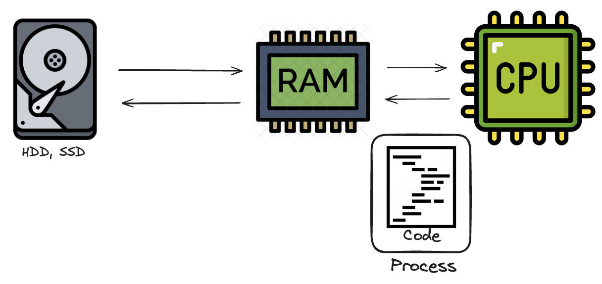
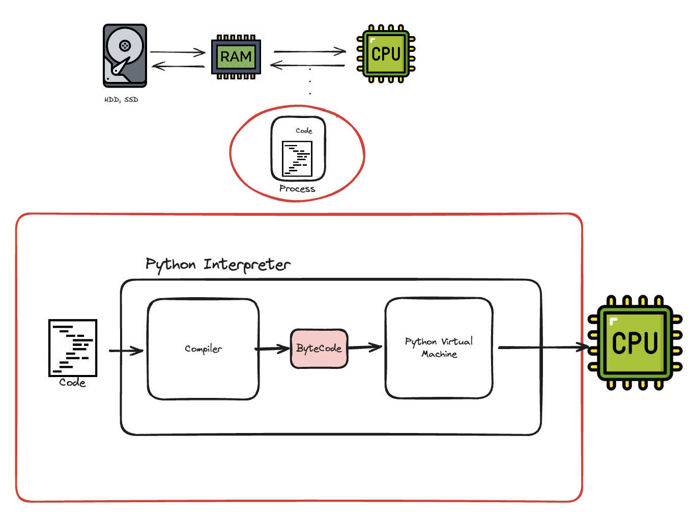
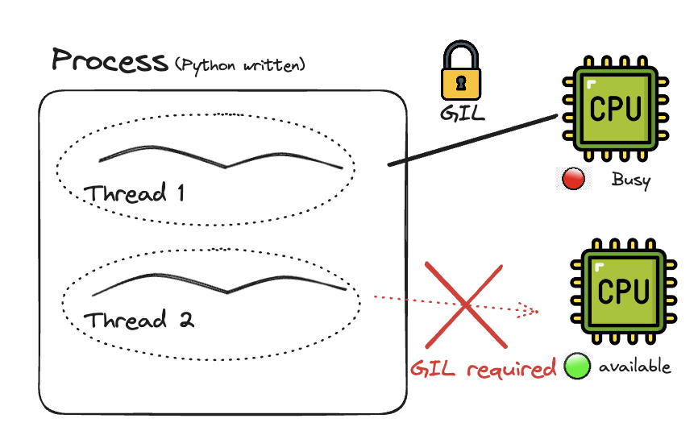
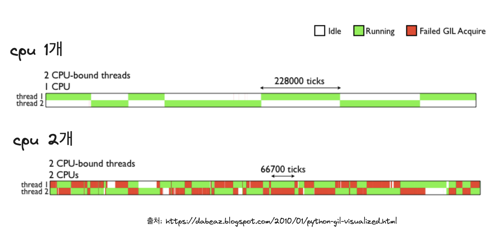
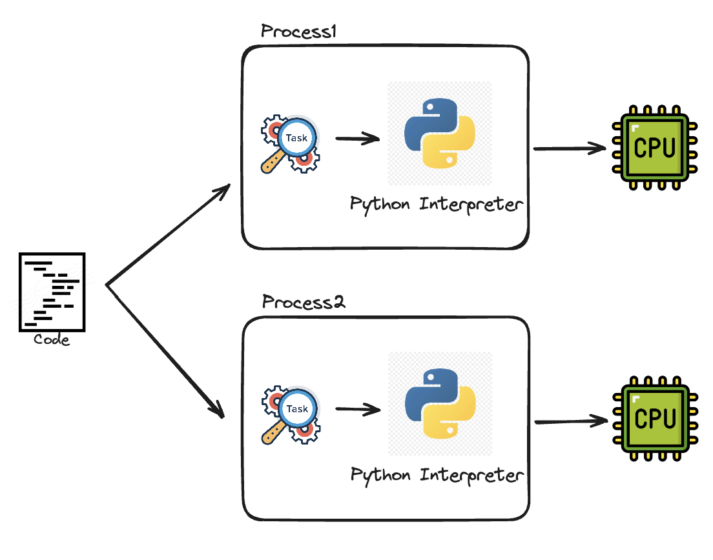

### Introduction
지난 10월 7일, 파이썬 3.13이 릴리즈되었습니다. 변경사항 중 가장 주목할만한 내용은 GIL을 키고 끌 수 있도록 변경한 부분이였습니다. 정식으로 GIL이 완전 제거 결정을 내리기까지는(제거하지 않기로 결정할 수도 있음) 약 5년정도의 시간이 걸린다고 하지만, 멀티쓰레딩이 어려웠던 기존의 파이썬을 생각하면 엄청난 변화라고 할 수 있을 것 같습니다. 이번 글에서는 GIL이 무엇인지, 왜 등장했고 왜 제거하기로 한 건지에 대해 알아보겠습니다.

### GIL이 무엇일까요?
GIL이 무엇인지 이해하기 위해서 우선 우리가 작성한 파이썬 코드가 어떤 식으로 돌아가는지 알아야합니다.
컴퓨터의 기본 동작 방식은 다음과 같습니다. 보조기억장치(하드 드라이브)에 저장된 코드를 읽어 메모리 공간(RAM)에 프로세스로써 올리고, CPU는 레지스터의 도움을 받아 RAM에 있는 명령어들을 처리합니다. 

RAM에 적재된 코드는 컴퓨터가 이해할 수 있는 언어로 번역(소스코드 ->바이트코드->기계어)되어야합니다. 언어마다 다르지만, 파이썬은 작성한 코드를 메모리에 올릴 때마다 인터프리터가 코드 한줄 한줄 이 번역을 수행해주는 `인터프리터 언어`입니다.

인터프리터는 사람이 작성한 코드를 CPU에서 수행할 수 있게 번역해주는 역할을 한다고 보면 됩니다. 그리고, GIL(Global Interpreter Lock)은 프로세스당 하나의 쓰레드만이 이 인터프리터의 제어권을 갖고 명령을 수행할 수 있게 하는 락(Mutex)입니다. 동일한 프로세스라면, 여러 쓰레드가 존재해도, 이 락을 소유하기 전까지는 명령을 수행할 수 없습니다. 
GIL은 멀티코어로 구성되어있는 최근 CPU들을(2024년 기준 인텔 i7은 최대 20개의 코어, 애플 M3는 최대 40코어 보유) 멀티 쓰레딩으로 활용할 수 있는 이점을 제약합니다. 

### GIL은 왜 등장한 것일까요?
그렇다면 왜 파이썬에 GIL이 등장한 걸까요? 정답은 다수의 쓰레드를 사용하면서 생길 수 있는 Race Condition을 예방하기 위해서입니다. 더 자세히는 파이썬의 메모리 관리 방법과 연관되어있습니다. 
파이썬에서는 Garbage Collection에 (Heap영역에서 더이상 사용되지 않는 객체들을 삭제) Reference Counting을 사용합니다. 어떤 객체의 Reference Count가 0이상이라면, Garbage Collection 대상에서 제외하고, 0에 도달한다면, 더 이상 사용하지 않는다고 판단하고 제거하는 식입니다. 그런데 이런 Reference Counting 방식은 같은 메모리 공간을 공유하는 쓰레드들끼리 같은 자원에 접근하는 Race Condition이 발생했을 때 문제가 생길 수 있습니다. Reference Counting에 대한 동시 접근으로 인해 삭제되어야할 객체가 삭제되지 않거나 유지되어야할 객체가 삭제되는 경우가 발생할 수 있습니다. 이런 Race Condition을 방지하기 위해 GIL이 탄생한 것입니다. (Java같은 경우, 특정 시점을 기준으로 garbage collection을 수행합니다.)

### 파이썬이 멀티코어를 활용하는 방법
GIL이 있다고 해서 파이썬이 멀티코어를 아예 활용하지 못 하는 건 아닙니다. 파이썬은 웹 프레임워크나 머신러닝 등 다양한 분야에서 활용되는 언어입니다. 파이썬이 멀티코어를 활용하는 방법은 크게 세 가지로 나뉠 수 있습니다.
1. 멀티 프로세싱
2. C나 C++로 작성한 코드
3. CPython이 아닌 다른 인터프리터(PyPy, Jython과 같은) 사용
(추가로 GIL때문에 멀티쓰레드가 아예 의미가 없는 건 아닙니다. `I/O작업시에 GIL은 자동으로 해제`되기 때문에 I/O bounded 작업에서는 멀티 쓰레드가 동작한다고 볼 수 있습니다.)

#### 파이썬 멀티코어 활용법1. 멀티프로세스
멀티프로세싱을 활용하면 멀티 코어를 온전히 사용할 수 있습니다. 그림으로 그리면 이런 식입니다. GIL에 의해 제약받지 않을 수 있도록 각 프로세스마다 별도의 인터프리터를 둡니다.

웹 게이트웨이 인터페이스인 `gunicorn`은 일반적으로 위에 보는 것과 같이 멀티 프로세싱 방식으로 동작합니다. 여기서 한 가지 알아야할 점은 프로세스는 개별적인 메모리 공간을 요구하기 때문에 멀티쓰레드에 비해서 메모리 공간을 더 차지합니다. 그리고 이 메모리 공간 때문에 메모리를 공유하는 쓰레드에 비해 컨텍스트 스위칭 비용이 발생합니다.

#### 파이썬 멀티코어 활용법2. C,C++ 작성 코드
파이썬에서는 C나 C++로 작성된 코드를 수행할 수 있도록 C API를 제공합니다. 파이썬 인터프리터가 C 코드를 확인하면 제어권을 넘기는 방식입니다. 이렇게 되면 GIL 상관없이 C나 C++ 코드에서 사용하는 것처럼 멀티쓰레딩을 사용할 수 있습니다. 대표적으로 numpy나 pandas와 같은 데이터과학 모듈이 이 방법을 활용합니다. C 작성 코드의 빠름과 유연함을 활용할 수 있다는 점이 장점이지만, C, C++ 데이터 구조에서 Python 구조체로 변경하기 위해 어느 정도의 오버헤드는 발생할 것입니다.

#### 파이썬 멀티코어 활용법3. CPython이 아닌 다른 인터프리터 사용하기
CPython이 표준 인터프리터이긴 하지만, PyPy나 Jython, IronPython 등 다른 인터프리터들도 존재합니다. GIL은 CPython 안에 존재하는 락으로, 만약 다른 인터프리터를 사용한다면 쓰레드 제약에 대해 더 이상 신경쓰지 않아도 됩니다. (물론, 다중 쓰레드 사용에 따른 공유 자원의 Race Condition을 직접 신경써줘야하겠죠) CPython이 아닌 다른 인터프리터를 직접 사용해본 적은 없지만, 필요하다면 인터프리터의 장단점을 확인하여 상황에 맞게 적절히 사용해볼 수 있을 것 같습니다.

### 3.13은 GIL 없이 어떻게 동작하는 걸까?
그럼 여기서 떠오르는 궁금증은 이미 잘 돌아가고 있는데, 왜 이제서야 바꾸는 걸까 입니다. 
2007년에 파이썬의 창시자 귀도 반 로썸이 게시한 글에는 멀티 코어가 등장하면서, GIL을 제거하는 방안을 고민해보았지만, 딱히 성능적으로 이점이 없었다는 얘기가 있습니다. GIL을 제거하면 CPU위주의 태스크를 수행하는 멀티 쓰레딩 프로그램에서는 확실히 이점이 있겠지만, 기존의 싱글쓰레드 프로그램에서 성능적으로 손실이 있었기 때문에 정식으로 반영되지 않았다고 합니다. 실제로 GIL을 제거하려는 여러 프로젝트(대표적으로 [Giletomy](https://github.com/larryhastings/gilectomy/tree/master))들이 있었지만, 3.13까지는 정식적으로 반영될 정도로 효과적이진 않았던 것 같습니다.
하지만 GIL 없이 멀티 쓰레딩을 사용가능하다면, 확실히 개선할 수 있는 포인트들이 있을 것입니다. 쓰레드 간 메모리를 공유한다는 점을 활용하면 메모리 공간을 더 효율적으로 사용할 수 있고, 멀티프로세스 사용시 프로세스 간에 자원을 공유해야하는 부담도 덜 수 있습니다. 
이 GIL 제거는 기존의 reference counting을 `biased referencing`, `immortialization`을 통해 가능해졌다고 합니다. 자세한 사항은 글이 길어져 생략하지만, 락을 걸지 않고, 어떻게 쓰레드 간의 Race Condition을 해결할지에 초점을 두고 키워드들을 살펴보시면 좋을 것 같습니다.

### Outro
지금까지 GIL이 무엇인지, 왜 파이썬에 GIL이 생긴 건지, 그리고 파이썬에서는 이런 제약을 어떻게 해결해왔는지에 대하여 알아보았습니다.
기존의 파이썬 생태계에서 어느정도의 최적화가 이루어진 상황이지만, no gil 도입을 통해 어떤 식으로 더 개선될 수 있을지 기대됩니다.
