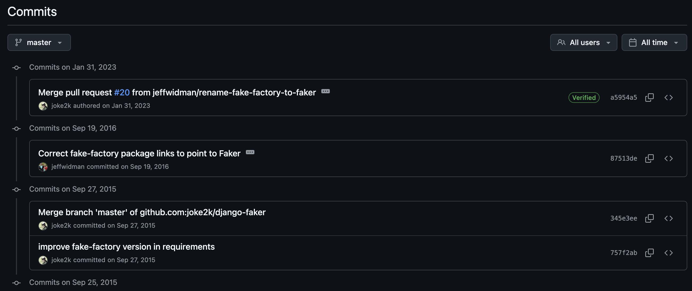
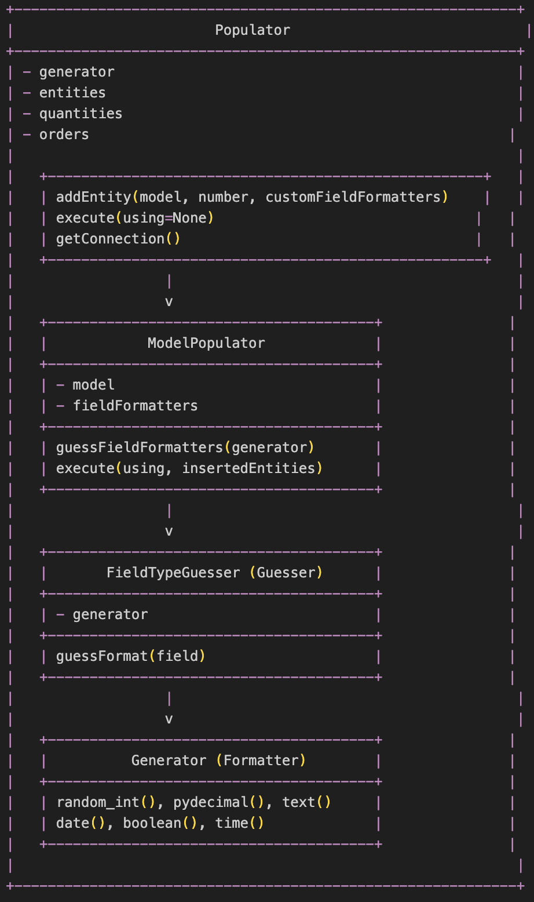
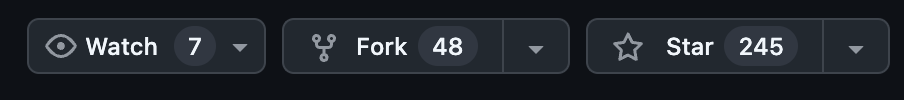
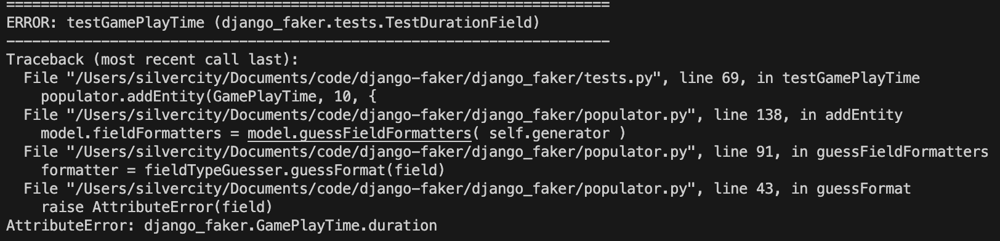
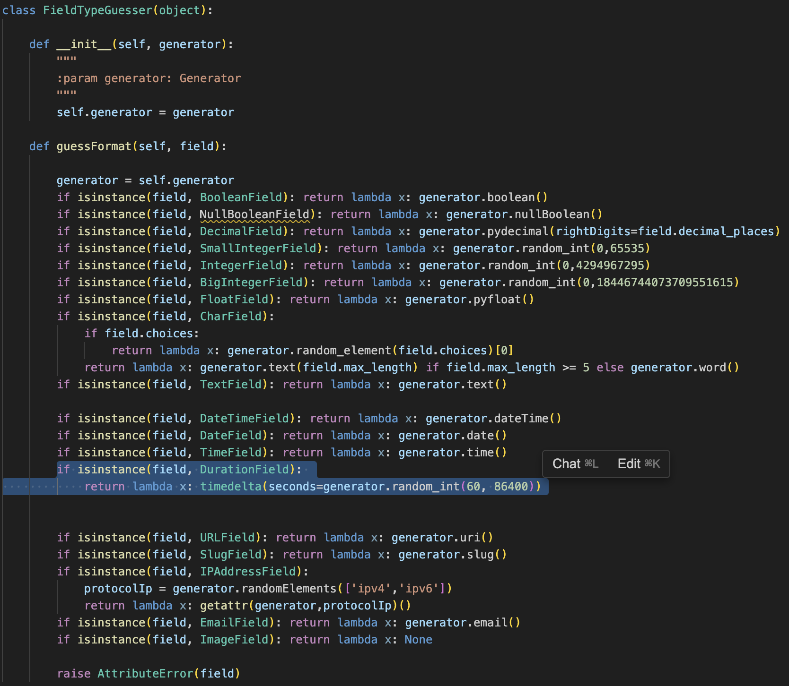
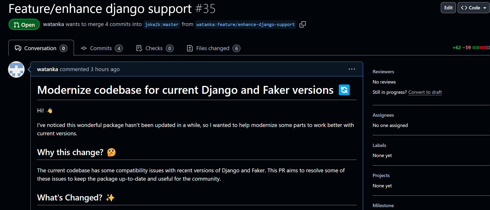

### Intro
2024년이 끝나간다. 연초에 이루고 싶은 여러 목표들을 적어두었었는데, 그 중 하나는 '오픈소스 기여하기'였다. 미루고 미루다가 24년이 얼마 안 남은 시점에 그 목표를 시도해보려고 한다. 전에 해본 적이 없으니 어디서부터 시작해야할지 막연한 마음이 컸고, 이런 오픈소스 기여같은 작업은 뭔가 대단한 작업이라 내가 할 수 있을까 하는 생각 때문에 미루게 된 것 같은데, 우선 해보는 게 중요하지 않을까. 이번 글은 그래서 PR을 제출하는 과정에 있어서 어떤 생각의 흐름을 가지고 진행했는지에 대해서 써보았다.

<br></br>
<br></br>


### 오픈소스란?
소스 코드가 공개되어 있어 누구나 자유롭게 사용, 복사, 수정, 배포할 수 있는 소프트웨어를 말한다. 오픈소스의 장점은 모두에게 수정할 기회가 열려있다보니, 코드에 대해서 활발하게 의견 교류가 이뤄지고, 더 좋은 코드로 발전할 가능성이 높아진다는 점이다. 오픈소스 코드 작성에 기여하면서 얻을 수 있는 점은 다른 개발자들의 코드를 읽고 배우면서 개발 실력을 기를 수 있다는 점이다. 그리고, 오픈소스에 기여하면서 개발자로써의 영향력을 키울 수 있으며, 전 세계 개발자들과 소통하고 협업하는 경험을 쌓을 수 있다. 이는 개인의 성장뿐만 아니라 개발자 커뮤니티 전체의 발전에도 긍정적인 영향을 미치게 된다. 결과적으로 오픈소스 활동은 개발자의 기술적 역량과 사회적 가치를 동시에 높일 수 있는 효과적인 방법이라고 할 수 있다.

<br></br>
<br></br>


### 오픈소스 기여 팁
본격적으로 시작하기 전, 오픈소스 기여 관련 다양한 자료를 얻을 수 있었다. 다음과 같은 조언을 얻었다.
- **어떤 오픈소스를 고를 것인가?** 
	=> 대단한 게 아니여도 된다. 비교적 코드가 복잡하지 않은 리포지토리부터 시작해보자
- **시작을 어떻게 하면 좋을까?** 
	=> 자주 사용하는 라이브러리 또는 프레임워크
	=> 리포지토리의 이슈 항목을 살펴보자. 보통 오픈소스는 컨트리뷰트를 어디서부터 시작하면 좋을지 안내하는 good first issue 라벨이 있다.
	=> 전체 코드를 한 번에 이해하려 하지 말고, 관심있는 컴포넌트를 하나 선택해서 거기서부터 시작하는 게 좋다.
- **어떻게 코드를 읽어야할지?**
	=> 우선 README부터 읽기
	=> 시작 포인트를 찾아서 거기서부터 타고들어갈 것
	=> 한줄 한줄 다 읽어볼 것
	=> 리포지토리의 TODO 부분을 확인하고 기여할 수 있는 부분을 확인해볼 것
	=> 테스트 코드 활용하기
	=> 코드를 읽다가 이해가 안되는 부분이 있다면, 관련 PR을 찾아보는 것도 방법
([배두식님의 PyCon KR 2023 오픈소스와 함께 성장하기](https://www.youtube.com/watch?v=gBjWgCXL4mA)를 참고했다.)


<br></br>
<br></br>


### 오픈소스 선정하기
위 팁들을 기반으로 요새 사용중인 웹 프레임워크인 django의 라이브러리 중 `django-faker`라는 라이브러리에 기여해보기로 마음먹었다. 
`django-faker`는 django model의 값들을 랜덤으로 생성해주는 역할을 한다. 아래는 README에 적힌 django-faker에 대한 설명이다.
	> _Django-faker_ provides an adapter for Django Models, for easy population of test databases. To populate with Model instances, create a new Populator class, then list the class and number of all of Models that must be generated. To launch the actual data population, call execute() method.
로직이 자료형에 알맞는 랜덤값만 생성하면 된다는 점에서 코드 파악을 위한 피로감이 다른 리포지토리보다 덜 하지 않을까하는 생각이 들었다. 한 가지 문제는 마지막 update가 2016년... 무려 8년전... 거의 업데이트가 더 이상 없는 라이브러리라는 점이였다. 하지만, 목표가 '오픈소스 기여하기'인만큼 이 또한 좋은 경험이 될 거라는 생각이 들었다. PR에 대한 피드백이 늦을 수 있다는 점만 감안하면 될 듯 했다.


<br></br>
<br></br>


### 코드 파악하기
README.md를 우선 한 번 훑었다. README에는 어떻게 모듈을 사용할지에 대한 예제가 있어서 이해가 조금 더 수월해졌다. 그리고 테스트 코드를 보면서 어떻게 동작하는지 파악할 수 있었다. `django-faker`는 django Model의  field 타입을 예측하는 `Guessor`, 타입에 맞춰 값을 랜덤하게 생성하는 `Generator`, 생성한 값의 포맷팅을 담당하는 `Formatter`, 모델에 생성한 랜덤값을 주입하는 `Populator`로 이루어져 있다. 이에 맞춰서 테스트 코드도 각 부분들을 테스트하는 것을 확인할 수 있었다.



<br></br>
<br></br>


### 기여 목표 선정하기
`django-faker`는 업데이트된지 꽤 오래되었다. 하지만 해당 모듈이 의존하는 `django`와 `faker`는 계속 업데이트가 이뤄지고 있었다. 그래서 django-faker가 현재 버젼이 커버하지 못하는 새로운 django의 model field들이 있을 거라고 가정을 세우고, 이 부분에 코드를 추가해보기로 마음먹었다.
그리고 다음과 같이 목표를 세웠다.
- `django-faker`에서 정해놓은 PR checks를 우선적으로 통과할 것.
- 메인테이너 또는 오너가 내가 올린 PR을 merge시켜주는 것. (워낙 오래된 라이브러리라 리액션이 늦게 돌아올 수도 있지만, 우선은 해보자)

<br></br>
<br></br>


### 기여할 부분 찾기
우선 보통 기여할 부분을 찾는 방법은 이슈를 살펴보거나, 모듈 사용중에 불편함을 겪은 부분에 대해 개선방법을 제시하는 식으로 진행한다는 점을 기억하자. (우리는 전략적으로 django-faker가 업데이트가 오랫동안 이뤄지지 않았다는 점을 이용하는 거다.) 
`django-faker`의 마지막 업데이트 일자인 2015년을 기점으로 `django`에는 어떠한 모델 관련 업데이트가 있었는지 확인해보았다.(https://docs.djangoproject.com/en/5.1/releases/)
여러 변경사항들중에 2.0을 기준으로 시간 간격을 저장하는 `DurationField` 필드가 추가된 것을 확인할 수 있었다! 
우선 내 계정으로 리포지토리를 fork하고 로컬에 clone했다.

실제로 `django-faker`가 `DurationField`를 처리하지 못하는지 확인할 필요가 있었기 때문에, `DurationField`를 사용하는 모델을 하나 만들고, 테스트 코드를 작성해준다.
```python
class GamePlayTime(models.Model):
	game = models.ForeignKey(Game, on_delete=models.CASCADE)
	player = models.ForeignKey(Player, on_delete=models.CASCADE)
	duration = models.DurationField()
```

```python
class TestDurationField(unittest.TestCase):
	def testGamePlayTime(self):
		generator = fake
		populator = Populator(generator)
		populator.addEntity(Game, 10)
		populator.addEntity(Player, 10, {
		'game': lambda x: Game.objects.order_by('?').first()
		})
		populator.addEntity(GamePlayTime, 10, {
		'game': lambda x: Game.objects.order_by('?').first(),
		'player': lambda x: Player.objects.order_by('?').first()
		})
		insertedPks = populator.execute()
		self.assertEqual(len(insertedPks[GamePlayTime]), 10)
```
테스트가 `django-faker`에서 발생하는 AttributeError로 테스트를 통과하지 못 하는 걸 확인했다.


새로운 코드를 반영하기 위한 브랜치를 생성한다. 브랜치 이름은 나름 비장하게 `eature/enhance-django-support` 그리고, 테스트 코드를 통과하기 위해 `FieldTypeGuesser`에 `DurationField`를 처리할 수 있도록 코드를 추가해주었다. (django와 faker의 버젼에 맞춰 코드를 업데이트해줄 필요가 있었는데, 이 부분에서 의외로 시간을 많이 사용했다.)

이렇게 작성한 코드를 바탕으로 테스트를 다시 실행시켜준다. 
테스트를 잘 통과한다..!
테스트를 내가 임의로 바꾸는 건 좋지 않은 방법이지만, 오랫동안 관리되지 않은 부분에 대한 업데이트를 적용하기 위한 테스트이기 때문에 우선 적용하기로 했다.


<br></br>
<br></br>


### Pull Request 작성하기
테스트도 무사히 잘 통과하니, 이제 마지막으로 메인 리포지토리에 풀리퀘스트를 날려준다!! PR에는 어떤 문제를 찾았고, 그 문제를 해결하기 위해 어떤 변경사항을 적용했는지 코드를 보지 않더라도 의도와 변경사항이 명확히 전달될 수 있도록 작성하는 게 중요하다. 작성한 [PR](https://github.com/joke2k/django-faker/pull/35)은 여기에서 확인 가능하다. 


<br></br>
<br></br>


### Outro
이렇게 첫 오픈소스 기여하기를 진행해보았다. 나름 단순한 코드 리포지토리였지만, 소스코드를 살펴보는 과정, 업데이트 릴리즈 노트를 확인하는 과정, 라이브러리 호환성을 맞추는 과정, PR을 잘 작성하는 과정 등 생각보다 신경쓸 것이 많았다. 하지만, 오픈소스 기여라는 것이 내가 엄두조차 못 낼 정도로 대단한 건 아니라는 걸 알게 되었다. 다음에는 버그를 찾고, 픽스해보는 PR을 날려보자! 
2024년도 며칠 안 남았다. 연초에 다짐했던 목표 중 하나를 이렇게 글을 쓰면서 달성할 수 있어서 다행이다!

