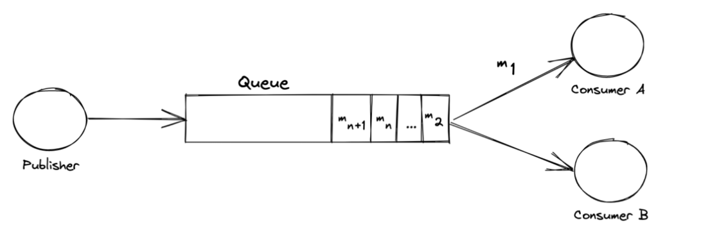

### Intro

django를 학습 중이다. django에서는 웹 서비스 개발에 필요한 편리한 도구들을 제공한다. 그 중 Signal은 이벤트 기반 아키텍쳐에서 강력한 도구로 활용될 수 있다.
이번 글에서는 **Django Signal이란 무엇인지**, **어떻게 동작하는지**, 그리고 **어떤 상황에서 Signal을 사용하는 것이 적절한지**에 대해 심층적으로 알아보려고 한다.

<br></br>

### Signal이 뭔가요?

signal은 django 시스템 실행 중 이벤트가 발생했을 때 실행되는 콜백 메커니즘이다. 이 시그널은 이벤트를 알리는 publisher와 알림을 받는 subscriber로 이루어진 pub/sub 구조를 통해 동작한다. publisher가 이벤트의 특정 동작 시점을 알리면, 대기하고 있던 subscriber는 그에 맞춰서 필요한 동작들을 수행한다. 이 pub/sub 구조의 장점은 **느슨한 결합을 유지**할 수 있다는 점인데, 예를 통해 어떤 의미인지 살펴보자.

<br></br>

### Pub/Sub 구조


신호등이 없는 나라에 새로 부임받은 교통경찰이 있다. 이 교통경찰은 차량들이 지체없이 통행할 수 있도록 해야한다. 이 교통경찰은 지나가는 차량들을 일일이 붙잡고 멈춰야할 시점과 출발해야하는 시점을 알려준다. 열심히 뛰어다녔지만 혼자서는 버겁다. 그리고 간혹 말이 통하지 않는 외국인이 있는 경우에는 정보 전달을 위해 더 많은 시간이 걸렸다.  차량 퇴근시간이 되어 차량이 많아지자, 교통경찰 혼자서 차량들을 통제하는 일은 점점 더 버거워졌고, 결국은 3중 추돌 사고가 나고 말았다.

이렇게는 안 되겠다 싶었던 경찰은 신호등을 설치하기로 마음먹는다. 빨강, 노랑, 초록 싸인에 대한 설명 글귀를 큼지막하게 적어 운전자들이 확인할 수 있도록 하고, 차량들이 신호등의 신호에 따를 수 있도록 통제했다. 색깔 사인은 언어가 달라도 이해할 수 있었기 때문에 외국인도 별 무리 없이 운전이 가능했다. 만약 신호등 통제를 따르지 않는다면, 벌금을 부과하도록 단속했다. 이제 모든 차량들이 신호등의 신호에 집중해서 악셀을 밟을지 브레이크를 밟을지 결정했고, 교통 경찰은 더 이상 차량들을 하나하나 통제하지 않아도 됐다.



이 스토리에서 교통경찰이 일일이 차량을 통제하는 건 강한 결합, 그리고 신호등을 통해 통제하는 건 느슨한 결합이라고 볼 수 있다. SRP 원칙에 따라 한 앱(모델 또는 앱)은 자신이 맡은 역할만 수행하는 게 기본적이지만, 로직상 다른 앱의 처리과정과 연관되어 있을 경우도 자주 발생한다. (예를 들어 온라인 쇼핑몰에서 상품 결제 처리 시 재고 처리, 결제 처리, 알림 처리 등이 동작해야한다.)

pub/sub 구조는 로직을 같은 컨텍스트 안에 작성하여 강하게 결합된 코드를 만드는 대신, ‘분리되어야하는 동작을 발동시키는 로직’을 ‘이벤트’로 정의하고 큐에 넣어서 처리한다. 이렇게 하면, 모델은 본 컨텍스트에 관련된 로직만 처리하고, 신호등과 같은 역할인 큐에서 컨슈머들(차량)이 알아서 가져가서 처리할 수 있도록 할 수 있다. 퍼블리셔는 자신의 행동 외에 컨슈머가 어떤 행동을 할지에 대해서 모르고, 컨슈머도 발생한 이벤트에 맞춰 자신이 어떤 행동을 해야할지만 알 뿐이다.

<br></br>

정리하자면, signal을 사용함으로써 얻을 수 있는 이점은  

*“독립적인 컴포넌트들이 독립적으로 구분되어 서로를 모르고 동작할 수 있도록 한다.”*

<br></br>

한 가지 주의할 점은 일반적인 pub/sub 구조는 publisher와 subscriber 가운데에 queue 또는 broker를 두어 느슨한 결합을 이루지만, django signal 같은 경우 **따로 queue없이 publisher, 즉 signal 자체가 브로커 역할을 한다는 점**이다. 


django에서 signal을 사용하는 대표적인 예는 유저 정보를 처리할 때다. django에서 제공하는 User 모델로는 충분한 정보를 담지 못 하기 때문에 일대일 대응되는 UserProfile 같은 모델로 추가 정보를 담는 경우가 일반적인데, User 생성시에 UserProfile도 함께 생성될 수 있도록, User 생성 이벤트에 UserProfile이 생성되는 시그널을 만들어 처리한다.

```python
@receiver(post_save, sender=User) 
def create_user_profile(sender, instance, created, **kwargs):
	if created:
		UserProfile.objects.create(user=instance)
```

receiver 데코레이터는 아래 함수가 이벤트 콜백 함수임을 명시하고, 어떤 이벤트에 동작하는지 정의한다. create_user_profile이 `User` 모델의 `post_save` 시에 동작하는 콜백함수인 것을 확인할 수 있다.

<br></br>
### signal 종류

이벤트 종류에 따라 시그널 종류가 나뉜다. 

크게 ORM관련, Request와 Response 사이클 관련, Authentication 관련, 그리고 데이터베이스 연결, 테스트, 매니지먼트(manage.py 실행 관련), Admin관련, 미들웨어 관련 등으로 나눌 수 있다. 다양한 종류들이 존재하지만, ORM, Request/Response, 그리고 Authentication 관련 시그널이 많이 쓰인다고 볼 수 있다. pre, post와 같이 세부적으로 이벤트 시점 조정이 가능하고, 필요하다면 Custom Signal을 만들어 특정 이벤트에 동작할 수 있도록 구성할 수도 있다. 

아래 표를 통해 어떤 signal 종류가 있는지 알아보자.

<br></br>

**ORM 관련**
| **Signal** | **설명** |
| --- | --- |
| **`pre_init`** | 모델 인스턴스가 초기화되기 전에 발생 |
| **`post_init`** | 모델 인스턴스가 초기화된 후에 발생 |
| **`pre_save`** | 모델 인스턴스가 저장되기 전에 발생 |
| **`post_save`** | 모델 인스턴스가 저장된 후에 발생 |
| **`pre_delete`** | 모델 인스턴스가 삭제되기 전에 발생 |
| **`post_delete`** | 모델 인스턴스가 삭제된 후에 발생 |
| **`m2m_changed`** | `ManyToManyField`관계가 변경될 때 발생 |
| **`pre_migrate`** | 마이그레이션이 실행되기 전에 발생 |
| **`post_migrate`** | 마이그레이션이 실행된 후에 발생 |
**Request/Response 관련**

| **Signal** | **설명** |
| --- | --- |
| **`request_started`** | HTTP 요청이 시작될 때 발생 |
| **`request_finished`** | HTTP 요청이 끝날 때 발생합 |
| **`got_request_exception`** | 예외가 발생했을 때 발생 |
| **`setting_changed`** | Django 설정(`settings.py`)이 변경될 때 발생 |

**Authentication 관련**

| **Signal** | **설명** |
| --- | --- |
| **`user_logged_in`** | 사용자가 로그인할 때 발생합니다. |
| **`user_logged_out`** | 사용자가 로그아웃할 때 발생합니다. |
| **`user_login_failed`** | 로그인에 실패했을 때 발생합니다. |
| **`password_changed`** | 사용자의 비밀번호가 변경될 때 발생합니다. |
| **`password_reset`** | 사용자의 비밀번호가 재설정될 때 발생합니다. |

### 어떤 식으로 사용할 수 있나요?

1. **Decorator 방식 (@receiver 사용)**

가장 일반적이고 권장되는 방식이다.

```python
# signals.py
from django.db.models.signals import post_save
from django.dispatch import receiver
from django.contrib.auth.models import User

@receiver(post_save, sender=User)
def user_created_signal(sender, instance, created, **kwargs):
    if created:
        print(f'New user created: {instance.username}')

```

1. **`connect` 메서드 사용하기**

```python
python
# signals.py
from django.db.models.signals import post_save
from django.contrib.auth.models import User

def user_created_signal(sender, instance, created, **kwargs):
    if created:
        print(f'New user created: {instance.username}')

post_save.connect(user_created_signal, sender=User)

```

**차이점:**

- `connect`는 동적으로 Signal을 연결할 수 있다.

**c. Custom Signal 만들기**

```python
python
코드 복사
# signals.py
from django.dispatch import Signal

# Signal 정의
order_completed = Signal()

# Signal 수신기
def notify_order_completed(sender, **kwargs):
    print(f"Order completed for: {kwargs['user']}")

# Signal 연결
order_completed.connect(notify_order_completed)

# Signal 발행
order_completed.send(sender=None, user='John Doe')

```

그럼 signal은 디렉터리 구조 중 어디에 위치하는 게 좋을까?

일반적으로 다음과 같은 구조를 사용한다.
```lua
myapp/
├── __init__.py
├── models.py
├── views.py
├── signals.py   <-- Signal 정의
├── apps.py      <-- Signal 등록
└── admin.py

```

(apps.py에 시그널을 등록해야만 활성화된다는 점도 잊지말자)

```python
# apps.py
from django.apps import AppConfig

class MyAppConfig(AppConfig):
    default_auto_field = 'django.db.models.BigAutoField'
    name = 'myapp'

    def ready(self):
        import myapp.signals  # Signal import

```

<br></br>

### 어떻게 동작하나요?(내부 동작을 살펴보자)

signal의 동작 방식은 생각보다 단순하다. `django.dispatch.dispatcher.py`의 Signal의 `connect` 함수를 통해 확인 할 수 있다. 

```python
with self.lock:
    self._clear_dead_receivers()
    if not any(r_key == lookup_key for r_key, _, _ in self.receivers):
        self.receivers.append((lookup_key, receiver, is_async))
    self.sender_receivers_cache.clear()
```

lock이 걸린 상태에서 `connect`함수가 호출될 경우, Signal 인스턴스에 정의된 receivers를 순회하며 해당 signal에 대해 어떻게 반응해야할지 찾는다. 그리고 기본값으로 설정되어 있는 `weak=True`는 receiver가 호출 후, garbage collector에 의해 수거되어 메모리를 낭비하지 않아도 될 수 있도록 약한 참조를 할 수 있게 돕는다.

```python
if weak:
  ref = weakref.ref
  receiver_object = receiver
  # Check for bound methods
  if hasattr(receiver, "__self__") and hasattr(receiver, "__func__"):
      ref = weakref.WeakMethod
      receiver_object = receiver.__self__
  receiver = ref(receiver)
  weakref.finalize(receiver_object, self._remove_receiver)
```

<br></br>

### 어떨 때 사용하면 좋을까요?

장점과 단점을 알고 상황에 맞게 사용하는 것이 중요하다. 위에서 언급한 것처럼 signal을 사용하면서 얻을 수 있는 장점은 느슨한 결합이다. 책임이 분리되어있기 때문에 코드가 깔끔해지고, 유지보수가 쉬워진다는 장점이 있다. 하지만 물론 단점도 있다. 코드 흐름을 알기 어렵다. two scoops of django 책에는 “그러므로 시그널을 받는 리시버가 어떤 것인지조차 알 필요가 없는 경우라면 그 때 시그널을 활용하라”라는 조언이 있다. 그리고, signal은 “**동기화되고 블로킹**을 일으키는 무거운 프로세스를 호출한다. 확장과 성능 면에서 어떤 장점도 찾아볼 수 없다”라는 단점이 있기도 하다. 그러므로 signal을 과도하게 사용하기보다는 정말 필요한 경우에만 사용하도록 하고, 무거운 작업일 경우, celery를 사용하는 등 비동기 처리로 옮기는 게 더 바람직하다.

<br></br>

### Outro

이번 글에서는 django Signal에 대해 알아보았다. signal이 어떤 장점을 가지고 있는지, 어를 통해 어떤 기능을 구현할 수 있는지, 그리고 어떻게 동작하는지와 언제 사용하면 적합한지에 대해 살펴보았다. 모쪼록 django를 공부하는 분들께 도움이 되었으면 좋겠다.