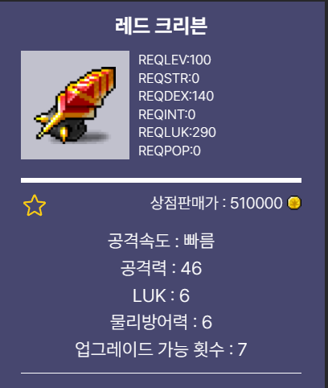
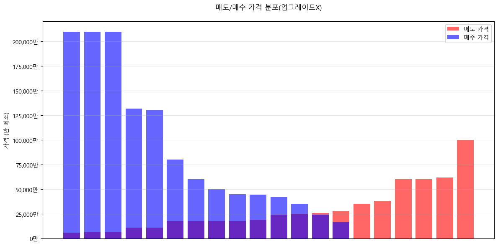
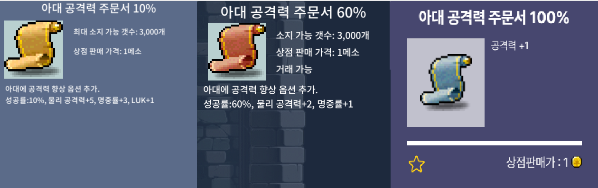
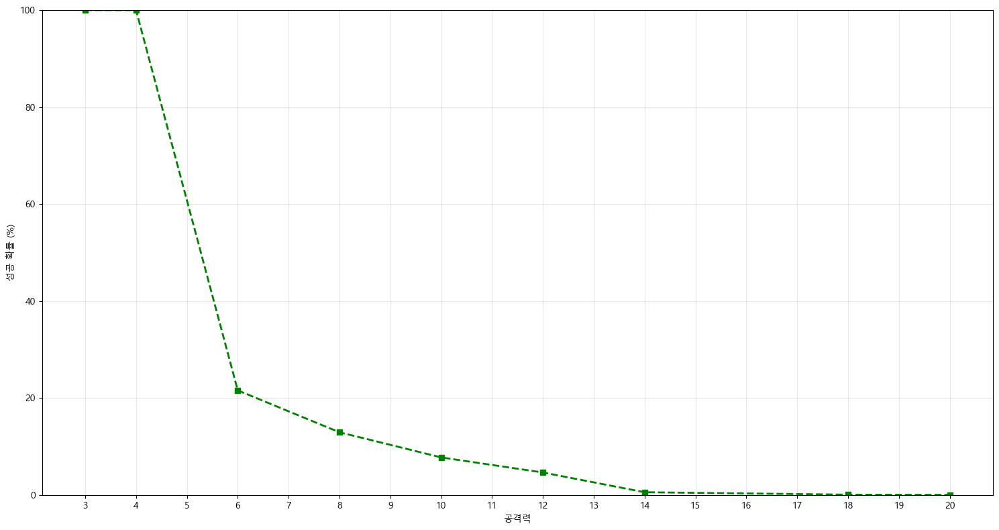
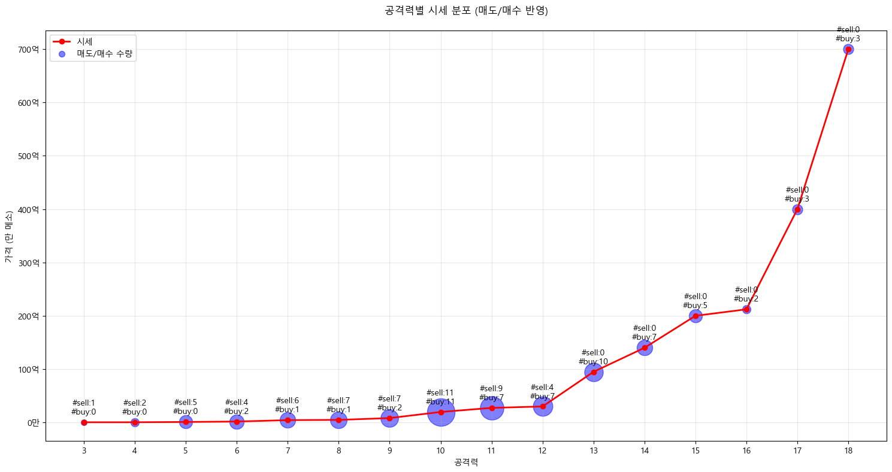

**이번 글은 호기심을 데이터로 구현하는 **월간 데이터노트** 1회차를 참여하면서 작성한 내용을 담았다.**

<br></br>

### 내가 월간 데이터노트에 참여하게 된 계기

참여중인 개발자 글쓰기 모임(글또)에서 [월간 데이터노트](https://github.com/MonthlyDataNote/MonthlyReport) 홍보글을 봤다.

월간 데이터노트는 호기심을 데이터로 구현하여 1-2장의 결과물을 기록하는 모임이다. 예를 들어, 계절별 과일 가격은 추석이나 설날 같은 명절에 어떻게 변동하는지 추적하거나, 한강의 노벨문학상 수상을 통해 종이책 구매량은 어떻게 변했는지와 같은 일상 주제들을 데이터로써 분석해볼 수 있다.

 예전부터 자주 이런 일상 주제들에 대해서 머릿속으로 나름의 가설을 세우고, 증명하기 위해서는 어떤 데이터들이 필요할지 상상해보곤 했다. 예를 들어, 퇴근시간과 같이 교통량이 몰리는 시기에 신호 패턴이 어떤 식으로 바뀌는지, 그에 따른 영향은 어떤 식으로 수치화할 수 있는지와 같은 상상.. 그래서 이런 상상을 직접 데이터를 수집해보고 결과물을 뽑아보는 실천으로 옮겨보면 재밌을 거라는 생각에 참여하게 되었다.

### 분석 주제 및 목적

- 초등학교 시절 자주 하던 메이플스토리. 그 시절 메이플스토리가 최근에 다시 ‘메이플랜드’ 라는 이름으로 런칭되었다. 반가운 마음에 유튜브에 뜬 메이플스토리 플레이 영상을 보다보면 아련한 옛 추억에 잠기곤 한다.
- 찾아보니 게임머니를 현금처럼 사용하고, 아이템을 구매하기 위해 적지 않은 금액을 기꺼이 지불하는 걸 알게 되었다.
- 아이템 매니아(25.01.09) 기준 현재 100만메소당 5000-9000원 정도의 가격에 거래되는 것을 확인할 수 있다. 정말 비싼 아이템은 몇백만원에 거래되기도 한다.
- mapleland.gg같은 사이트에 팝니다, 삽니다 정보를 알아보기 쉽게 정리되어있다.
    
    
    


### 분석 결과

**“아이템 시세에 영향을 미치는 요소에는 뭐가 있을까?”**

- 시세를 어떻게 측정할 수 있을까?
    
    매수희망 가격을 내림차순, 매도희망 가격을 오름차순으로 정렬함.
    
    **파는 사람은 최대한 비싸게, 사는 사람은 최대한 싸게**
    
    순서대로 매수/매도 금액을 매칭하여 거래가 성사될 수 있는 건들에 대한 평균값을 시세로 측정.
    
    
    

    업그레이드 없는 순정 레드 크리븐을 기준으로 **시세는 2억 4889만 메소**로 형성 되어있음.
    
    *발표 후 질문 중에 ‘실제 성사된 거래 내역을 확인해볼 수도 있을까요?’라는 질문에 깨닫게 되었는데, 시세를 확인하기 위해 먼저 고려해볼 부분은 실제 거래가 성사된 내역이라는 걸 간과하고 있었다. 
    
- 어떤 아이템의 시세를 살펴보면 좋을까?
    
    현시점(2025-01-25) 직업군 중 가장 쎈 도적의 엔드 아이템(가장 좋은 아이템) **레드 크리븐**
    
    옵션이 좋은 매물을 기준으로 5억 메소에 매수가가 형성되어 있음. 5억 메소는 자그마치 **현금 450만원**(100만 메소=9000원 가정)
    
    
    

- 아이템 스탯별 시세의 상승률을 시각화해보자
    
    
    

    - 메이플랜드에는 “주문서” 시스템이 있음. 주문서를 사용해서 아이템의 스탯을 업그레이드할 수 있는 시스템임
    - 아이템에는 보통 업그레이드횟수가 7번 정도 주어짐.
    - 주문서는 성공 확률에 따라 10%, 60%, 100%로 나뉘는데, 성공확률이 낮을수록 업그레이드할 수 있는 스탯 비중이 높아짐.
    - 공격력별 성공확률 시각화
        
        
        

    
    - 공격력별로 매수/매도 데이터를 그룹화한 후, 시세를 구한다.
    
    
    

    ```markdown
    === 시세 분석 ===
    공격력과 시세의 상관계수: 0.776
    매도 있는 최대 공격력: 12
    매수 있는 최대 공격력: 18
    
    === 공격력 구간별 가격 상승률 ===
    공격력 3 → 4: 0.0%
    공격력 4 → 5: 122.2%
    공격력 5 → 6: 80.0%
    공격력 6 → 7: 144.4%
    공격력 7 → 8: 11.4%
    공격력 8 → 90: 69.4%
    공격력 9 → 10: 137.3%
    공격력 10 → 11: 39.1%
    공격력 11 → 12: 9.5%
    공격력 12 → 13: 216.7%
    공격력 13 → 14: 47.4%
    공격력 14 → 15: 42.9%
    공격력 15 → 16: 6.1%
    공격력 16 → 17: 88.6%
    공격력 17 → 18: 75.0%
    ```
    

### 진행하면서 배우게 된 것/ 더 보충할 수 있을 것 같은 부분

- 분석면에 있어서 한 문장으로 정의내릴 수 있는 명확한 결론은 나지 않은 것 같다.
- 시세를 어떻게 정의내릴지에 대해 알아본 것은 유용했다.
- 업그레이드 수준에 따른 시세 변화 같은 경우에 결론은 결국 ‘업그레이드가 잘 될 수록 시세는 비싸진다’ 정도에서 그친 것 같아서 좀 아쉽다. 업그레이드 횟수와 성공확률에 따라 ‘기회비용’이 얼마정도 되는지(과연 추가로 주문서 작을 하는 게 나을지에 대한 판단을 위한 수치)와 같은 분석을 추가로 진행하면 좋을 것 같다는 생각이 들었다.
- 한 아이템에 대해서만 분석을 진행했는데, 크롤링 범위를 전체 아이템 또는 API 형식으로 확장하고 범용적으로 분석이 가능한 대쉬보드를 작성한다면 좀 더 유용한 결과물이 될 수 있을 것 같다는 생각이 들었다.


<br></br>

**데이터출처 & 코드**

- [mapleland.gg](http://mapleland.gg) - 셀레니움으로 크롤링(코드는 chatGPT로 작성)


