얼마전 의도치 않은 AWS 요금 폭탄을 맞고(미리 요금 모니터링을 안 한 내 잘못이 맞ㄷㅏ…), 개인용 pc로 배포 서버를 구성하기로 마음 먹었다. 마침 중고로 팔려고 언젠가부터 창고 한켠에 쳐박아두었던 맥북 프로가 생각났다. 오랫동안 쓰지 않은 터라, 부팅 속도가 느리고, 프로그램 하나만 실행해도 팬 돌아가는 소리가 시끄럽긴 했지만, 꽤 잘 동작한다.  

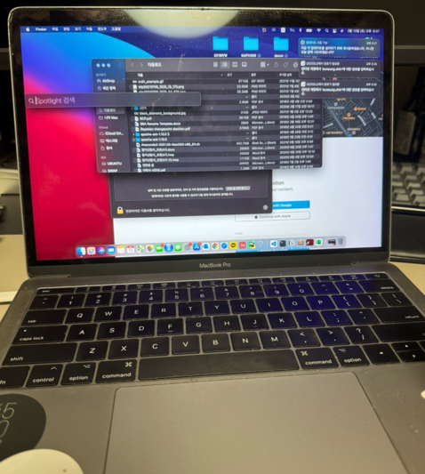

이 맥북을 서버로 사용하기 위해 필요한 작업을 크게 세가지로 정리했다.  

1. 서버 셋팅
2. 외부에서 접속 가능하도록 네트워크 설정
3. 앱 배포

  

서버 셋팅과 앱 배포 부분은 우선 네트워크를 구성해놓은 후 천천히 진행해도 될 것 같아서, 이번 글에서는 2번 네트워크 설정한 후기에 대해서 적어보려고 한다. 

  

진행 방식은 다음과 같다.

1. 홈 네트워크 구성 파악하기
2. 외부 IP와 내부 IP 파악하기
3. DHCP 서버에서 고정 IP 할당받기
4. 포트 포워딩하기
5. dDNS 등록하기

  

### 홈 네트워크 구성 파악하기

우선 맥북이 연결된 네트워크의 구성을 파악할 필요가 있었다. 

네트워크 구성을 살펴보면 이렇게 그림으로 정리될 수 있다.

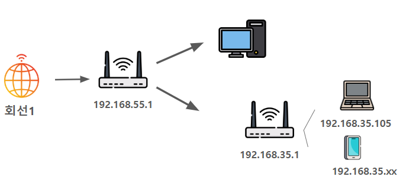

네트워크 구성 트러블 슈팅

    
    우리집 네트워크는 회선이 두 개다. 하나는 내 방에 랜선으로 데스크탑에 연결되어있고, 다른 하나는 거실에 WiFi를 연결할 수 있는 공유기로 연결되어 있다. 회선을 2개를 사용(아니 애시당초 왜 2개 회선인 거지…?)하고 있기 때문에 당연히 나는 구성이 데스크탑과 WIFI가 서로 별개의 네트워크 구성이라고 생각했다. 그림으로 그려보자면,  
    
    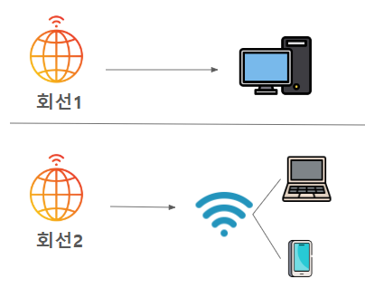
    
    이런 식으로 말이다.  
    
    결론적으로 알게 된 구성의 형태는  
    
    
    
    이런 식이였다.  
    
    35.1 공유기의 포트 포워딩 설정 후에도 외부에서 접속이 불가한 이슈가 있었는데, 한참을 헤매다가 `traceroute 8.8.8.8` 커맨드로 35.1 공유기를 지나친 패킷이 55.1을 거쳐간다는 걸 확인하고 35.1이 55.1에 속해있다는 걸 파악할 수 있었다.  
    
    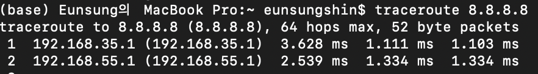
    
    그래서 이 35.1 공유기를 bridge모드로 설정하여 서브넷팅 없이 패킷만 전송하도록 설정하니 외부에서 접속이 가능해졌다.  
    
    아무튼 내 소소한 삽질이였고, 본인의 네트워크 구성도 skbroad밴드에서 회선을 두 개 사용하는 분이라면, 위에 저 그림만 참고하면 좋을 것 같다.  
    
    그런데 인터넷 회선은 결국 랜선에 연결된 55.1 하나인 것 같은데, 도대체 왜 회선 2개만큼의 비용을 지불해야하는지 의문이다. 아시는 분…?  

  

### 외부 IP와 맥북 IP 파악하기

외부에서 바라보는 내 네트워크(맥북이 연결된)의 공인 IP를 우선 파악한다.  

이렇게 되면  

[ip.pe.kr](http://ip.pe.kr)에 접속하면 내 공인 IP를 확인할 수 있다.  

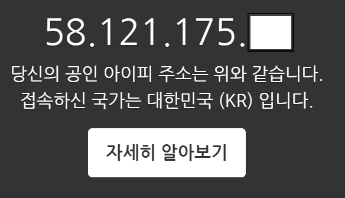  

그리고 이제 맥북의 IP를 파악해야한다. 공유기 관리자 페이지(?)에서 확인할 수도 있고, `ifconfig` 를 통해 확인할 수도 있다. 

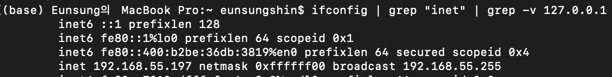

  

### DHCP 서버에서 고정 IP 할당받기

지금 맥북 주소는 공유기의 DHCP 서버로부터 할당받은 동적 IP이기 때문에, 공유기 관리자 페이지에서 DHCP 서버가 이 맥북에게 고정 IP를 제공할 수 있도록 설정해줘야 한다.  

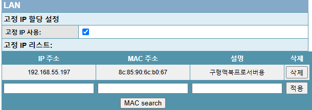

  

### 포트 포워딩하기

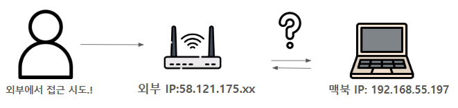

맥북에서 실행되는 앱을 외부에서 접근할 수 있도록 하려면, 포트 포워딩이 필요하다.   

실제로 앱이 접속가능한지 테스트해보기 위해 간단한 fastapi 앱을 작성해준다.  

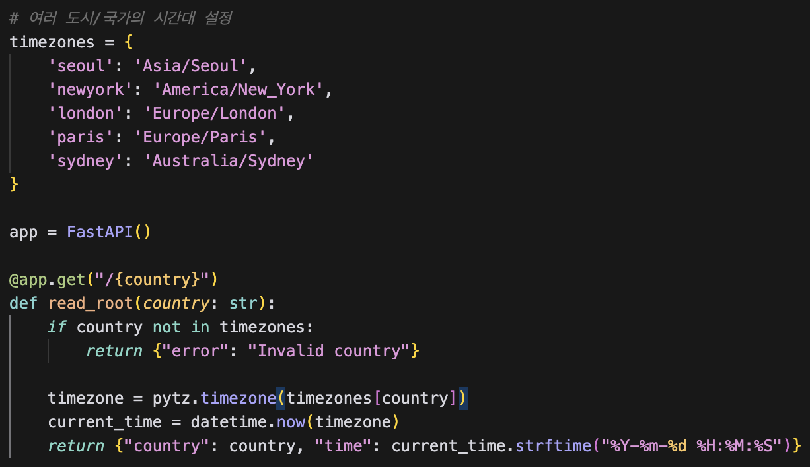

그리고, 공유기 관리자 페이지에서 외부에서 해당 포트로 접속했을 경우 맥북 IP의 로컬 포트로 연결받을 수 있도록 설정을 추가해준다.  

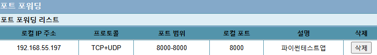

그럼 이제 외부 IP의 8000번 포트로 접속이 성사되는 걸 확인할 수 있다.  

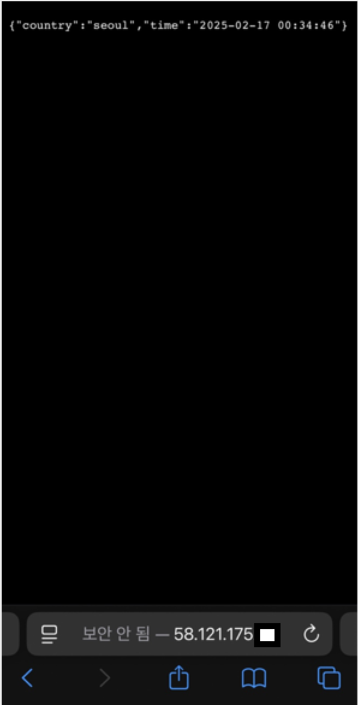

  

### dDNS 등록하기

마지막으로 한가지 문제가 남았다.

맥북은 와이파이를 통해 연결이 되고, 가정용 인터넷 서비스는 대부분의 경우 동적 IP를 할당한다.(고정 IP를 할당받기 위해서는 추가적인 비용이 필요하다.) 왜 동적 IP를 할당하냐면, 인터넷 서비스 업체들(ISP)이 수익을 최대화하기 위해서라고 할 수 있다. 접속을 끊은 사용자들의 IP는 거둬들이고, 접속한 사용자들에게 다시 할당하는 방식으로 한정된 IP주소들을 최대한 활용하는 방법이다.

외부에서 계속해서 바뀌는 동적 IP 주소를 접근하도록 하기 위해서는 동적 DNS가 필요하다. DNS(Domain Name System)는 서버의 이름과 IP를 매칭해서 관리하는 시스템이라고 보면된다. 서버의 이름을 설정해놓고, 서버에 DNS가 제공하는 소프트웨어를 설치해놓으면 지속적으로 변경되는 IP를 DNS에서 추적해서 업데이트해준다. (무료로 DNS를 활용할 수 있는 [사이트](https://freedns.afraid.org/)들이 있다.)

나는 noip.com이라는 사이트를 이용했다. 내 공인 IP와 hostname을 매칭해서 설정해준다.   

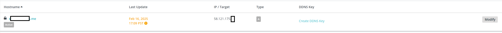  

이제 dDNS에서 할당받은 hostname으로 맥북에 실행시켜둔 앱이 정상적으로 동작하는 걸 확인할 수 있다.  

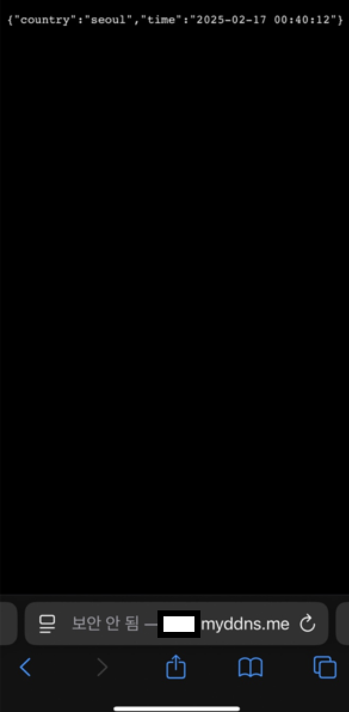

  

### 마무리

이렇게 외부에서 접근가능한 개인서버의 네트워크 설정이 완료되었다. 이 맥북 프로를 팔았을 때 중고가격(서버로 운용한다면 사용가능한 수명이 확 떨어지지 않을까…), 24시간 운용했을 때 발생하는 전기비 등 클라우드 서비스 비용과 비교해봤을 때 개인 서버 운용이 과연 경제적인가 하는 질문에 대해서는 좀 더 지켜봐야겠지만, 서버를 구성하면서 나름 네트워크 공부도 하고 나만의 서버를 구성한다는 것 자체가 즐거웠다.   

정상적으로 동작하긴 하지만, 아직 추가할 부분들이 많다. 도메인 구매, SSL설정, 도커 레지스트리 구성, CI/CD 설정 그리고 쿠버네티스 환경 구성, 모니터링, 백업 설정 등 앱 올려보면서 진행해보려고 한다. 다음 글은 [여기](https://watanka.github/io/personal_server2)에서 확인 가능하다!