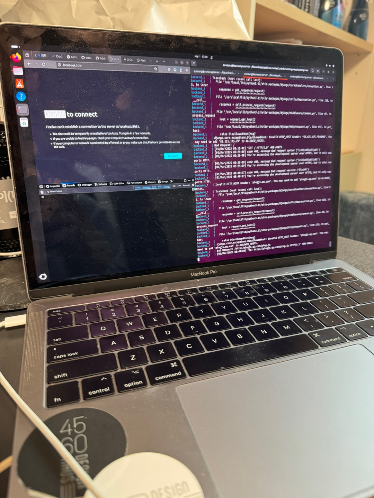
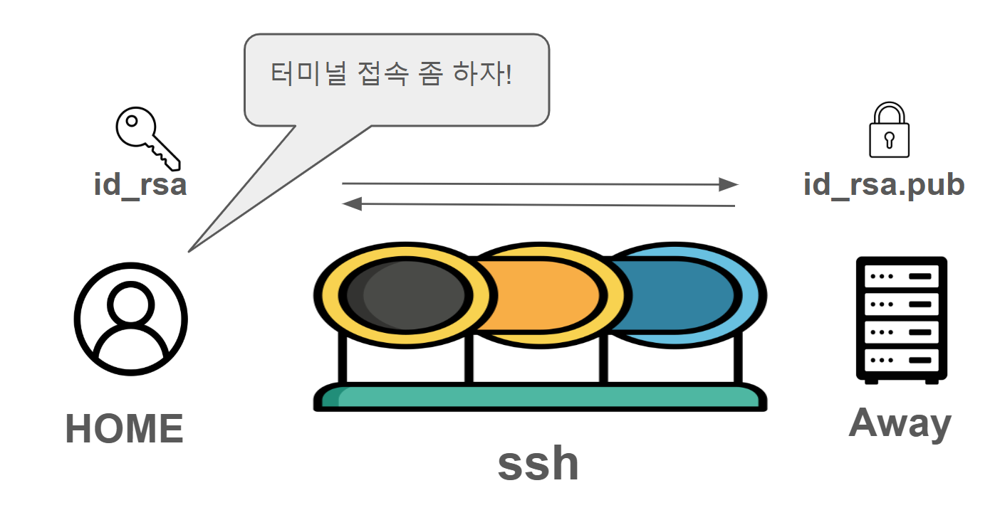
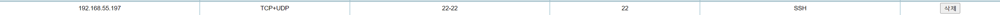
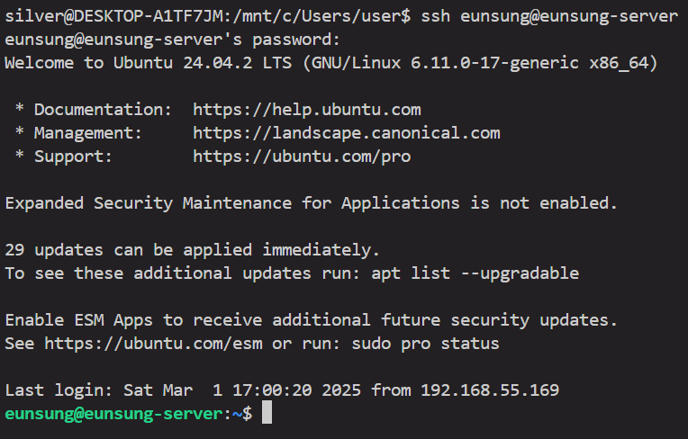
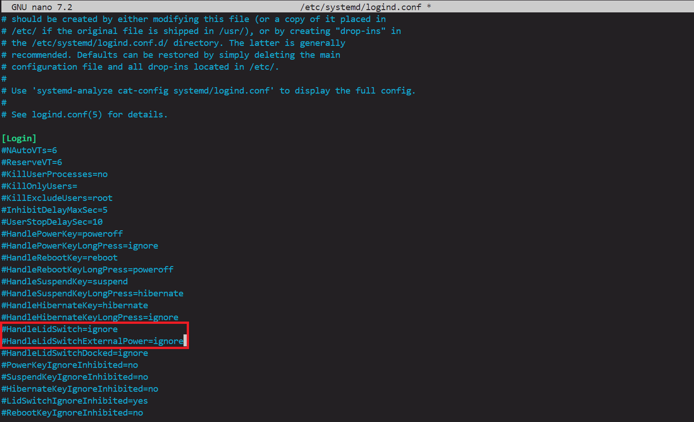
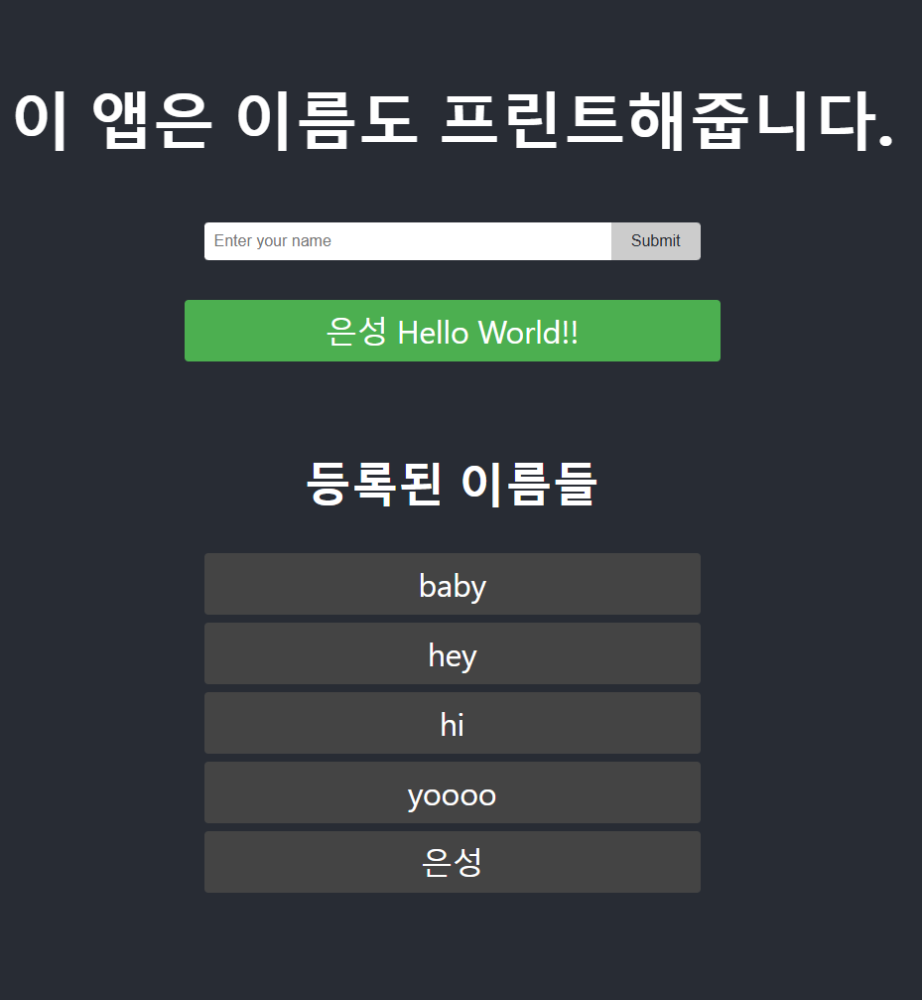
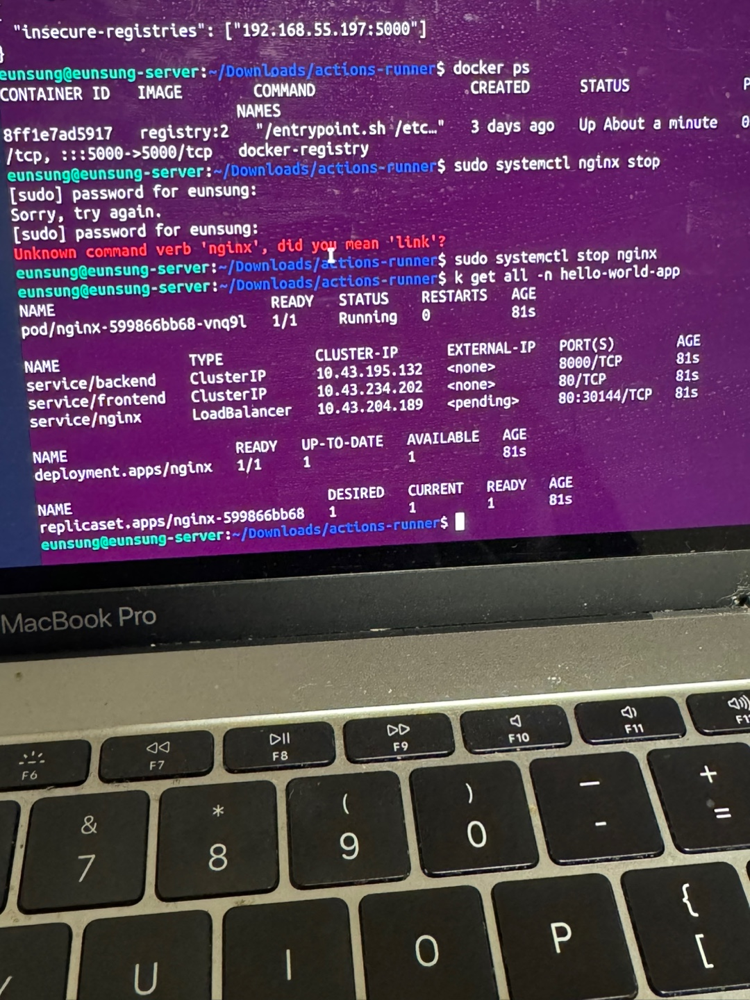

이전 글에서는 홈서버의 네트워크를 셋팅했다. (궁금하다면 [여기](https://watanka.github.io/personal_server)에서)  

이번 글에서는 본격적으로 홈서버에서 사이드 프로젝트(들)를 배포하고 관리하기 위해서 필요한 설정들을 하려고 한다. 글의 구성은 다음과 같다. 필요한 부분만 찾아서 확인해보셔도 좋겠다.  

- 리눅스 설치
- ssh 설치
- 서버용 설정
- docker-registry 설정
- github-action runner 설정
- 쿠버네티스 환경 구성

<br></br>


### 리눅스 설치
 ~~'서버는 리눅스지~'가 아니고~~  macos의 버젼이 오래 돼서 도커 데스크탑 설치가 안 된다. os를 업데이트하려고 했지만, 왠지 모르는 이유로 소프트웨어 업데이트 버튼 클릭 시, 무한로딩에 걸려버려서 리눅스를 설치했다.



<br></br>


### ssh 설치

 다음은 외부에서 홈서버의 콘솔에 접속할 수 있도록 ssh를 설치한다.  

(ssh는 컴퓨터 간 암호화되어 안전한 통신을 가능하게 해주는 프로토콜이다. ssh에 대해 처음 들어본다면, 검색해보자. 자세히 잘 설명해준 글들이 많다.)  




터미널에서 다음과 같은 커맨드로 설치할 수 있다.  

```python
sudo apt update
sudo apt install openssh-server
sudo systemctl enable ssh
sudo systemctl start ssh
```
  
id_rsa를 발급받고 id_rsa.pub을 서버에 심는다. (이 내용도 검색하면 친절한 설명글이 많다)  

그리고, 공유기 관리자 페이지에서 포트 포워딩을 해준다.   



이제 접속이 가능하다.  




현재는 외부 네트워크에서 접속하는 거지만, 외부에서 접속하고 싶다면, 마찬가지로 ssh key를 발급받고, 서버에 심은 다음, 이전 글에서 설정한 dDNS 주소로 접속하면 된다.  

<br></br>


### 서버용으로 노트북 설정 변경하기

 이 노트북은 24/7 돌아가기에 적합한 서버용은 아니지만, 필요한 설정들을 해주자. 절전 모드를 비활성화하고, 덮개가 닫혀도 돌아갈 수 있도록 설정한다.  

```bash
sudo systemctl mask sleep.target suspend.target hibernate.target hybrid-sleep.target
```


이제 이 서버(노트북이였던)는 더 이상 절전모드에 들어가지 않는다.(노트북 수명 byebye)  

그리고 이어서 노트북 덮개를 덮어도 꺼지지 않도록 설정한다. etc 디렉토리의 `logind.conf` 에 들어가서 그림 아래 두 설정들을 ignore로 바꿔준다.  

```bash
sudo nano /etc/systemd/logind.conf
```



노트북이 덮여도 꺼지지 않도록 구성한다.  

그리고 서버가 재부팅되었을 때, 시작할 프로그램들을 설정해준다.  

systemd 서비스에 직접 등록하거나, `systemctl enable [your-service]`로 설정할 수 있다. 나는 docker registry와 github action runner가 자동으로 시작되도록 설정했다.

<br></br>


### docker-registry 구성

 다음은 docker-registry 구성했다. docker-registry는 도커 이미지 저장소이다. docker-registry를 처음 들어봤다면, AWS의 ECR이나 dockerhub를 생각하면 된다. 도커 컨테이너로 docker-registry를 띄우고, 컨테이너가 내려가도 이미지들은 그대로 저장되어 있을 수 있도록 volume을 지정해두었다.  

<br></br>


### github action runner 구성

 그리고 github action runner를 local-hosted runner로 구성했다. github action은 CI/CD를 무료로 제공하는 편리한 서비스다. github action은 기본적으로 github에서 제공하는 runner를 사용하는데, 이 runner는 무료인만큼 속도가 비교적 느리다는 단점과 따로 캐시를 설정하지 않는다면, 매번 CI/CD에 설정된 빌드 과정을 처음부터  실행하여 시간이 오래 걸린다는 단점이 있다. 이 또한, 설정하는 방법은 github action 페이지의 local-hosted runner 섹션에 [친절히 설명](https://docs.github.com/en/actions/hosting-your-own-runners/managing-self-hosted-runners/about-self-hosted-runners)되어 있으므로 자세한 과정은 생략한다.  

 github action 페이지에 local-hosted runner를  프로젝트별로 설정해야하길래, 나는 Organization을 만들어 사이드 프로젝트들을 다 옮기고, 이 organization을 관리하는 local-hosted runner로 등록했다.  

<br></br>


### 쿠버네티스 환경 구축하기

 마지막은 대망의 쿠버네티스 환경 구축이다. 사실 이 부분은 환경적으로 정말 필요해서라기보다는 쿠버네티스 운영을 맛보고 싶어서다.  

 보통 쿠버네티스 환경 구성은 최소 3개의 마스터 노드와 여러 개의 워커 노드들로 이루어져있다. 나는 단지 맥북 하나 있을 뿐이고, 이 환경이 얼마만큼의 부하를 견딜 수 있을지도 모른다.  

 그리고 쿠버네티스의 기능은 컨테이너 오케스트레이션, 즉 여러 개의 컨테이너들을 한 번에 관리하는 것이다.이 여러 개의 컨테이너가 필요한 이유는 서버가 받는 트래픽을 분산시키기 위해서(또는 아키텍쳐 구성상 예를 들면 MSA)인데, 내가 진행하고 있는 사이드 프로젝트들 중에서 서버량이 여러 개의 인스턴스가 필요할 정도의 트래픽은 있는 건 아니다.  

 정리하자면 노드도 한 개이고 서비스 규모도 크지 않아서 쿠버네티스의 필요성은 의문이다. 하지만, 뭐 이렇게 시간이 남아돌 때 해봐야지 언제 해보겠나. 간단한 서비스를 띄워보고, 실제 트래픽이 많은 서비스 구성과는 어떻게 다를지 가늠하는 식으로 진행해보자.  

 우선 단일 노드 환경에 적합한 경량화된 쿠버네티스 배포판에는 minikube, k3 , kind 등이 있는데, 그 중에 k3를 선택했다. k3를 선택한 이유는 여러 상태를 관리하는 시스템(?)인 etcd 대신 sqlite3를 사용하여 리소스를 절약할 수 있기 때문이다. 우리는 단일 노드를 사용하기 때문에 etcd의 분산 시스템이 필요가 없다.   

내 서버는 i5-7360U, cpu 4코어, 8gb RAM, 228gb 디스크를 가지고 있다. 이 노드 안에서 구성을 어떻게 할지 고민됐다.   

서버 안에 가상 머신으로 노드들을 몇 개 구성하면, 좀 더 실제와 가까운 쿠버네티스 셋팅을 맛볼 수 있을 것 같다는 생각이 들었다. 예를 들어, taint나 tolerate 같은 노드 라벨링, 노드 간의 네트워크 통신 설정, 드레이닝이나 코든 같은 노드 유지보수 과정들을 실습해볼 수 있을 것 같다.   

하지만 결과적으로는 가상 머신으로 분리하지 않고, 단일 노드에서 마스터 노드가 워커 노드 역할을 겸하는 구성으로 가기로 했다. 왜냐하면, 첫번째로 가상 머신을 여럿 띄울만큼의 리소스가 없다는 점. 그리고 두번째로 마스터 노드와 워커 노드의 분리 목적이 애초에 클러스터의 안정성을 위해서라는 점에서, 가상머신을 띄운 맥북이 다운되면 노드 전부가 꺼져버릴 게 당연하기 때문이다.   

이 단일 노드에 쿠버네티스에 띄울 앱과 상태를 적은 쿠버네티스 manifest를 작성했다. 최대한 간단하게 앱을 구성했다. fastapi, react, mysql, 그리고 nginx로 돌아가는 앱이다. 이름을 등록하면, '이름 hello world'를 리턴하는 간단한 앱이다.(코드는 [여기](https://github.com/silver-s-side-projects/k8s-hello-world-app))  



이 앱은 이름도 프린트해준다!

<details>
    <summary>소소한 트러블 슈팅</summary>
    docker registry에 이미지를 push할 때, github action이 계속 https로 요청을 보내서 오류가 난다. 우선은 docker daemon config에 insecure-registries 목록에 해당 registry 주소를 추가하여 (우회)해결했다. 근본적으로는 registry에도 https로 통신하는 게 맞기 때문에 후에 추가로 설정을 바꿔봐야겠다.
</details>

그리고 k8s에 올리기 위해 필요한 manifest들을 작성한다. 앱의 라벨링을 담당할 namespace, 각 요소(backend, frontend, nginx)의 deployment와 서비스, 그리고 각종 config들을 담을 configmap과, secret, 그리고 요청의 라우팅을 처리해줄 ingress(이쪽은 손을 더 봐야할듯)를 작성한다. 이후에는 self-hosted runner에서 돌아갈 workflow를 작성해준다. (몇 문장으로 정리가 가능하지만, 이 과정에 거의 세시간 정도 소요된 것 같다…) 드디어 이제, 로컬 서버 쿠버네티스에서 실행되는 앱을 확인할 수 있다….!




이번 시간에는 홈 서버에 작성한 앱을 배포하기 위한 배포 환경을 구성했다. 

양이 생각보다 길어져서 다음 편으로 이어서 쓰겠다. 다음 편에는 이 앱을 가지고, 여러 설정을 추가(ingress 설정, 파드 증설 등)하고 실험을 해보면서 모니터링을 해보려고 한다.