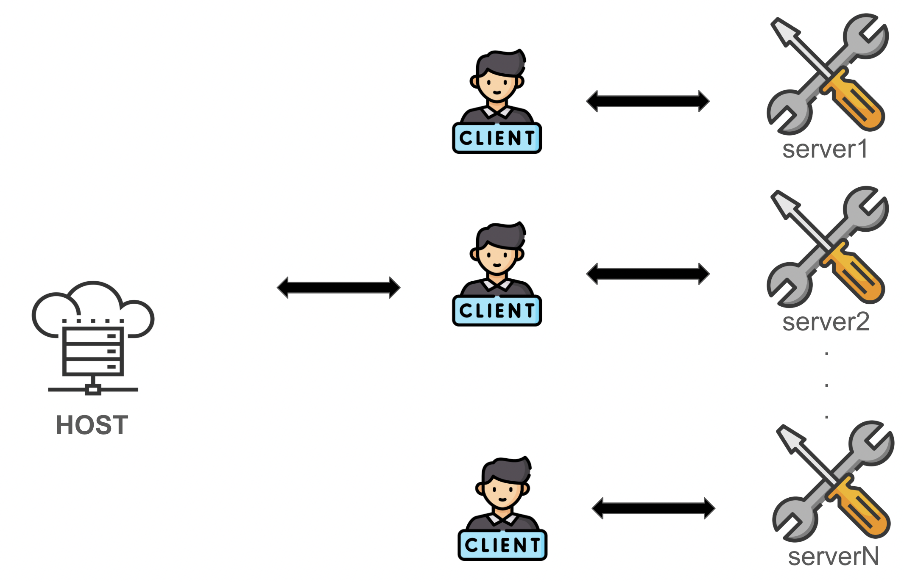

# **MCP(Model Context Protocol)란?**

최근 AI 개발 커뮤니티에서 **MCP(Model Context Protocol)**가 큰 주목을 받고 있습니다. 2024년 11월 **Anthropic**이 오픈소스로 공개한 이 프로토콜은 처음에는 큰 반응을 얻지 못했지만, 2025년 초부터 관심이 급격히 증가하고 있습니다. MCP는 LLM에게 부족한 파일 시스템, 데이터베이스, API 등 기존 데이터 소스를 컨텍스트로써 통신할 수 있는 표준을 제공합니다. HTTP 통신이 처음 세상에 나왔을 때처럼, LLM 엔진에 붙일 수 있는 도구를 정의하는 규격을 제공함으로써, LLM이 가진 가능성을 무한대로 확장시켜줍니다.

## **MCP란 무엇인가?**

MCP는 **대규모 언어 모델(LLM)이 외부 데이터와 시스템을 효과적으로 활용할 수 있도록 설계된 개방형 표준 프로토콜**입니다. **Anthropic**은 MCP를 **USB-C 포트**에 비유하는데, USB-C가 다양한 기기와 주변 장치를 표준화된 방식으로 연결하듯이, MCP는 AI 모델이 다양한 데이터 소스와 도구에 표준화된 방식으로 연결될 수 있도록 합니다.

### **MCP의 주요 특징**

1. **개방형 표준**: 누구나 자유롭게 사용하고 개선할 수 있습니다.
2. **양방향 연결**: AI 모델과 데이터 소스 간의 지속적인 통신을 지원합니다.
3. **범용성과 표준화**: 다양한 데이터 소스와 도구를 하나의 프로토콜로 연결합니다.
4. **보안 및 신뢰성**: 안전하고 신뢰할 수 있는 연결을 제공합니다.

## **MCP의 동작 방식**

MCP는 다음과 같은 프로세스를 거칩니다.

### **1. 연결 설정**

- 호스트 애플리케이션(예: **Claude Desktop, Cursor**)이 필요한 기능을 가진 **MCP 서버에 대한 클라이언트를 생성**합니다.

### **2. 초기화 프로세스**

- 클라이언트가 서버와 연결되면 **JSON-RPC 기반 메시지를 통해 프로토콜 버전과 지원 가능한 기능을 확인**합니다.
- 이 과정에서 **서버의 능력과 제약 사항이 결정**됩니다.

### **3. 기능 탐색**

- 클라이언트는 서버에 `tools/list` 등의 요청을 보내 **사용 가능한 도구, 리소스, 프롬프트 목록을 수집**합니다.
- 이 정보는 호스트를 통해 **LLM에게 전달**됩니다.

### **4. 요청 처리 과정**

1. 사용자가 호스트에 질문을 입력하면 LLM이 이를 분석합니다.
2. LLM은 적절한 서버와 도구를 선택해 **구조화된 요청**을 생성합니다.
3. 호스트는 해당 요청을 관련 클라이언트에 전달합니다.
4. 클라이언트는 요청을 서버가 이해할 수 있는 형식으로 변환하여 전송합니다.
5. 서버는 요청된 작업을 수행하고 결과를 반환합니다.
6. 결과는 클라이언트를 통해 호스트로 전달되며, 최종적으로 LLM에게 제공됩니다.

### **5. 통신 형식**

- **JSON-RPC 2.0 프로토콜**을 기반으로 데이터 교환이 이루어집니다.
- **텍스트 데이터는 UTF-8 인코딩**, 이미지 및 바이너리 데이터는 **Base64 인코딩**을 사용하여 전송됩니다.

## **MCP 구조**

MCP는 호스트(Host), 클라이언트(Client), 서버(Server) 세 개의 컴포넌트로 이루어져 있습니다.

### **1. 호스트(Host)**

호스트는 AI 애플리케이션의 컨테이너이자 조정자 역할을 합니다.  

### **호스트의 주요 역할**

- 여러 클라이언트 인스턴스를 생성하고 관리  
- 클라이언트 연결 권한과 생명 주기 제어  
- 보안 정책과 동의 요구사항 시행  
- AI/LLM 통합 및 샘플링 조정  
- 대화 컨텍스트 관리 및 클라이언트 간 컨텍스트 집계  

### **2. 클라이언트(Client)**

클라이언트는 **호스트에 의해 생성되며 서버와의 독립적인 1:1 연결을 유지**합니다.

### **클라이언트의 주요 역할**

- 서버당 하나의 상태 유지 세션 설정
- 프로토콜 협상 및 기능 교환 처리
- 양방향으로 프로토콜 메시지 라우팅
- 구독 및 알림 관리
- 서버 간 보안 경계 유지

### **3. 서버(Server)**

서버는 특정 **컨텍스트와 기능을 제공하는 독립적인 프로그램**입니다.

### **서버의 주요 역할**

- 리소스, 도구, 프롬프트 등의 기능 노출
- 독립적으로 작동하며 특정 책임 수행
- 클라이언트 인터페이스를 통해 샘플링 요청 처리
- 보안 제약 준수
- 로컬 프로세스 또는 원격 서비스로 구현 가능

## **클라이언트가 서버를 호출하는 방식**

### **1. stdio 방식 (표준 입출력)**

- 클라이언트가 서버를 **하위 프로세스로 실행**합니다.
- 서버는 표준 입력(`stdin`)으로 명령을 받고 표준 출력(`stdout`)으로 응답합니다.
- **JSON-RPC 2.0 형식**으로 메시지를 주고받습니다.
- **로컬 환경에서 설정이 간단**하고 **빠르게 실행 가능**합니다.

### **2. HTTP+SSE 방식 (Server-Sent Events)**

- 클라이언트는 HTTP `POST` 요청으로 명령을 서버에 보냅니다.
- 서버는 `SSE(Server-Sent Events)`를 사용하여 **클라이언트에게 응답이나 이벤트를 스트리밍**합니다.
- **웹 애플리케이션 및 분산 시스템**에서 유용합니다.

## 마무리

MCP는 **AI 모델이 외부 데이터와 도구에 접근할 수 있는 표준화된 방법을 제공**함으로써 AI 애플리케이션의 가능성을 크게 확장시키고 있습니다. **호스트, 클라이언트, 서버**로 구성된 아키텍처는 복잡한 시스템을 효율적으로 관리할 수 있도록 돕습니다.